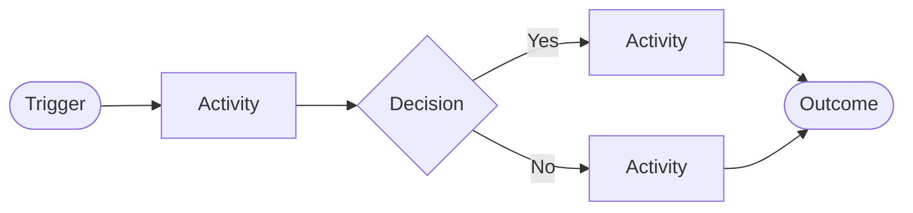
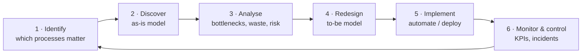
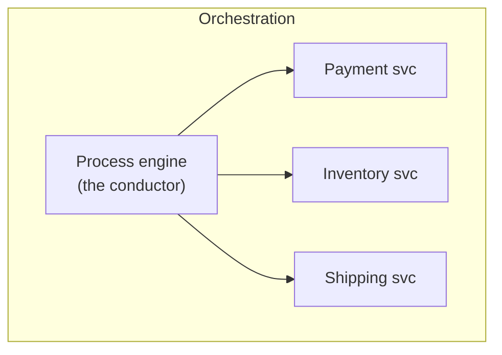
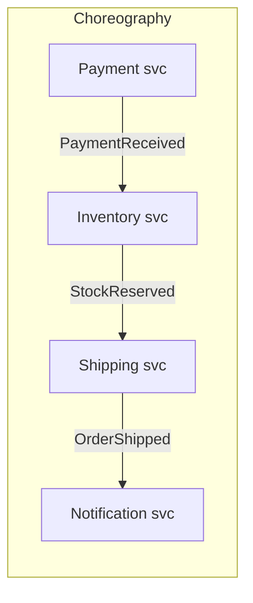
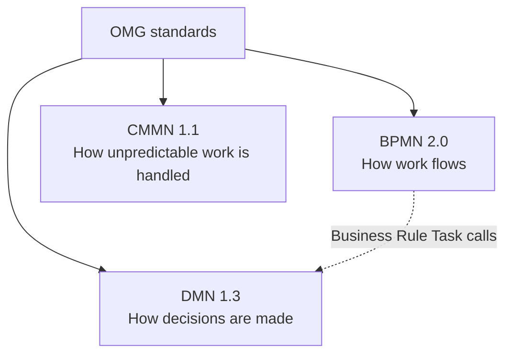
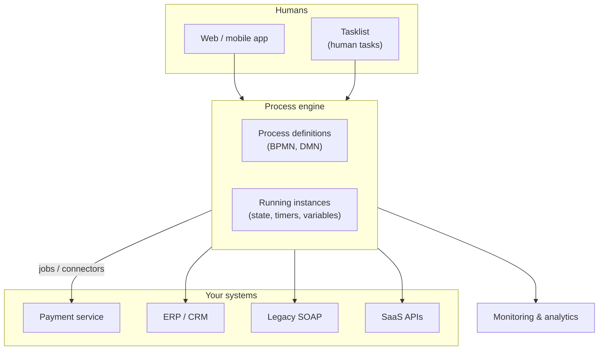
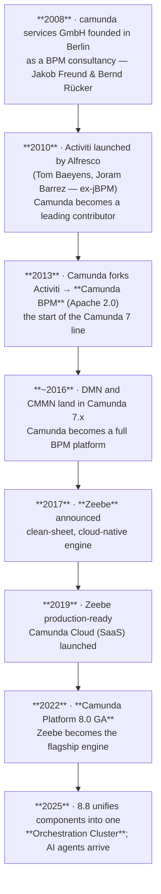

# 01 · BPM Fundamentals

> Prerequisite for everything else. If you can explain this section conversationally, you can hold
> the "business" half of a Camunda interview.

---

## 1. What is a business process?

A **business process** is a repeatable sequence of activities that turns a trigger into a business
outcome for a customer (internal or external).

Three things every process has:

| Element                | Question it answers                                 | Example (loan application)                         |
|------------------------|-----------------------------------------------------|----------------------------------------------------|
| **Trigger**            | What starts it?                                     | Customer submits application                       |
| **Activities + rules** | What happens, in what order, under what conditions? | Validate → credit check → decide → notify          |
| **Outcome**            | When is it "done"?                                  | Loan approved & disbursed, or rejected with reason |

Processes cross **systems**, **teams**, and **time**. That crossing is exactly what makes them hard,
and exactly why a process engine exists.

---

## 2. What is BPM?

**Business Process Management (BPM)** is the *discipline* of deliberately designing, executing,
measuring, and improving business processes — supported by methodology, governance, and tooling.

The one-sentence version for an interview:

> A BPM is a workflow orchestration engine that lets us visually design, automate and optimize our
> business processes more effectively. By continually monitoring which ultimately cuts down on
> manual
> errors and improves business process & productivity.

### The BPM lifecycle

The classic (Dumas et al.) lifecycle — worth memorising, it's a very common opening question:

| Phase     | Output                           | Camunda touchpoint             |
|-----------|----------------------------------|--------------------------------|
| Identify  | Process portfolio / architecture | — (workshops)                  |
| Discover  | *As-is* BPMN model               | Modeler (descriptive)          |
| Analyse   | Bottleneck & waste report        | Optimize, process mining       |
| Redesign  | *To-be* BPMN model               | Modeler                        |
| Implement | Executable model + workers       | Modeler + engine + job workers |
| Monitor   | KPIs, SLAs, incidents            | Operate/Cockpit, Optimize      |

### Why organisations invest in BPM

- **Visibility** — you can *see* where an order actually is, instead of asking three teams.
- **Consistency & compliance** — the same steps every time, auditable end-to-end.
- **Automation** — remove manual hand-offs; humans only handle exceptions and judgement calls.
- **Change agility** — change the model, redeploy; no scattered `if` statements across
  microservices.
- **Measurability** — cycle time, throughput, cost per case become real numbers.

### ❓ Interview angle

> *"Isn't this just a state machine / a bunch of if-statements?"*
> Answer: a process engine adds **durable state** (survives restarts), **timers and long waits**
> (days/weeks), **compensation and error handling**, **visibility to non-developers**, and **audit
> history** — all things you'd otherwise rebuild badly in every service.

---

## 3. Process vs. workflow vs. case vs. orchestration

Interviewers love these distinctions because sloppy usage is everywhere.

| Term                 | Meaning                                                                           | Predictability |
|----------------------|-----------------------------------------------------------------------------------|----------------|
| **Business process** | The end-to-end business capability ("order to cash")                              | conceptual     |
| **Workflow**         | A concrete, ordered flow of tasks — usually the executable model                  | high           |
| **Case**             | Knowledge work where the *worker* decides what to do next based on evolving facts | low            |
| **Orchestration**    | One central component actively tells participants what to do                      | —              |
| **Choreography**     | No central brain; services react to each other's events                           | —              |

### Orchestration vs. choreography (very common microservices question)

|                          | Orchestration                           | Choreography                      |
|--------------------------|-----------------------------------------|-----------------------------------|
| Where is the flow logic? | Centralised & explicit                  | Spread across services, implicit  |
| Visibility               | Excellent — one model                   | Poor — must reconstruct from logs |
| Coupling                 | Engine knows participants               | Services know event contracts     |
| Failure handling         | Central retries, timeouts, compensation | Each service reinvents it         |
| Change                   | Edit one model                          | Coordinated multi-service change  |

**Camunda's position:** orchestration doesn't have to mean centralised *ownership*. Each team can
own its own process model; Camunda calls this "decentralised orchestration". Good nuance to raise —
it defuses the "orchestration = monolith" objection.

### ❓ Interview angle

> *"When would you NOT use a process engine?"*
> Very short-lived, purely synchronous request/response logic; ultra-low-latency hot paths;
> processes with a single step; or when the flow genuinely never spans systems or time. Adding an
> engine there is overhead without payoff.

---

## 4. The three OMG standards: BPMN, DMN, CMMN

All three are maintained by the **OMG (Object Management Group)** — the same body behind UML. Being
open standards is a major Camunda selling point: models are portable XML, not vendor lock-in.

### 4.1 BPMN — Business Process Model and Notation

**What:** a standardised *graphical notation + XML interchange format* for process flows. **Current
version:** BPMN 2.0 (2011) — the "2.0" matters because it added the executable XML serialisation,
which is what made engines like Camunda possible.

Core visual vocabulary (full detail in [`02-bpmn-essentials.md`](02-bpmn-essentials.md)):

| Shape               | Meaning                                                       |
|---------------------|---------------------------------------------------------------|
| ⭕ Circle           | **Event** — something that happens (start, intermediate, end) |
| ▭ Rounded rectangle | **Activity/Task** — work being performed                      |
| ◇ Diamond           | **Gateway** — branching / merging of the flow                 |
| → Solid arrow       | **Sequence flow** — order of execution within one pool        |
| ⇢ Dashed arrow      | **Message flow** — communication *between* pools              |
| ▤ Big box           | **Pool / lane** — participant / role                          |

**Two modes of BPMN — know this distinction:**

| Mode            | Purpose                                        | Rigour required                                                                   |
|-----------------|------------------------------------------------|-----------------------------------------------------------------------------------|
| **Descriptive** | Documentation, workshops, shared understanding | loose — a subset of ~10 symbols                                                   |
| **Executable**  | Actually run by an engine                      | strict — every task needs an implementation, every gateway a resolvable condition |

Camunda Modeler supports both; Camunda even publishes a "BPMN descriptive subset" for business
users.

### 4.2 DMN — Decision Model and Notation

**What:** a standard for modelling **business decisions and rules** *outside* the process flow,
usually as **decision tables**.

**Why separate decisions from the process?**

- Rules change far more often than flows (rates, thresholds, tiers, eligibility).
- Business analysts can edit a decision table; they can't safely edit Java or a spaghetti of
  gateways.
- Decisions become independently testable and auditable.
- Avoids "gateway explosion" — 5 conditions × 4 outcomes as gateways is unreadable; as a table it's
  20 rows.

Minimal decision table (an expense-approval tier):

| # | Amount (input) | Department (input) | Approval Level (output) |
|---|----------------|--------------------|-------------------------|
| 1 | `< 1000`       | `-`                | `"TEAM_LEAD"`           |
| 2 | `[1000..5000)` | `-`                | `"MANAGER"`             |
| 3 | `>= 5000`      | `-`                | `"VP"`                  |

Called from BPMN via a **Business Rule Task**. Full treatment in
[`06-dmn-and-feel.md`](06-dmn-and-feel.md).

### 4.3 CMMN — Case Management Model and Notation

**What:** a standard for **unstructured / knowledge work**, where the *order isn't knowable
upfront*. Instead of a flow, you declare a set of available activities plus **sentries** (entry/exit
criteria)
that make them available or required as case data evolves.

|                  | BPMN                                       | CMMN                                                                      |
|------------------|--------------------------------------------|---------------------------------------------------------------------------|
| Metaphor         | Assembly line                              | Detective investigation / doctor's rounds                                 |
| Drives execution | The **flow** (tokens along sequence flows) | The **data & events** (sentries open stages/tasks)                        |
| Worker's freedom | Follows the modelled path                  | Chooses which discretionary tasks to run                                  |
| Good for         | Order fulfilment, payments, onboarding     | Insurance claim investigation, complaints, legal cases, patient treatment |

CMMN key concepts: *Case Plan Model*, *Stage*, *Human Task*, *Milestone*, *Sentry* (the little
diamond on the border), *Discretionary item* (dashed border — available but not automatic).

**🔶 Critical version fact:** **Camunda 7 supports CMMN. Camunda 8 does NOT.** Camunda concluded
adoption didn't justify the complexity, and that most real cases are better served by BPMN features:

- **Ad-hoc subprocess** — a container of activities with no fixed order; a completion condition
  decides when it's done. (This is the direct CMMN replacement in Camunda 8, and it's what powers
  AI-agent task selection in 8.8+.)
- **Event subprocesses** — react to things happening mid-flow.
- **Multi-instance + collections** — dynamic fan-out.
- **Conditional/message events** — data-driven activation.

### ❓ Interview angle

> *"You need to model an insurance claim investigation where adjusters decide what to do next.
> How?"*
> In C7: CMMN case model with discretionary tasks and sentries. In C8: a BPMN **ad-hoc subprocess**
> containing the candidate activities, with the set of activated elements driven at runtime (either
> declaratively via `activeElementsCollection`, or by a job worker on the subprocess deciding what
> to activate).

---

## 5. Where a process engine fits in an architecture

The engine owns **flow, state, time, and retries**. Your services own **business capability**. Keep
business logic *in* services and *out* of the model — the model should read like the process, not
like code.

---

## 6. How Camunda originated

A short, accurate narrative — interviewers occasionally ask "why does Camunda 8 look nothing like
Camunda 7?", and the history is the answer.

| Year     | Milestone                                                           |
|----------|---------------------------------------------------------------------|
| 2008     | camunda services GmbH founded (Berlin) as a BPM consultancy         |
| 2010     | Activiti launched by Alfresco; Camunda becomes a top contributor    |
| **2013** | **Camunda forks Activiti → Camunda BPM (Camunda 7 lineage begins)** |
| ~2016    | DMN + CMMN support in Camunda 7.x                                   |
| 2017     | Zeebe announced — clean-sheet cloud-native engine                   |
| 2019     | Zeebe production-ready; Camunda Cloud launched                      |
| **2022** | **Camunda Platform 8.0 GA**                                         |
| 2025     | 8.8 Orchestration Cluster consolidation; AI agents                  |

### The lineage in prose

1. **Roots in jBPM → Activiti.** The open-source Java workflow lineage runs jBPM (JBoss/Red Hat) →
   **Activiti** (Alfresco, 2010). Camunda, then a Berlin BPM consultancy founded in **2008** by
   **Jakob Freund** and **Bernd Rücker**, became one of Activiti's most active contributors.

2. **The 2013 fork.** Disagreements over project governance and roadmap direction led Camunda to
   **fork Activiti in March 2013** and ship **Camunda BPM** under Apache 2.0. This is the origin of
   the **Camunda 7** codebase. (Trivia: the Activiti lineage forked again later into *Flowable* — so
   jBPM, Activiti, Camunda 7 and Flowable are all cousins.)

3. **Camunda 7's defining trait: the embeddable engine.** A Java library you drop into your app,
   backed by a relational database, sharing your transactions. Perfect for the Java-enterprise world
   of the 2010s: JEE app servers, Spring, one big DB.

4. **The wall.** That architecture had hard limits for cloud-native workloads: the relational DB
   became the throughput ceiling and a single point of contention (row locks, optimistic-locking
   retries, job-executor polling). Horizontal scaling meant scaling *one* database.

5. **Zeebe: a clean-sheet rewrite (announced 2017).** Instead of tables and transactions, Zeebe uses
   an **append-only event log**, **partitioning**, **Raft replication**, embedded **RocksDB** state,
   and **event sourcing** — the design vocabulary of Kafka, not of Hibernate. No relational DB in
   the hot path, so throughput scales by adding partitions and brokers.

6. **Camunda 8 (GA April 2022).** Zeebe + Operate + Tasklist + Optimize + Identity + Connectors,
   offered as SaaS and Self-Managed. The engine is **no longer embeddable** — your app is a *client*
   that connects to a cluster (exactly the model this repository uses: a Spring Boot app with
   `camunda-spring-boot-starter` talking to a separately running cluster).

7. **Consolidation (8.8, 2025) and AI (8.8+).** Components were unified into a single
   **Orchestration Cluster** deployment with a **REST API v2**, and BPMN gained first-class **AI
   Agent** capabilities built on ad-hoc subprocesses.

### ❓ Interview angle

> *"Why did Camunda rewrite the engine instead of optimising Camunda 7?"*
> Because the bottleneck was **architectural, not incidental**: a shared relational database with
> transactional locking cannot scale horizontally the way an event-sourced, partitioned log can. The
> rewrite traded embeddability and direct SQL access for horizontal scalability, deterministic
> replay, and cloud-native operations.

---

## 7. Key takeaways

- BPM = discipline + notation + technology, driven by a 6-phase lifecycle.
- BPMN models **flow**, DMN models **decisions**, CMMN models **unpredictable case work**.
- Camunda 8 supports **BPMN + DMN**, drops **CMMN** (use ad-hoc subprocesses instead).
- Camunda descends from jBPM → Activiti → (2013 fork) Camunda 7; Camunda 8 is a **clean-sheet
  rewrite** around the Zeebe event-sourced engine.
- Orchestration gives visibility and central failure handling; choreography gives autonomy but
  scatters the flow.

➡️ Next: [`02-bpmn-essentials.md`](02-bpmn-essentials.md)

