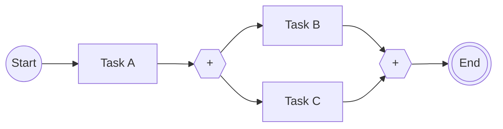
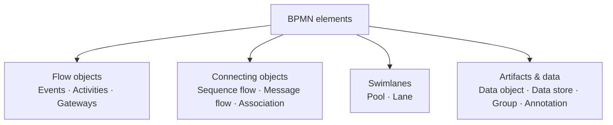
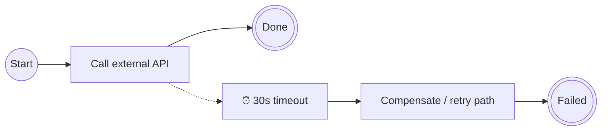
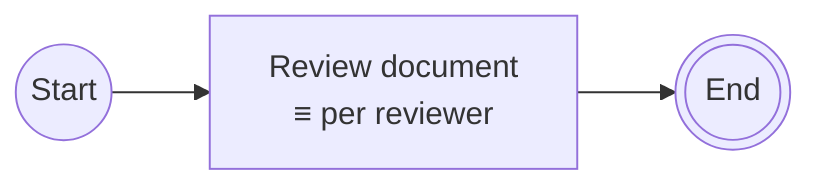
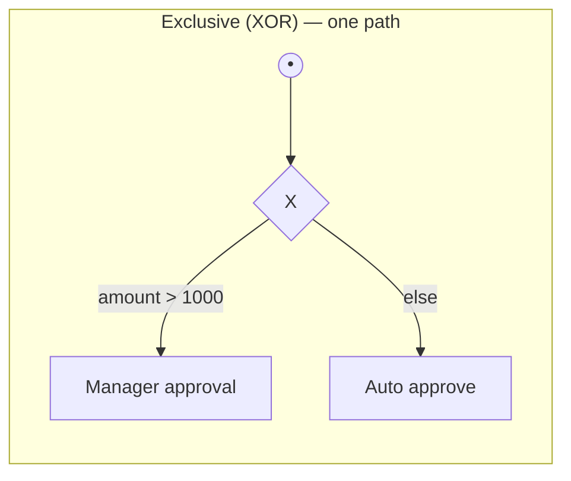
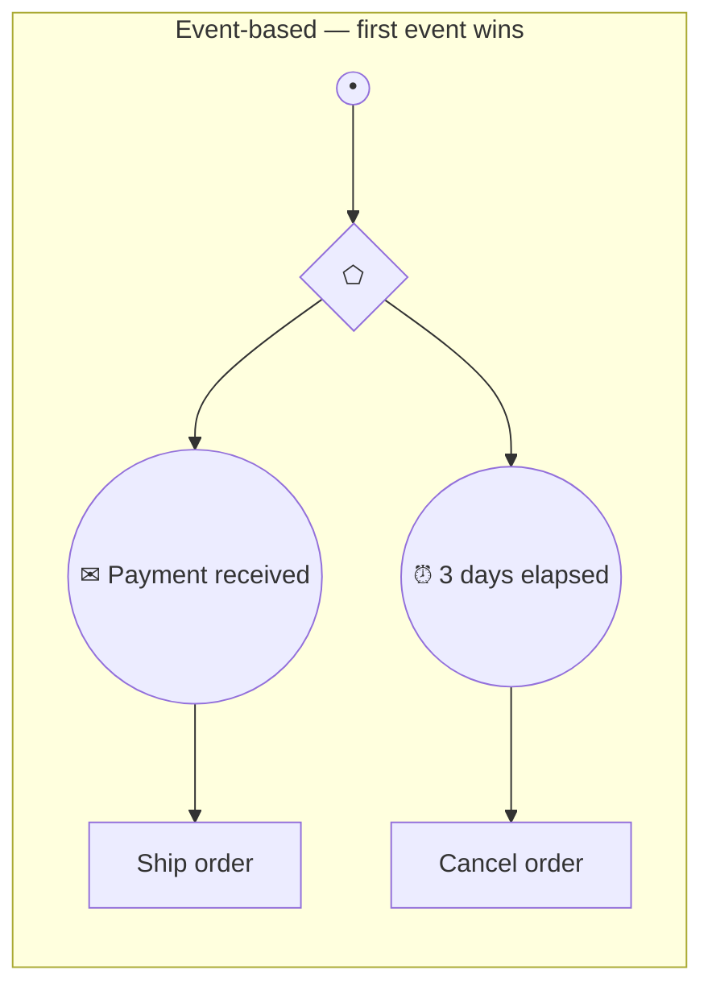
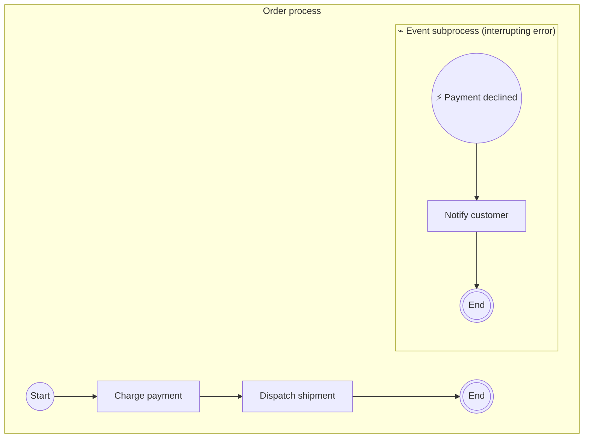
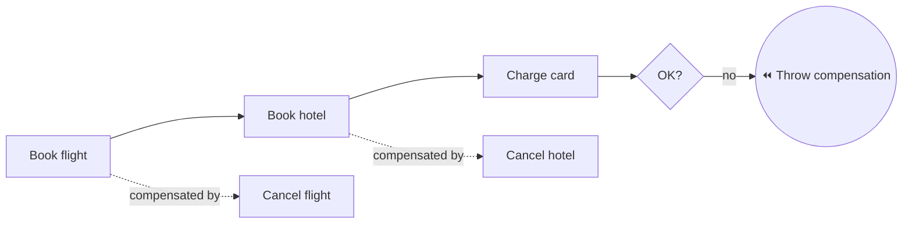
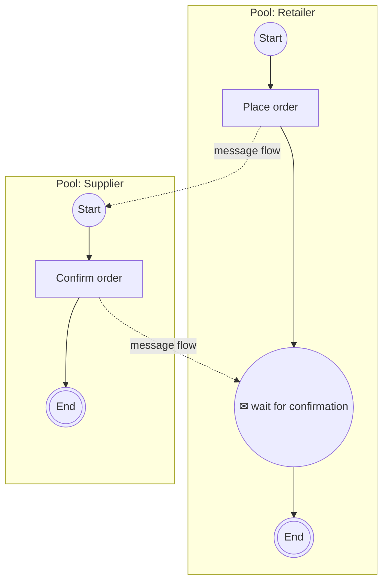

# 02 · BPMN Essentials

> The modelling language. Applies to **both Camunda 7 and Camunda 8** — differences are flagged 🔶.
> This is the single highest-yield document for interviews: BPMN questions come up in *every*
> Camunda interview regardless of version.

---

## 1. The mental model: tokens

BPMN execution is explained with **tokens** — an imaginary marker that moves through the diagram.

- A **start event** creates a token.
- A token moves along **sequence flows**, one element at a time.
- An element only executes when a token arrives.
- **Parallel gateway (split)** → one token becomes N tokens.
- **Parallel gateway (join)** → waits for N tokens, produces 1.
- A **process instance ends** when *all* its tokens are consumed.



Above: 1 token → 2 tokens after the split → back to 1 after the join.

**Why tokens matter in interviews:** almost every "what happens if…" question is answered by tracing
tokens. *"What if only one branch reaches a parallel join?"* → the token waits forever → the
instance is stuck. *"What if a token reaches an end event while another branch is still running?"* →
that token is consumed, the instance continues until all tokens are gone.

---

## 2. Element categories



---

## 3. Events

An **event** is something that *happens*. Three dimensions define every event:

| Dimension         | Options                                                                                                        |
|-------------------|----------------------------------------------------------------------------------------------------------------|
| **Position**      | Start · Intermediate · End · Boundary (attached to an activity)                                                |
| **Behaviour**     | **Catching** (waits for something) · **Throwing** (emits something)                                            |
| **Interrupting?** | Interrupting (solid border) · Non-interrupting (dashed border) — boundary & event-subprocess start events only |

Visual cue cheat sheet:

| Border                         | Meaning                   |
|--------------------------------|---------------------------|
| Thin single circle             | Start event               |
| Double thin circle             | Intermediate **catching** |
| Double circle, **filled** icon | Intermediate **throwing** |
| Thick single circle            | End event                 |
| **Dashed** circle              | Non-interrupting          |

### 3.1 Event types you must know

| Type                             | Icon                  | What it does                                                     | Typical use                                   |
|----------------------------------|-----------------------|------------------------------------------------------------------|-----------------------------------------------|
| **None**                         | (blank)               | Plain start/end; no trigger semantics                            | Manual instance start, normal end             |
| **Message**                      | ✉ envelope           | Wait for / send a targeted message (1:1, correlated by a key)    | "Payment confirmation received"               |
| **Timer**                        | ⏰ clock              | Wait for a date, duration, or cycle                              | "Escalate after 2 days", "run daily at 08:00" |
| **Error**                        | ⚡ lightning (filled) | Signal a **business error** that must be handled                 | "Card declined", "Invalid document"           |
| **Signal**                       | ▲ triangle            | Broadcast 1:N — every listener reacts                            | "Product recall issued"                       |
| **Escalation**                   | ▲ arrowhead           | Non-critical hand-up to a parent scope (can be non-interrupting) | "Notify supervisor but keep going"            |
| **Conditional**                  | 📄 lines              | Trigger when a data condition becomes true                       | "When stock < 10" 🔶 *C7; limited in C8*      |
| **Compensation**                 | ⏪ rewind             | Trigger undo logic for completed activities                      | "Refund the payment, cancel the booking"      |
| **Terminate**                    | ⬤ filled circle       | Kill **all** tokens in the scope immediately                     | "Order cancelled — stop everything"           |
| **Link**                         | ↪ arrow               | Off-page connector (visual only, same process)                   | Tidy up huge diagrams                         |
| **Multiple / Parallel Multiple** | ⬠ pentagon            | Any-of / all-of several triggers                                 | Rare                                          |

### 3.2 Message vs. Signal — the classic exam question

|             | **Message**                                                   | **Signal**                                                |
|-------------|---------------------------------------------------------------|-----------------------------------------------------------|
| Delivery    | **1:1**, targeted                                             | **1:N**, broadcast                                        |
| Routing     | **Correlation key** (e.g. `orderId`) picks the exact instance | No correlation — every waiting subscriber fires           |
| Analogy     | Direct message / letter                                       | Radio broadcast / public announcement                     |
| Risk        | None inherent                                                 | Can accidentally trigger far more instances than intended |
| Camunda API | correlate message with variables + key                        | broadcast signal                                          |

### 3.3 Error vs. Escalation vs. Incident — the other classic

|                | **Error event**                               | **Escalation event**                                    | **Incident**                                           |
|----------------|-----------------------------------------------|---------------------------------------------------------|--------------------------------------------------------|
| Nature         | Modelled **business** error                   | Modelled **notification** to a higher level             | **Technical** failure, not modelled                    |
| Who defines it | The process designer                          | The process designer                                    | The engine, at runtime                                 |
| Interrupting?  | Always interrupting                           | Can be **non**-interrupting                             | n/a                                                    |
| Example        | "Credit card declined"                        | "SLA at risk — alert manager, keep processing"          | Worker threw `NullPointerException`, retries exhausted |
| Handled by     | Boundary error event / error event subprocess | Boundary escalation event / escalation event subprocess | Human/ops in Operate or Cockpit (retry or cancel)      |

> 💡 **Golden rule:** an **incident** means "a developer/operator must look at this". An **error
> event** means "the business anticipated this outcome and modelled a path for it". Don't model
> technical failures as BPMN errors, and don't let business outcomes become incidents.

### 3.4 Boundary events

Attached to the border of an activity; they listen *while that activity is running*.



- **Interrupting** (solid): cancels the activity, token leaves via the boundary path.
- **Non-interrupting** (dashed): activity keeps running; a **new token** is spawned on the boundary
  path — meaning two tokens now exist. Classic use: reminder timers that fire repeatedly while a
  user task stays open.

Attachable types: message, timer, error, escalation, signal, conditional, compensation. **Error
boundary events are always interrupting** — an error cannot be "observed and ignored".

---

## 4. Activities (tasks)

| Task type                   | Marker              | Meaning                                                   | C7 implementation                                | C8 implementation                                              |
|-----------------------------|---------------------|-----------------------------------------------------------|--------------------------------------------------|----------------------------------------------------------------|
| **Service Task**            | ⚙ gear             | Automated work by a system                                | `JavaDelegate`, expression, or **external task** | **Job worker** (`@JobWorker`) or **connector**                 |
| **User Task**               | 👤 person           | Human work with a form/inbox                              | Tasklist                                         | Tasklist                                                       |
| **Script Task**             | 📜 scroll           | Inline script                                             | Groovy/JS/Python in-engine                       | 🔶 FEEL expression only (no arbitrary scripting in the broker) |
| **Business Rule Task**      | 📊 table            | Evaluate a DMN decision                                   | Built-in DMN engine                              | DMN evaluated in-cluster / via job                             |
| **Send Task**               | ✉ filled           | Fire-and-forget message out                               | Delegate                                         | Job worker                                                     |
| **Receive Task**            | ✉ open             | Wait for a message (alternative to a message catch event) | Message correlation                              | Message correlation                                            |
| **Manual Task**             | ✋ hand             | Work done entirely outside the system, untracked          | Pass-through                                     | Pass-through                                                   |
| **Call Activity**           | ▭ with thick border | Invoke another **deployed** process as a subprocess       | ✔                                               | ✔                                                             |
| **Business/Undefined Task** | none                | Placeholder in descriptive models                         | —                                                | —                                                              |
| **AI Agent (8.8+)**         | 🤖                  | LLM-driven task selection inside an ad-hoc subprocess     | ✖                                               | 🔶 C8 only                                                     |

### 4.1 Task markers (bottom-centre icons)

| Marker              | Name                          | Meaning                                   |
|---------------------|-------------------------------|-------------------------------------------|
| ≡≡≡ (vertical bars) | **Parallel multi-instance**   | Run once per collection item, all at once |
| ⋯ (horizontal bars) | **Sequential multi-instance** | Run once per item, one after another      |
| ↻                   | **Loop**                      | Repeat while a condition holds            |
| ⏪                  | **Compensation**              | This activity is an undo handler          |
| ⊞                   | **Subprocess (collapsed)**    | Expand to see inner detail                |
| ~                   | **Ad-hoc**                    | Inner activities have no fixed order      |

### 4.2 Multi-instance in one picture



Key configuration: **input collection** (list to iterate), **input element** (variable name per
item), **output collection/element** (gather results), and a **completion condition** (e.g. "stop
early once 2 approvals are in").

---

## 5. Gateways

Gateways **never do work** — they only route tokens.

| Gateway             | Symbol     | Split behaviour                                                | Join behaviour                                 |
|---------------------|------------|----------------------------------------------------------------|------------------------------------------------|
| **Exclusive (XOR)** | ◇ with `X` | Takes exactly **one** outgoing path (first matching condition) | Pass-through — no waiting                      |
| **Parallel (AND)**  | ◇ with `+` | Takes **all** outgoing paths                                   | **Waits** for all incoming tokens              |
| **Inclusive (OR)**  | ◇ with `O` | Takes **every** path whose condition is true (1..N)            | Waits for all tokens that *could still arrive* |
| **Event-based**     | ◇ with ⬠   | Waits; the **first event to occur** decides the path           | —                                              |
| **Complex**         | ◇ with `*` | Custom join semantics                                          | 🔶 Rarely used; avoid                          |





### Gateway rules that trip people up

1. **Always set a default flow** on an exclusive gateway. If no condition matches and there's no
   default, the engine raises an **incident** (C7: `ProcessEngineException`; C8: incident).
2. **Don't join a parallel split with an exclusive gateway** — you'll get duplicate downstream
   execution (one token per branch continues). Symmetric splits/joins are the safe pattern.
3. **Don't join an exclusive split with a parallel gateway** — the join waits for tokens that will
   never arrive → the instance hangs forever.
4. **Event-based gateway** must be followed only by *catching intermediate events* or *receive
   tasks* — not by regular tasks.
5. **Inclusive gateway joins are expensive** — the engine must reason about which tokens can still
   arrive. 🔶 Camunda 8 supports inclusive gateways but they're often better remodelled as parallel
    + conditional paths.

---

## 6. Subprocesses

| Kind                       | Looks like                                       | Key trait                                                                                 |
|----------------------------|--------------------------------------------------|-------------------------------------------------------------------------------------------|
| **Embedded subprocess**    | Rounded box drawn inline                         | Same instance, own **scope** for variables, boundary events, and error handling           |
| **Call activity**          | Box with thick border                            | Invokes a **separately deployed** process → own instance, own lifecycle, reusable         |
| **Event subprocess**       | Box with **dotted** border, starts with an event | Not connected by sequence flows; triggered by its start event **within the parent scope** |
| **Transaction subprocess** | Double-bordered box                              | Groups work with compensation + cancel semantics                                          |
| **Ad-hoc subprocess**      | Box with `~` marker                              | Inner activities have **no predefined order**; runtime decides what to activate           |

### 6.1 Embedded subprocess vs. call activity

|                                       | Embedded                              | Call activity                                            |
|---------------------------------------|---------------------------------------|----------------------------------------------------------|
| Instance count                        | 1 (parent only)                       | 2 (parent + child)                                       |
| Reuse across processes                | ✖                                    | ✔                                                       |
| Variable isolation                    | Scoped, but shares the instance       | Fully separate; explicit in/out mapping                  |
| Independent versioning                | ✖                                    | ✔                                                       |
| Visible separately in Operate/Cockpit | ✖                                    | ✔                                                       |
| Use when                              | Grouping for a boundary event / scope | Genuine reusable sub-capability, separate team ownership |

### 6.2 Event subprocess



- **Interrupting** start event → the whole parent scope is cancelled, then the handler runs.
- **Non-interrupting** start event (dashed) → the parent keeps running, a **new token** starts the
  handler. Classic use: a **timer** reminder ("every 2 days, nudge the approver") while the main
  flow waits.
- Difference from a boundary event: an event subprocess covers the **entire scope**, not one
  activity, and can be triggered repeatedly (non-interrupting).

### 6.3 Ad-hoc subprocess (the CMMN replacement in Camunda 8)

A container of activities with **no sequence flows between them**. At runtime, something decides
which inner elements to activate; a **completion condition** decides when the container is done.

🔶 Camunda 8 supports two modes:

- **Declarative / internal** — an `activeElementsCollection` expression names the elements to run.
- **Job-worker mode** — a worker on the subprocess itself returns the elements to activate. This is
  also the foundation of **AI agents** (the LLM picks the "tools" = inner elements).

### 6.4 Compensation & transaction subprocess

BPMN's answer to "you can't roll back a booked flight". Instead of a DB rollback, you run explicit
**undo activities** (the **Saga pattern**).



Rules: compensation handlers run **in reverse order**, only for activities that actually
**completed**, and they are attached via a **compensation boundary event** + association to a
compensation handler task.

### ❓ Interview angle

> *"How do you implement distributed transactions across microservices in Camunda?"*
> You don't — you implement a **Saga**: model each step with a compensation boundary event and an
> undo activity, then throw a compensation event (or use a transaction subprocess) on failure. The
> process instance itself is the durable saga log.

---

## 7. Pools, lanes, and flows

| Concept                | Meaning                                                                              |
|------------------------|--------------------------------------------------------------------------------------|
| **Pool / participant** | An independent participant — a company, a system, or a separately-executable process |
| **Lane**               | A subdivision *within* a pool — role, department, or system responsible              |
| **Sequence flow**      | Solid arrow; token movement. **Never crosses a pool boundary**                       |
| **Message flow**       | Dashed arrow; communication **between** pools only                                   |
| **Association**        | Dotted line; links artifacts/annotations/compensation handlers                       |



🔶 **Executable reality:** in Camunda, **one pool = one executable process**. A second pool is
usually either a *black box* (collapsed, documentation only) or a separately deployed process
correlated via messages. Lanes are purely organisational — they carry **no execution semantics**,
though they're commonly used to derive user-task assignment conventions.

---

## 8. Data in BPMN

| Element                           | Purpose                                                                               |
|-----------------------------------|---------------------------------------------------------------------------------------|
| **Data object**                   | A document/payload flowing through the process (documentation)                        |
| **Data store**                    | An external persistent store (documentation)                                          |
| **Data input/output association** | Which data goes into/out of an activity                                               |
| **Process variables**             | 🔶 The *real* runtime mechanism in Camunda — a JSON-ish key/value map on the instance |

**Practical rule:** keep variables **small**. They are copied, versioned, and persisted on every
state change. Store references (IDs, URLs), not blobs. 🔶 Camunda 8 enforces limits — the default
gRPC/record size cap means very large payloads will fail; use a document store and pass the key.

---

## 9. Common modelling patterns

| Pattern                                | Model                                                                                                                             |
|----------------------------------------|-----------------------------------------------------------------------------------------------------------------------------------|
| **Timeout on a service call**          | Service task + interrupting **timer boundary event**                                                                              |
| **Reminder / nudge**                   | User task + **non-interrupting timer boundary event** (or a non-interrupting timer **event subprocess** for scope-wide reminders) |
| **Cancel the whole case**              | **Message/signal event subprocess** (interrupting) → clean-up → **terminate end event**                                           |
| **Race between response and deadline** | **Event-based gateway** with a message catch + a timer catch                                                                      |
| **Human approval with escalation**     | User task + non-interrupting timer → notify manager; interrupting timer → auto-reject                                             |
| **Retry with backoff**                 | 🔶 Job retries with backoff (worker config), **not** a modelled loop                                                              |
| **Undo a completed step**              | Compensation boundary event + compensation handler                                                                                |
| **Fan-out over a list**                | Multi-instance (parallel) with an input collection                                                                                |
| **Long-running external wait**         | Receive task / message catch event correlated by a business key                                                                   |
| **Poll until ready**                   | Timer intermediate event inside a loop, or a timer cycle — prefer a message callback if possible                                  |

---

## 10. Modelling pitfalls (great "code review" interview material)

1. **Technical exceptions as BPMN error events.** Wrong. Let them become **incidents** so ops can
   retry. Errors are for *business* outcomes.
2. **Asymmetric gateways.** Parallel split + exclusive join = duplicates. Exclusive split + parallel
   join = deadlock.
3. **Missing default flow** on exclusive gateways.
4. **Business logic hidden in gateway conditions.** If the condition is a paragraph of FEEL, it
   belongs in a **DMN table**.
5. **The 300-element mega-model.** Split with **call activities**. A model should fit on a screen
   and be explainable in 60 seconds.
6. **Huge variables.** Pass identifiers, not documents.
7. **Sequence flows across pools.** Illegal — use message flows.
8. **Non-interrupting boundary events without a terminating path.** They spawn tokens; if those
   tokens never end, the instance never completes.
9. **Forgetting message correlation uniqueness.** Two instances waiting on the same correlation
   key → correlation error/incident.
10. **Modelling every micro-step.** The engine is for *orchestration*, not for replacing method
    calls. If two steps always happen together in the same service, that's one task.

---

## 11. BPMN XML — what's actually under the diagram

```xml

<bpmn:definitions xmlns:bpmn="http://www.omg.org/spec/BPMN/20100524/MODEL"
  xmlns:zeebe="http://camunda.org/schema/zeebe/1.0">
  <bpmn:process id="order-process" name="Order Process" isExecutable="true">
    <bpmn:startEvent id="start" name="Order received"/>
    <bpmn:sequenceFlow id="f1" sourceRef="start" targetRef="validate"/>
    <bpmn:serviceTask id="validate" name="Validate order">
      <bpmn:extensionElements>
        <!-- Camunda 8: binds this task to a job worker type -->
        <zeebe:taskDefinition type="validate-order" retries="3"/>
      </bpmn:extensionElements>
    </bpmn:serviceTask>
    <bpmn:endEvent id="end"/>
  </bpmn:process>
  <bpmndi:BPMNDiagram><!-- purely visual layout --></bpmndi:BPMNDiagram>
</bpmn:definitions>
```

Two things to notice — both are common interview probes:

1. **`isExecutable="true"`** — without it, the engine will deploy the definition but refuse to start
   instances of it.
2. **`extensionElements`** — the vendor-specific glue. 🔶 Camunda 7 uses the `camunda:` namespace
   (`camunda:class`, `camunda:delegateExpression`, `camunda:type="external"`); Camunda 8 uses the
   `zeebe:` namespace (`zeebe:taskDefinition`, `zeebe:ioMapping`, `zeebe:subscription`). **This is
   why C7 models are not drop-in deployable to C8.**
3. **`BPMNDiagram` / `BPMNPlane`** — the DI (diagram interchange) section holds x/y coordinates
   only. Execution ignores it entirely.

---

## 12. Quick self-test

1. What happens if a token reaches a parallel join but one branch was skipped by an exclusive
   gateway upstream?
2. When would you choose a non-interrupting boundary timer over an interrupting one?
3. Message or signal for "one specific order was paid"? For "all instances must abort"?
4. Difference between a terminate end event and a plain end event?
5. Where do compensation handlers get their order from?
6. Why can't a sequence flow cross a pool boundary?
7. What's the executable difference between a lane and a pool?

<details>
<summary>Answers</summary>

1. It waits forever → stuck instance (a modelling bug; use an inclusive gateway or restructure).
2. When the main work must continue while you also do something in parallel (reminder, alert, SLA
   warning).
3. **Message** (correlated by `orderId`); **signal** (broadcast to all subscribers).
4. Plain end consumes **one** token; terminate end kills **all** tokens in that scope immediately.
5. Reverse order of completion, and only for activities that actually completed.
6. Pools are independent participants with independent token flows; only messages cross the
   boundary.
7. A pool is an executable process boundary; a lane is documentation/organisation only.

</details>

➡️ Next: [`03-camunda-7.md`](03-camunda-7.md) · or jump to [`04-camunda-8.md`](04-camunda-8.md)

