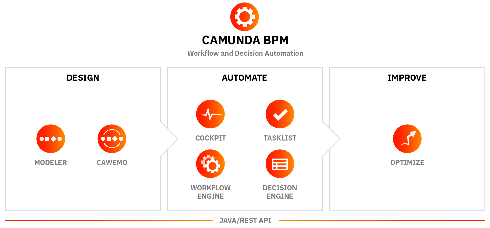
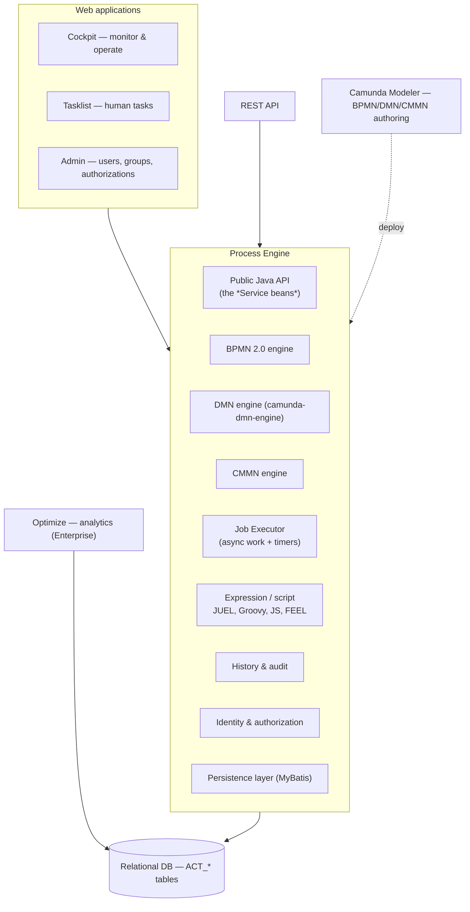
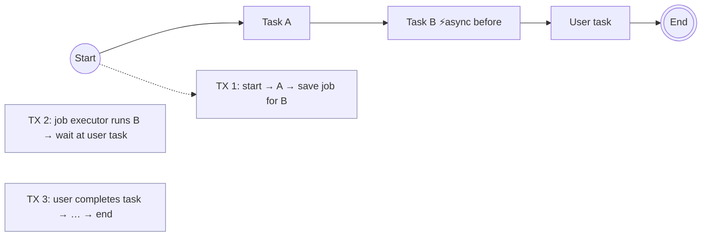

# 03 · Camunda 7 (Camunda BPM / Camunda Platform 7)

> The **embeddable, relational-database-backed** Java process engine. Still very widely deployed —
> many interviews are for maintaining or migrating C7 systems.
>
> 🔶 **Lifecycle note:** Camunda 7 is in maintenance mode; Camunda has announced end-of-life dates
> and the 7.2x line as the final minor releases. Always check Camunda's official EOL page before
> quoting dates — don't guess in an interview, say "it's in maintenance/EOL wind-down and new builds
> should target Camunda 8."

---

## 1. Defining characteristic: the engine is a library



Camunda 7 is a **JAR you put on your classpath**. The engine runs *inside your JVM*, in *your*
threads, participating in *your* transactions, against *your* relational database.

```
┌───────────────────────────────────────────────┐
│              Your Java application            │
│  ┌────────────────────────────────────────┐   │
│  │        Camunda 7 Process Engine        │   │
│  │  RuntimeService · TaskService · ...    │   │
│  │  Job Executor (thread pool)            │   │
│  └────────────────┬───────────────────────┘   │
│      same JVM     │  same transaction         │
│      your beans   │                           │
└───────────────────┼───────────────────────────┘
                    ▼
            ┌───────────────┐
            │  RDBMS        │  ACT_* tables
            │  (Postgres,   │  process defs, instances,
            │   Oracle, …)  │  variables, jobs, history
            └───────────────┘
```

**Consequence #1 (the superpower):** a `JavaDelegate` can call your `@Service`, write to your
business tables, and the process state change commits *in the same database transaction*. No
dual-write problem, no outbox pattern.

**Consequence #2 (the ceiling):** throughput is bounded by that one relational database. Scaling out
means more app nodes hammering the same DB with row locks and optimistic-locking retries.

### The three deployment topologies

| Topology                       | Description                                                                          | When                                          |
|--------------------------------|--------------------------------------------------------------------------------------|-----------------------------------------------|
| **Embedded**                   | Engine inside one app (Spring Boot starter is the common case)                       | Most modern C7 apps, microservice-per-process |
| **Shared / container-managed** | Engine installed in the app server (Tomcat/WildFly), shared by several deployed apps | Classic JEE estates                           |
| **Remote / standalone**        | Camunda runs as its own server (Camunda Run / distro); apps talk to it via **REST**  | Polyglot clients, non-Java teams              |

---

## 2. Core components



### 2.1 The engine services (memorise these — near-guaranteed question)

| Service                    | Responsibility                                                                                         | Signature examples                                                   |
|----------------------------|--------------------------------------------------------------------------------------------------------|----------------------------------------------------------------------|
| **`RepositoryService`**    | Deployments, process/decision **definitions**, suspend/activate definitions, fetch BPMN XML & diagrams | `createDeployment()`, `createProcessDefinitionQuery()`               |
| **`RuntimeService`**       | **Running** instances: start, signal, correlate messages, read/write variables, trigger execution      | `startProcessInstanceByKey()`, `correlateMessage()`, `setVariable()` |
| **`TaskService`**          | **User tasks**: query, claim, assign, complete, comments, attachments, identity links                  | `createTaskQuery()`, `claim()`, `complete()`                         |
| **`HistoryService`**       | Audit trail of finished/running items (separate `ACT_HI_*` tables)                                     | `createHistoricProcessInstanceQuery()`                               |
| **`IdentityService`**      | Users, groups, tenants; authentication                                                                 | `createUserQuery()`, `setAuthenticatedUserId()`                      |
| **`ManagementService`**    | Ops: jobs, incidents, job definitions, metrics, telemetry, DB schema                                   | `setJobRetries()`, `createJobQuery()`                                |
| **`AuthorizationService`** | Fine-grained permissions on resources                                                                  | `createAuthorization()`                                              |
| **`FormService`**          | Form keys, start/task form data & submission                                                           | `submitTaskForm()`                                                   |
| **`FilterService`**        | Saved task filters (Tasklist)                                                                          | `newFilter()`                                                        |
| **`ExternalTaskService`**  | Fetch & lock, complete, handle failures for **external tasks**                                         | `fetchAndLock()`, `complete()`                                       |
| **`DecisionService`**      | Evaluate DMN decisions directly                                                                        | `evaluateDecisionTableByKey()`                                       |
| **`CaseService`**          | CMMN case instances                                                                                    | `createCaseInstanceByKey()`                                          |

All are obtained from the `ProcessEngine`, and with the Spring Boot starter they're simply
`@Autowired` beans.

```java

@Service
public class OrderFacade {

    private final RuntimeService runtimeService;   // injected by camunda-bpm-spring-boot-starter
    private final TaskService taskService;

    public String startOrder(String orderId, BigDecimal amount) {
        ProcessInstance pi = runtimeService.startProcessInstanceByKey(
            "order-process",
            orderId,                                   // business key
            Map.of("orderId", orderId, "amount", amount));
        return pi.getId();
    }

    public void approve(String taskId, String userId) {
        taskService.claim(taskId, userId);
        taskService.complete(taskId, Map.of("approved", true));
    }
}
```

---

## 3. The database schema

Table prefixes — a favourite quick-fire question:

| Prefix        | Meaning                                                               | Examples                                                                                                     |
|---------------|-----------------------------------------------------------------------|--------------------------------------------------------------------------------------------------------------|
| **`ACT_GE_`** | **General** — deployments, byte arrays, schema version                | `ACT_GE_BYTEARRAY`, `ACT_GE_PROPERTY`                                                                        |
| **`ACT_RE_`** | **Repository** — static, versioned definitions                        | `ACT_RE_PROCDEF`, `ACT_RE_DEPLOYMENT`, `ACT_RE_DECISION_DEF`                                                 |
| **`ACT_RU_`** | **Runtime** — live state; rows are **deleted** when the instance ends | `ACT_RU_EXECUTION`, `ACT_RU_TASK`, `ACT_RU_VARIABLE`, `ACT_RU_JOB`, `ACT_RU_INCIDENT`, `ACT_RU_EVENT_SUBSCR` |
| **`ACT_HI_`** | **History** — append-only audit; survives instance completion         | `ACT_HI_PROCINST`, `ACT_HI_ACTINST`, `ACT_HI_TASKINST`, `ACT_HI_VARINST`, `ACT_HI_DETAIL`                    |
| **`ACT_ID_`** | **Identity** — users, groups, memberships                             | `ACT_ID_USER`, `ACT_ID_GROUP`                                                                                |

**`ACT_RU_EXECUTION` is the token table.** Each row is an execution (a token or a scope); the
parent/child hierarchy models nested scopes and parallel branches. `ACT_RU_JOB` holds async
continuations and timers. Understanding these two tables explains most C7 runtime behaviour.

### History levels 🔶

| Level      | What's recorded                              | Cost   |
|------------|----------------------------------------------|--------|
| `none`     | nothing                                      | lowest |
| `activity` | process & activity instances, task instances | low    |
| `audit`    | + variable updates (**default**)             | medium |
| `full`     | + user operation log, form properties        | high   |
| custom     | your own `HistoryEventProducer`              | —      |

History is the #1 cause of C7 database growth. Production checklist: set a **TTL**
(`historyTimeToLive` on the process definition) and enable the **history cleanup** job.

---

## 4. Implementing a service task

Four options in Camunda 7 — knowing all four and their trade-offs is a strong signal.

| Option                  | XML attribute                                                | Runs where                    | Notes                                                      |
|-------------------------|--------------------------------------------------------------|-------------------------------|------------------------------------------------------------|
| **Java class**          | `camunda:class="com.acme.MyDelegate"`                        | Engine JVM                    | Instantiated by the engine; no Spring injection            |
| **Delegate expression** | `camunda:delegateExpression="${myDelegate}"`                 | Engine JVM                    | Resolves a **Spring bean** — the idiomatic choice          |
| **Expression**          | `camunda:expression="${orderService.validate(orderId)}"`     | Engine JVM                    | Direct method call, result can be mapped to a variable     |
| **External task**       | `camunda:type="external"` + `camunda:topic="charge-payment"` | **Any process, any language** | Fetch-and-lock over REST; the forerunner of C8 job workers |

```java

@Component("chargePaymentDelegate")            // referenced as ${chargePaymentDelegate}
public class ChargePaymentDelegate implements JavaDelegate {

    private final PaymentClient client;

    @Override
    public void execute(DelegateExecution execution) {
        String orderId = (String) execution.getVariable("orderId");
        try {
            var receipt = client.charge(orderId);
            execution.setVariable("receiptId", receipt.id());
        } catch (CardDeclinedException e) {
            // Modelled BUSINESS error -> caught by a BPMN error boundary event
            throw new BpmnError("PAYMENT_DECLINED", e.getMessage());
        }
        // Any other RuntimeException -> retries, then an INCIDENT (technical failure)
    }
}
```

### External task pattern (the C7 → C8 bridge)

```java

@Component
@ExternalTaskSubscription("charge-payment")     // Spring Boot starter for external task client
public class ChargePaymentHandler implements ExternalTaskHandler {

    @Override
    public void execute(ExternalTask task, ExternalTaskService service) {
        try {
            service.complete(task, Map.of("receiptId", charge(task.getVariable("orderId"))));
        } catch (BusinessException e) {
            service.handleBpmnError(task, "PAYMENT_DECLINED");
        } catch (Exception e) {
            service.handleFailure(task, e.getMessage(), stackTrace(e),
                task.getRetries() == null ? 3 : task.getRetries() - 1,
                5000L /* retry timeout */);
        }
    }
}
```

> 💡 **Migration tip worth saying out loud:** if a C7 system already uses **external tasks**, the
> move
> to Camunda 8 job workers is largely mechanical — same fetch/complete/fail mental model. Systems
> built on `JavaDelegate` require real rework.

---

## 5. Transactions, wait states, and the job executor

This is *the* deep-knowledge area for C7 interviews.

### Transaction boundaries

The engine works in **transactions that run from one wait state to the next**. A wait state is
anywhere the engine persists and stops: user tasks, receive/message events, timers, and
**asynchronous continuations**.



### `asyncBefore` / `asyncAfter` — why you need them

Marking an activity async (the ⚡ lightning bolt in Modeler) creates a **job** in `ACT_RU_JOB`, ends
the current transaction, and lets the **job executor** pick the work up later.

Reasons to use it:

1. **Transaction scoping** — don't let one giant transaction span 20 activities.
2. **Retries** — only async work gets automatic retries + incidents. A failure in a *synchronous*
   delegate propagates to the caller (e.g. rolls back the REST call that started the instance).
3. **Save points** — the instance survives a crash at a known point.
4. **Load distribution** — jobs are picked up by any node in the cluster.
5. **Parallel branches genuinely running in parallel** — without async markers, a parallel gateway
   still executes branches **sequentially in one thread**. 🔶 This surprises almost everyone: BPMN
   parallelism is about *token* semantics, not threads.

> **Rule of thumb:** put `asyncBefore` on every activity that calls an external system, and after a
> parallel split.

### The job executor

- A **thread pool** that polls `ACT_RU_JOB` for acquirable jobs (due timers, async continuations,
  event-based jobs).
- **Acquisition** → **locking** (row is locked with an owner + lock expiry) → **execution** → delete
  or retry.
- On failure: `retries` decrement (default 3) and the job is retried with a backoff. When
  `retries = 0`, an **incident** is created and the job stops being retried until someone bumps
  retries (Cockpit → "Retry", or `ManagementService.setJobRetries`).
- Key tuning knobs: `maxJobsPerAcquisition`, `corePoolSize`/`maxPoolSize`, `queueSize`,
  `lockTimeInMillis`, `waitTimeInMillis`, `backoffTimeInMillis`, and **exclusive jobs**
  (jobs of the same process instance are not executed concurrently — prevents optimistic locking
  storms).

### Optimistic locking

Every row has a `REV_` (revision) column. Concurrent updates to the same execution cause an
`OptimisticLockingException`; the engine rolls back and retries the *job*. This is normal, expected
behaviour — but a high rate of it means contention (usually too many parallel branches on one
instance, or non-exclusive jobs).

### ❓ Interview angle

> *"A parallel gateway splits into three service tasks. Do they run in parallel?"*
> Not by default — the engine executes them sequentially in a single thread/transaction. Add
> `asyncBefore` to each branch so the job executor picks them up as separate jobs; then they can run
> concurrently (and, in a cluster, on different nodes).

---

## 6. Errors, incidents, and recovery

| Situation                                  | Mechanism                                                  | Where you see it         |
|--------------------------------------------|------------------------------------------------------------|--------------------------|
| `BpmnError` thrown                         | Caught by an error boundary event / error event subprocess | Normal flow, no incident |
| Unhandled `RuntimeException` in async work | Retries → **incident**                                     | Cockpit → Incidents      |
| Unhandled exception in **sync** work       | Propagates to caller, transaction rolls back               | Caller's error           |
| Timer/job stuck                            | `FAILED_JOB` incident                                      | Cockpit                  |
| Message can't be correlated                | `MismatchingMessageCorrelationException`                   | Caller / incident        |
| Custom incident                            | `runtimeService.createIncident(...)`                       | Cockpit                  |

Recovery actions in **Cockpit**: increment retries, modify the instance (move a token to another
activity — *process instance modification*), suspend, cancel, or migrate to a new definition
version.

### Versioning & migration

- Every deployment creates a new **version** of the process definition; **running instances stay on
  their original version** (a core BPMN-engine principle).
- To move them: **Process Instance Migration** (`RuntimeService.newMigration(...)`), mapping old
  activity IDs to new ones. Cockpit has a UI for this in the Enterprise edition.
- **Versioning strategies:** `versionTag`, `binding` on call activities (`latest`, `deployment`,
  `version`, `versionTag`) — a common design question for reusable subprocesses.

---

## 7. Web applications

| App             | Audience         | Does                                                                                                            |
|-----------------|------------------|-----------------------------------------------------------------------------------------------------------------|
| **Cockpit**     | Ops / developers | Monitor instances, inspect variables & tokens, resolve incidents, retry jobs, modify/migrate instances, suspend |
| **Tasklist**    | Business users   | Claim & complete user tasks, filters, embedded/external forms                                                   |
| **Admin**       | Administrators   | Users, groups, tenants, authorizations                                                                          |
| **Optimize** 💰 | Analysts         | Heatmaps, duration/bottleneck analysis, KPI dashboards, alerts (**Enterprise only**)                            |

🔶 Community vs Enterprise: batch operations, instance migration UI, Optimize, LDAP/SSO plugins, and
official support are Enterprise features. Worth knowing — interviewers check whether you understand
the licensing model.

---

## 8. Spring Boot integration

```groovy
// build.gradle (Camunda 7)
implementation 'org.camunda.bpm.springboot:camunda-bpm-spring-boot-starter-rest:7.23.0'
implementation 'org.camunda.bpm.springboot:camunda-bpm-spring-boot-starter-webapp:7.23.0'
runtimeOnly 'org.postgresql:postgresql'
```

```yaml
# application.yaml
camunda.bpm:
  admin-user: { id: demo, password: demo }
  filter.create: All tasks
  database.schema-update: true
  history-level: audit
  generic-properties.properties:
    historyTimeToLive: P30D
  job-execution:
    core-pool-size: 5
    max-pool-size: 20
```

Useful annotations/hooks: `@EnableProcessApplication`, `@Deployment(resources = ...)` (tests),
`ProcessEngineConfigurationImpl` customisation via a `ProcessEnginePlugin`, and
`@EventListener` on `DelegateExecution`-based execution/task listeners.

### Listeners

| Listener               | Attaches to                       | Fires on                                                        |
|------------------------|-----------------------------------|-----------------------------------------------------------------|
| **Execution listener** | Any flow element or sequence flow | `start`, `end`, `take`                                          |
| **Task listener**      | User tasks                        | `create`, `assignment`, `complete`, `delete`, `update`, timeout |

Use them for logging, metrics, and setting derived variables — **not** for business logic (they're
invisible in the diagram, which hurts the whole point of BPM).

---

## 9. Testing Camunda 7

```java

@SpringBootTest
@Deployment(resources = "bpmn/order-process.bpmn")
class OrderProcessTest {

    @Autowired
    RuntimeService runtimeService;

    @Test
    void shouldRouteHighValueOrdersToManager() {
        var pi = runtimeService.startProcessInstanceByKey(
            "order-process", Map.of("amount", 9_000));

        assertThat(pi).isWaitingAt("manager-approval");   // camunda-bpm-assert
        complete(task(), withVariables("approved", true));
        assertThat(pi).isEnded().hasPassed("ship-order");
    }
}
```

Toolbox: `camunda-bpm-assert` (fluent assertions), `ProcessEngineRule`/`@ExtendWith`, an in-memory
H2 engine, `Mocks.register(...)` to stub delegates, and `camunda-bpm-assert-scenario` for complex
multi-actor scenarios.

---

## 10. Camunda 7 strengths & limits (say both in an interview)

**Strengths**

- Same-transaction consistency with your business data — no dual-write problem.
- Extremely rich Java API, mature, huge amount of documentation and community answers.
- CMMN + DMN + BPMN in one engine.
- Embeddable → trivial to run in tests and CI, no external cluster needed.
- Direct SQL access to state and history (good for reporting, dangerous if abused).

**Limits**

- Throughput bounded by one relational DB; scaling out increases lock contention.
- Job executor polling adds latency and DB load.
- History tables grow aggressively; cleanup is an operational chore.
- Rolling upgrades and multi-DC operation are hard.
- Java-centric (external tasks mitigate this, but the engine is a JVM library).

➡️ Next: [`04-camunda-8.md`](04-camunda-8.md)

