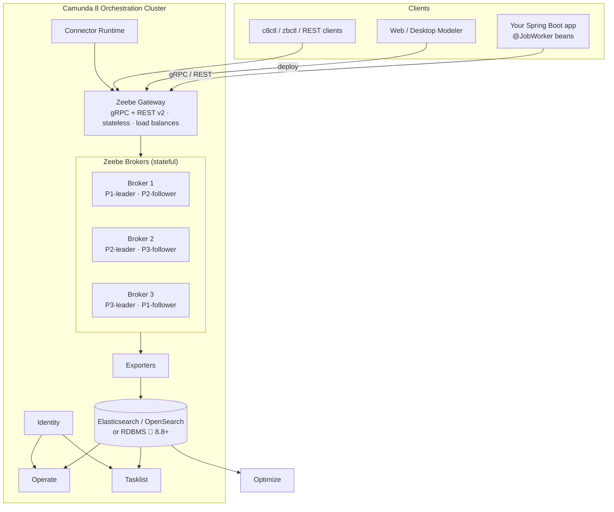
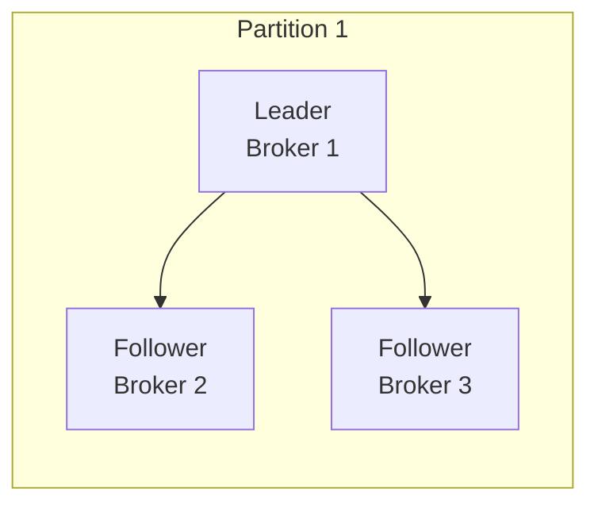
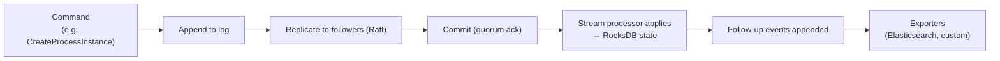
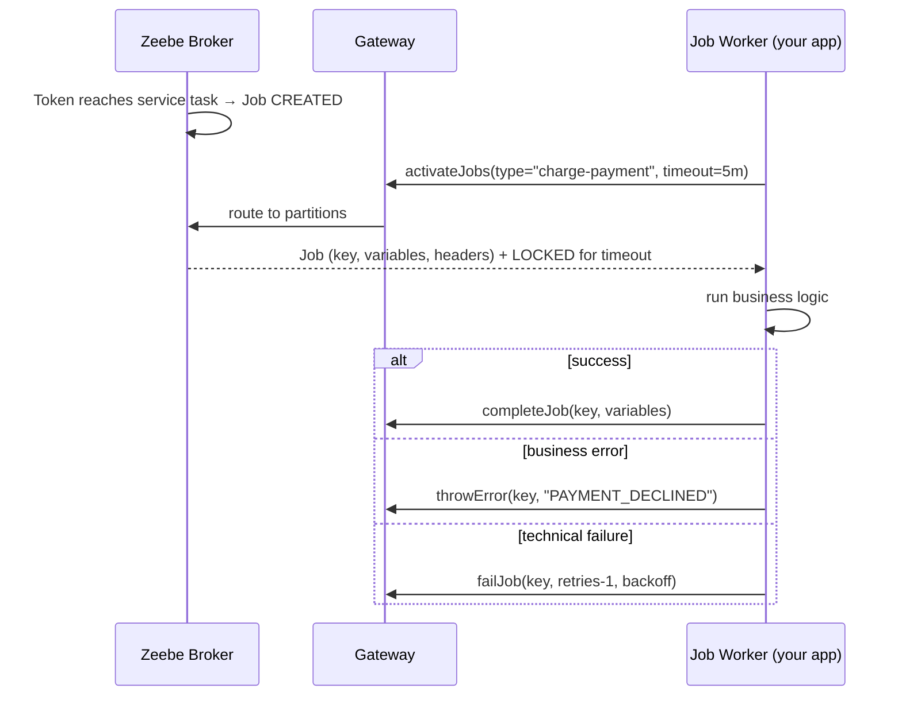

# 04 · Camunda 8 (Zeebe-based, cloud-native)

> The current flagship. **Not** an evolution of Camunda 7 — a clean-sheet rewrite around an
> event-sourced, horizontally scalable engine called **Zeebe**.
>
> 🔶 Written against 8.8+/8.10 conventions (unified *Orchestration Cluster*, REST API v2). Verify
> version-specific details at [docs.camunda.io](https://docs.camunda.io).

---

## 1. The one-sentence difference

**Camunda 7** = a library inside your app, storing state in a relational DB. **Camunda 8** = a
distributed cluster you connect to as a **client**, storing state in a replicated, partitioned
**event log** — with an **exporter** pushing data out to Elasticsearch/OpenSearch for querying.

```
        Camunda 7                              Camunda 8
   ┌────────────────┐                 ┌──────────────┐   ┌────────────────────┐
   │  Your app      │                 │  Your app    │   │  Camunda 8 cluster │
   │ ┌────────────┐ │                 │ ┌──────────┐ │   │  ┌──────────────┐  │
   │ │  ENGINE    │ │  ← embedded     │ │  CLIENT  │─┼───┼─▶│ Zeebe engine │  │
   │ └─────┬──────┘ │                 │ │ workers  │ │   │  └──────┬───────┘  │
   └───────┼────────┘                 │ └──────────┘ │   │         ▼          │
           ▼                          └──────────────┘   │   Elasticsearch    │
     ┌───────────┐                                       │   Operate/Tasklist │
     │  RDBMS    │                                       └────────────────────┘
     └───────────┘
```

---

## 2. Architecture overview



### ASCII fallback

```
Client (job workers, REST) ──► Gateway (stateless) ──► Brokers (partitions, Raft, RocksDB)
                                                              │
                                                          Exporter
                                                              ▼
                                                Elasticsearch / OpenSearch
                                                              │
                                        ┌────────────┬────────┴─────┬───────────┐
                                     Operate      Tasklist       Optimize     (APIs)
```

---

## 3. Zeebe internals — the part that impresses interviewers

### 3.1 Event sourcing on an append-only log

Zeebe does not store "the current state of instance X" as a mutable row. It appends **records** to a
log:

```
… ProcessInstance:ELEMENT_ACTIVATING → ELEMENT_ACTIVATED → Job:CREATED →
  Job:ACTIVATED → Job:COMPLETED → ProcessInstance:ELEMENT_COMPLETING → …
```

- **Commands** (intent to do something) and **events** (what happened) are both records.
- A **stream processor** reads the log sequentially and applies records to an embedded **RocksDB**
  key-value store that holds the *materialised* current state.
- Because the log is the source of truth, state can always be **rebuilt by replay** — that's what a
  restarting or newly-promoted broker does.

Why this is fast: **sequential appends**, no random-access row locking, no SQL round trips, no
distributed transactions in the hot path.

### 3.2 Partitions

A **partition** is an independent log + state machine — Zeebe's unit of parallelism (conceptually
like a Kafka partition or a database shard).

- Every process instance lives entirely **inside one partition** for its whole life.
- Partition assignment is by a **correlation/round-robin** scheme; message correlation is routed by
  hashing the correlation key so a message reaches the right partition.
- **More partitions = more throughput.** 🔶 The partition count is fixed **at cluster creation** and
  cannot be changed later without a migration — a well-known planning gotcha and a great thing to
  mention.
- Rough guidance: start with partitions ≈ number of brokers (or a small multiple); size for peak
  throughput, not average.

### 3.3 Replication with Raft

Each partition is replicated across brokers with the **Raft** consensus protocol.

| Concept                | Meaning                                                              |
|------------------------|----------------------------------------------------------------------|
| **Replication factor** | How many copies of each partition (must be **odd**: 1, 3, 5 …)       |
| **Leader**             | The single replica that processes commands for that partition        |
| **Follower**           | Replicas that receive the replicated log; can be elected leader      |
| **Quorum**             | Majority needed to commit — `(replicationFactor / 2) + 1`            |
| **Fault tolerance**    | Survives `(replicationFactor - 1) / 2` broker failures per partition |

With replication factor 3 you tolerate 1 broker loss per partition; with 5, two losses.



### 3.4 The processing pipeline



### 3.5 Exporters

Brokers keep only what they need to *run* processes. Everything you want to **query** (Operate,
Tasklist, Optimize, your own analytics) comes from an **exporter** streaming records out.

- Built-in: **Elasticsearch / OpenSearch** exporter. 🔶 8.8+ also supports an RDBMS-backed secondary
  storage option for simpler deployments.
- You can write **custom exporters** (Java, deployed onto the broker) to push records to Kafka, a
  data lake, etc.
- **Log compaction is gated by exporters:** the broker cannot delete log segments that haven't been
  exported yet. A stalled Elasticsearch = growing broker disk = eventual failure. **This is one of
  the most important C8 operational facts.**

### 3.6 Backpressure

If a broker can't keep up, it **rejects** commands with `RESOURCE_EXHAUSTED` instead of degrading
for everyone. Clients must retry with backoff (the official clients do). Seeing backpressure means
"scale partitions/brokers or slow the producers", not "the cluster is broken".

### ❓ Interview angle

> *"Why is Camunda 8 faster/more scalable than Camunda 7?"*
> Sequential append-only writes instead of random-access transactional row updates; state sharded
> across partitions with no cross-partition transactions; no shared relational DB in the hot path;
> replication via Raft instead of DB clustering; and queries served from a separate read model
> (Elasticsearch) so reporting load never touches the engine.

---

## 4. Component tour

| Component                      | Purpose                                                                                                        | Notes                                           |
|--------------------------------|----------------------------------------------------------------------------------------------------------------|-------------------------------------------------|
| **Zeebe Broker**               | The engine: stores the log, runs the stream processor, holds RocksDB state                                     | Stateful, clustered                             |
| **Zeebe Gateway**              | Client entry point (gRPC + REST v2), routes to the right partition, aggregates responses                       | **Stateless** — scale freely, put a LB in front |
| **Operate**                    | Monitor & operate instances: token view, variables, incidents, retries, cancel, **process instance migration** | Reads from Elasticsearch                        |
| **Tasklist**                   | Human task inbox + Camunda Forms                                                                               | Reads from Elasticsearch                        |
| **Optimize** 💰                | Analytics, heatmaps, KPIs, alerts, reports                                                                     | Enterprise/SaaS                                 |
| **Identity**                   | Users, groups, roles, tenants, OIDC/Keycloak integration, API clients                                          | RBAC and multi-tenancy                          |
| **Connectors runtime**         | Executes inbound & outbound connectors                                                                         | Runs as a job worker itself                     |
| **Web / Desktop Modeler**      | BPMN/DMN/Forms authoring, deploy & start, collaboration                                                        | Web Modeler is SaaS/Enterprise                  |
| **Elasticsearch / OpenSearch** | Secondary storage / read model                                                                                 | 🔶 or RDBMS in 8.8+                             |
| **Zeebe Gateway REST API v2**  | 🔶 8.8+ unified REST API replacing per-component APIs                                                          | The modern integration surface                  |

🔶 **8.8 consolidation:** Zeebe, Operate, Tasklist and Identity are packaged into a single
**Orchestration Cluster** application (one deployable, one API), which massively simplifies
self-managed installs. Older material describing four separate apps is pre-8.8.

---

## 5. Job workers — how your code participates

A **service task** in the model declares a **job type**. Workers subscribe to that type, receive
jobs, do the work, and report completion.



### The Spring Boot way (what this repository uses)

```java

@Component
public class ChargePaymentWorker {

    private final PaymentClient client;

    @JobWorker(type = "charge-payment")               // always set type explicitly
    public Map<String, Object> handle(
        ActivatedJob job,
        @Variable String orderId,
        @Variable BigDecimal amount) {

        var receipt = client.charge(orderId, amount);  // may throw
        return Map.of("receiptId", receipt.id());      // returned map = output variables
    }
}
```

Throwing a **business** error instead:

```java
throw new BpmnError("PAYMENT_DECLINED","Card was declined by issuer");
// → caught by an error boundary event / error event subprocess in the model
```

Any other exception → the job fails, retries decrement, and at 0 an **incident** appears in Operate.

### Worker configuration knobs

| Knob                           | Meaning                                                                                        | Typical pitfall                                                                                            |
|--------------------------------|------------------------------------------------------------------------------------------------|------------------------------------------------------------------------------------------------------------|
| `type`                         | Must match `zeebe:taskDefinition type` in the BPMN                                             | Typos = jobs pile up, task never executes                                                                  |
| `timeout`                      | How long the job stays locked                                                                  | Too short → the job is handed to another worker while the first is still running → **duplicate execution** |
| `maxJobsActive`                | In-flight jobs per worker                                                                      | Too high → memory pressure & timeouts                                                                      |
| `pollInterval` / **streaming** | 🔶 Modern clients use **job streaming** (push) with polling as a fallback → much lower latency | —                                                                                                          |
| `fetchVariables`               | Only fetch what you need                                                                       | Fetching everything wastes bandwidth and leaks data                                                        |
| `autoComplete`                 | Spring default: `true` — return value completes the job                                        | Set `false` for async/reactive completion                                                                  |
| `retries` (in BPMN)            | Attempts before an incident                                                                    | Default 3                                                                                                  |
| `backoff`                      | Delay before retry                                                                             | Use exponential backoff for flaky systems                                                                  |

### ⚠️ Idempotency — the single most important worker rule

Zeebe guarantees **at-least-once** job delivery. A network hiccup after your side effect but before
`completeJob` means the job will be delivered again. **Every worker must be idempotent** — use the
job key, an `idempotencyKey` variable, or a natural business key to deduplicate.

### ❓ Interview angle

> *"Your payment worker charged a customer twice. Why, and how do you fix it?"*
> Because job delivery is at-least-once and/or the job timeout expired mid-processing so the job was
> re-activated. Fix: make the charge idempotent (idempotency key sent to the PSP), size `timeout`
> above the realistic p99 duration, and keep worker logic short — long work should be handed off
> asynchronously with `autoComplete = false`.

---

## 6. Connectors

Instead of writing a worker for every integration, Camunda 8 ships **connectors**.

| Kind         | Direction                 | Example                                                                           |
|--------------|---------------------------|-----------------------------------------------------------------------------------|
| **Outbound** | Process → external system | REST, AWS Lambda, SendGrid, Slack, Kafka producer, GraphQL, **OpenAI / AI Agent** |
| **Inbound**  | External system → process | Webhook (start/intermediate), Kafka consumer, RabbitMQ, polling                   |
| **Protocol** | Generic building blocks   | HTTP REST, gRPC, SQS/SNS                                                          |
| **Custom**   | Yours                     | Built with the connector SDK + an **element template**                            |

Mechanically, an outbound connector is just a **job worker with a well-known type** (e.g.
`io.camunda:http-json:1`) that runs inside the **Connector Runtime**, plus an **element template**
(a JSON file) that gives the Modeler a friendly property panel.

**Decision rule (worth quoting):**

1. Is there an **OOTB connector**? Use it.
2. Is it a generic HTTP/API call? Use the **REST connector**.
3. Does it need custom logic, reuse across teams, or non-trivial auth? Build a **custom connector**
   (reusable, template-driven).
4. Does it need deep access to your own domain code/libraries? Write a **job worker**.

---

## 7. Expressions: FEEL everywhere

🔶 Camunda 8 uses **FEEL** (from the DMN standard) for *all* expressions — gateway conditions,
input/output mappings, timers, correlation keys, multi-instance collections, connector fields. There
is **no JUEL and no arbitrary scripting inside the broker** (a deliberate safety/scalability
decision).

```feel
= amount > 1000                                  // gateway condition
= order.customer.tier = "GOLD"                    // property access
= if approved then "APPROVED" else "REJECTED"     // conditional
= count(items) > 0                                // built-in function
= items[price > 100]                              // list filter
= for i in items return i.price * i.qty           // list projection
= date and time("2026-08-16T10:00:00@UTC")        // temporal
= duration("PT30M")                               // timer duration
```

Full reference in [`06-dmn-and-feel.md`](06-dmn-and-feel.md).

**Input/output mappings** (`zeebe:ioMapping`) keep variable scope clean:

```xml

<zeebe:ioMapping>
  <zeebe:input source="= order.id" target="orderId"/>
  <zeebe:output source="= result.receipt" target="receiptId"/>
</zeebe:ioMapping>
```

---

## 8. Variables & scopes

- Variables are **JSON**, stored per **scope** (process instance, subprocess, activity).
- A child scope can read parent variables; writes default to the **root** scope unless you use
  output mappings or `setVariables(local = true)`.
- **Keep them small.** 🔶 There are hard limits (record/message size, default max message size on the
  gateway). Large documents → store externally, pass an ID or URL. 8.8+ adds a **document handling**
  API for exactly this.

---

## 9. Messages & correlation

```xml

<bpmn:message id="PaymentReceived" name="payment-received">
  <bpmn:extensionElements>
    <zeebe:subscription correlationKey="= orderId"/>
  </bpmn:extensionElements>
</bpmn:message>
```

- **Message name + correlation key** identify the waiting instance.
- **Message TTL / buffering:** a published message can be buffered so it correlates with an instance
  that isn't waiting *yet* — a big improvement over naive designs.
- **`messageId`** provides deduplication within the TTL window.
- Only **one** instance may wait on a given (name, correlationKey) pair at a time; otherwise you get
  a correlation error.

---

## 10. Deployment & operations

| Option                             | What it is                                                              | Use for                                              |
|------------------------------------|-------------------------------------------------------------------------|------------------------------------------------------|
| **SaaS**                           | Camunda-hosted clusters                                                 | Fastest start; trials; production without ops burden |
| **Self-Managed — Helm/Kubernetes** | Official Helm charts                                                    | Production self-hosting                              |
| **Self-Managed — Docker Compose**  | Reference compose files                                                 | Local/dev, small demos                               |
| **Camunda 8 Run**                  | Single-JAR/script local distribution (what `camunda-local/` wraps here) | Local development — start in seconds                 |
| **CLI**                            | `zbctl` (classic) / `c8ctl` (modern)                                    | Deploy, start, inspect, resolve incidents            |

Operational essentials:

- **Sizing:** partitions ≥ desired parallelism, replication factor 3, **fast local SSD/NVMe disks**
  (the log is the hot path), generous RAM for RocksDB + page cache.
- **Elasticsearch is not optional** for Operate/Tasklist/Optimize — and if exporting stalls, broker
  disks fill. Monitor exporter lag.
- **Data retention:** configure ILM/retention in Elasticsearch and Operate's archiver; C8 has no
  `ACT_HI_*` cleanup job like C7.
- **Backups:** coordinated broker + Elasticsearch snapshot API — must be taken together.
- **Metrics:** Prometheus endpoints on brokers/gateway; watch backpressure rate, exporter lag,
  partition health, Raft leader changes, job activation latency.
- **Rolling upgrades:** supported broker-by-broker within a version window; check the upgrade
  matrix.

---

## 11. Security & multi-tenancy

- **Identity** manages users, groups, roles, and API clients; integrates with **Keycloak / OIDC**.
- Clients authenticate with **OAuth2 client credentials** (SaaS: client ID/secret → token) or run
  unauthenticated in simple local setups.
- **Multi-tenancy** is first-class: deployments, instances, and workers are tenant-scoped; a worker
  must declare which tenant (s) it serves.
- **RBAC / authorizations** 🔶 significantly expanded in 8.6–8.8 (resource-level permissions).

---

## 12. Testing: Camunda Process Test (CPT)

```java

@SpringBootTest
@CamundaSpringProcessTest                      // spins up an in-memory/Testcontainers engine
class OrderProcessTest {

    @Autowired
    CamundaClient client;

    @Test
    void routesHighValueOrderToManagerApproval() {
        var instance = client.newCreateInstanceCommand()
            .bpmnProcessId("order-process").latestVersion()
            .variables(Map.of("amount", 9_000))
            .send().join();

        CamundaAssert.assertThat(instance)
            .hasActiveElements("manager-approval")
            .hasVariable("tier", "VP");
    }
}
```

- **CPT** (`camunda-process-test-spring`) replaces C7's `camunda-bpm-assert`.
- Runs against a real engine (Testcontainers or an embedded runtime), so behaviour is authentic.
- **Scope tests to routing and coverage**, not to external-system data correctness — mock the
  workers/connectors.

---

## 13. AI agents (8.8+) 🔶

Camunda 8.8 introduced first-class **agentic orchestration**:

- **AI Agent Sub-process / AI Agent task** — an LLM decides which activities ("tools") to invoke.
- Built on the **ad-hoc subprocess**: the inner elements are the tool catalogue; the agent activates
  the ones it needs, receives results, and loops until a completion condition is met.
- Providers are pluggable (OpenAI, Anthropic, Bedrock, Azure OpenAI, or any **OpenAI-compatible**
  endpoint such as a local LiteLLM proxy).
- The value proposition: **the process model stays the guardrail** — the LLM can only call tools you
  modelled, and every decision is recorded in the audit log.

---

## 14. Camunda 8 strengths & limits

**Strengths**

- Horizontal scalability; very high throughput; predictable latency under load.
- Fault tolerant by design (Raft, no single DB).
- Polyglot: any language with a gRPC/REST client.
- Clean separation of write model (engine) and read model (Elasticsearch) → reporting never hurts
  execution.
- Rich connector ecosystem + AI agents.
- SaaS option removes ops entirely.

**Limits / trade-offs**

- **No embedded mode** — you always need a running cluster (local dev needs Camunda 8 Run/Docker).
- **No shared transaction with your business DB** → you must design for idempotency and eventual
  consistency.
- **No SQL access** to engine state; you query the REST API or Elasticsearch.
- **No CMMN**, no in-engine scripting, no JUEL.
- Operationally heavier when self-managed (brokers + gateway + Elasticsearch + Identity).
- Partition count is fixed at creation.

➡️ Next: [`05-camunda-7-vs-8.md`](05-camunda-7-vs-8.md)

