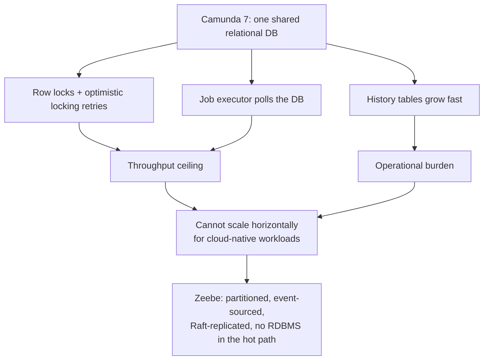
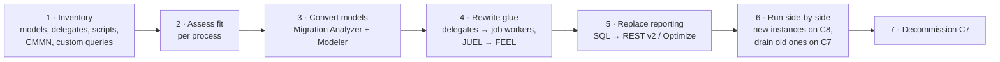

# 05 · Camunda 7 vs Camunda 8 — comparison & migration

> If an interviewer asks only **one** architecture question, it will probably be this one.

---

## 1. The 30-second answer

> "Camunda 7 is an **embeddable Java engine** backed by a **relational database** — the engine runs
> inside your application and shares its transactions. Camunda 8 is a **distributed, cloud-native
> engine (Zeebe)** that you connect to as a **client**; it stores state in a replicated, partitioned
> **event log** with RocksDB, and exports data to Elasticsearch for querying. The rewrite traded
> embeddability and same-transaction consistency for horizontal scalability, fault tolerance, and
> polyglot access."

---

## 2. Side-by-side

| Dimension           | **Camunda 7**                                                       | **Camunda 8**                                                                               |
|---------------------|---------------------------------------------------------------------|---------------------------------------------------------------------------------------------|
| Engine deployment   | Embedded library, shared container, or standalone                   | **Remote cluster only** (SaaS or self-managed)                                              |
| Core engine         | Camunda BPM (Activiti fork, 2013)                                   | **Zeebe** (clean-sheet, 2017)                                                               |
| State storage       | Relational DB (`ACT_*` tables)                                      | Append-only **event log** + **RocksDB**, Raft-replicated                                    |
| Query/read model    | Same DB (`ACT_HI_*`)                                                | **Elasticsearch/OpenSearch** (🔶 or RDBMS in 8.8+) via **exporters**                        |
| Scaling model       | Vertical; horizontal limited by the shared DB                       | **Horizontal** — add partitions & brokers                                                   |
| Transactions        | Shares your JTA/Spring transaction                                  | **No shared transaction** — design for idempotency                                          |
| Client protocol     | Java API (in-process) + REST                                        | **gRPC** + **REST API v2**                                                                  |
| Service task impl.  | `JavaDelegate`, expression, delegate expression, **external task**  | **Job worker** or **connector**                                                             |
| Async work          | Job executor polling `ACT_RU_JOB`, `asyncBefore/After` markers      | Jobs are inherent; **job streaming** (push) + polling                                       |
| Expression language | **JUEL** (`${...}`) + FEEL for DMN, plus Groovy/JS/Python scripting | **FEEL only** (`=...`); no in-engine scripting                                              |
| Standards           | BPMN + **DMN** + **CMMN**                                           | BPMN + **DMN** (❌ no CMMN)                                                                 |
| Human tasks         | Tasklist, Camunda Forms, embedded/external forms                    | Tasklist, Camunda Forms, user task API                                                      |
| Monitoring/ops      | **Cockpit**                                                         | **Operate**                                                                                 |
| Analytics           | Optimize 💰                                                         | Optimize 💰                                                                                 |
| Identity            | Admin webapp, LDAP plugins 💰                                       | **Identity** + Keycloak/OIDC, first-class RBAC                                              |
| Multi-tenancy       | Supported (tenant IDs)                                              | First-class across all components                                                           |
| Connectors          | Community/handwritten                                               | **Rich OOTB connector ecosystem** + inbound connectors                                      |
| AI agents           | ✖                                                                  | ✔ (8.8+, ad-hoc-subprocess based)                                                          |
| Local dev           | Trivial — in-memory H2 engine in a unit test                        | Needs a running cluster (**Camunda 8 Run**, Docker, Testcontainers)                         |
| Testing             | `camunda-bpm-assert`, `ProcessEngineRule`                           | **Camunda Process Test (CPT)**                                                              |
| Direct SQL on state | Possible (and often abused)                                         | ✖ — API/Elasticsearch only                                                                 |
| Licence model       | Community (Apache 2.0) + Enterprise                                 | 🔶 Source-available/commercial with a free tier & trial; Enterprise for production features |

---

## 3. Why the rewrite happened

The bottleneck was **architectural, not incidental**. You cannot incrementally turn a transactional,
single-database engine into a horizontally partitioned distributed system.

---

## 4. What you lose moving to Camunda 8 (be honest about this)

| Lost                       | Consequence                                           | Mitigation                                                    |
|----------------------------|-------------------------------------------------------|---------------------------------------------------------------|
| Embedded engine            | No in-JVM engine; local dev needs a cluster           | **Camunda 8 Run** / Testcontainers / SaaS dev cluster         |
| Shared transaction         | Dual-write risk between engine and your DB            | **Idempotent workers**, business keys, compensation/saga      |
| `JavaDelegate`             | All service-task code becomes a job worker            | Mechanical rewrite; external tasks map 1:1                    |
| Scripting in the engine    | No Groovy/JS/Python in script tasks                   | Move logic to workers/connectors; FEEL for simple expressions |
| JUEL `${...}`              | All expressions must be rewritten in FEEL `=...`      | Systematic model rewrite                                      |
| CMMN                       | Case models must be redesigned                        | **Ad-hoc subprocess**, event subprocesses, multi-instance     |
| SQL access to engine state | Custom reports break                                  | REST API v2, Elasticsearch, Optimize, custom exporter         |
| Some C7 API semantics      | `ProcessInstanceModification`, some query APIs differ | Operate operations + REST v2 equivalents                      |

---

## 5. What you gain

- Horizontal scalability and much higher throughput ceilings.
- Fault tolerance without a DB HA setup (Raft quorum).
- Reporting load fully isolated from execution.
- Polyglot workers (Java, Node, .NET, Python, Go, Rust…).
- Large connector catalogue; inbound connectors (webhooks, Kafka) remove glue services.
- SaaS operation; Kubernetes-native self-managed story.
- AI-agent orchestration with the model as a guardrail.

---

## 6. Migration strategy

Camunda's official guidance and practical experience converge on this:

### Key decisions

1. **Do not "lift and shift" instances.** There is **no in-place runtime migration** of live C7
   instances to C8. The standard pattern is **strangler / drain**: route *new* instances to C8, let
   C7 finish its in-flight work, then retire it. (Bespoke data migration is possible but expensive
   and rarely worth it.)
2. **Refactor while you migrate.** Models written for C7 often embed technical detail (async
   markers, JUEL, delegates) that has no C8 equivalent. Treat it as a redesign, not a translation.
3. **External tasks first.** Any C7 process already using external tasks is the cheapest to move.
4. **CMMN is a redesign, not a migration.** Budget for it explicitly.
5. **Tooling:** Camunda ships a **Migration Analyzer / diagram converter** that flags unsupported
   elements and rewrites what it can. It gets you ~70% there; the rest is judgement.

### Common conversion table

| Camunda 7                                      | Camunda 8                                              |
|------------------------------------------------|--------------------------------------------------------|
| `camunda:class` / `camunda:delegateExpression` | `zeebe:taskDefinition type="..."` + `@JobWorker`       |
| `camunda:type="external"` + topic              | `zeebe:taskDefinition type="<topic>"` (near 1:1)       |
| `camunda:expression="${svc.call()}"`           | Job worker or connector (no in-engine method calls)    |
| `${amount > 1000}` (JUEL)                      | `= amount > 1000` (FEEL)                               |
| `camunda:inputOutput`                          | `zeebe:ioMapping`                                      |
| Script task (Groovy/JS)                        | Job worker / connector (FEEL for trivial cases)        |
| `asyncBefore` / `asyncAfter`                   | Not needed — jobs are inherently async                 |
| `RuntimeService.startProcessInstanceByKey`     | `client.newCreateInstanceCommand().bpmnProcessId(...)` |
| `runtimeService.correlateMessage`              | `client.newPublishMessageCommand()`                    |
| Cockpit retry / modify                         | Operate retry / modify / migrate                       |
| `camunda-bpm-assert`                           | Camunda Process Test (`CamundaAssert`)                 |
| CMMN case                                      | Ad-hoc subprocess / event subprocesses                 |

---

## 7. Choosing for a *new* project

| Choose **Camunda 8** when                 | Choose **Camunda 7** when                                                                     |
|-------------------------------------------|-----------------------------------------------------------------------------------------------|
| Greenfield anything                       | You're extending an existing C7 estate short-term                                             |
| Cloud-native / Kubernetes / microservices | You genuinely require same-transaction consistency with a single DB                           |
| High throughput or unpredictable spikes   | You need CMMN and cannot redesign                                                             |
| Polyglot teams                            | Hard constraint: no external cluster allowed (fully embedded, e.g. shipped on-prem appliance) |
| You want OOTB connectors / AI agents      | —                                                                                             |

🔶 Given Camunda 7's maintenance/EOL trajectory, **new builds should target Camunda 8** unless there
is a hard blocker. Say this — it shows current awareness.

### ❓ Interview angle

> *"We have a 6-year-old Camunda 7 monolith with 40 processes. How would you approach Camunda 8?"*
> Inventory and classify first (external-task processes = cheap, JavaDelegate-heavy = medium,
> CMMN/scripting = redesign). Then strangler pattern: pick one low-risk, high-volume process,
> stand up a C8 cluster, rewrite its workers with idempotency, run it in parallel, prove the
> operational model (monitoring, retention, backups), and only then industrialise. Never attempt a
> big-bang instance migration.

➡️ Next: [`06-dmn-and-feel.md`](06-dmn-and-feel.md)

