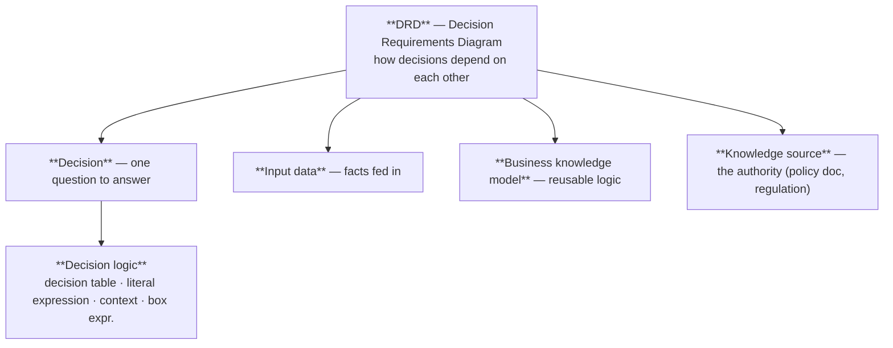
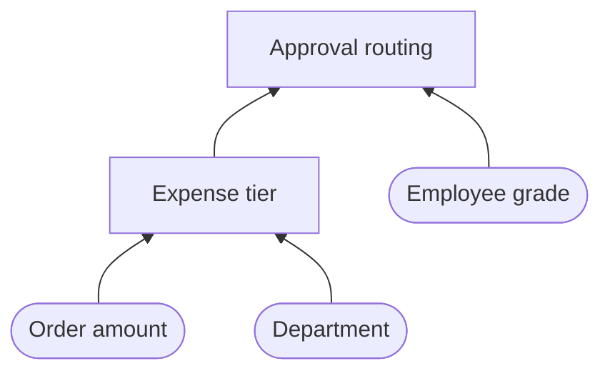

# 06 · DMN & FEEL

> DMN = the decision standard. FEEL = the expression language inside DMN, and — in Camunda 8 — the
> expression language for **everything**.

---

## Part A — DMN (Decision Model and Notation)

### 1. Why DMN exists

Business rules change far more often than process flows. Encoding them as BPMN gateways or Java
`if` chains means every rate change becomes a code deployment. DMN pulls them out into a **table a
business analyst can read, review, and edit**.

| Without DMN                                 | With DMN                                              |
|---------------------------------------------|-------------------------------------------------------|
| 12 nested gateways                          | 1 business rule task                                  |
| Rules buried in Java                        | Rules in a versioned, testable table                  |
| Developer needed for every threshold change | Analyst edits the table, redeploy the decision        |
| Unauditable                                 | Every evaluation recorded (decision instance history) |

### 2. The DMN pyramid



### 3. DRD elements

| Element                      | Shape                          | Meaning                                      |
|------------------------------|--------------------------------|----------------------------------------------|
| **Decision**                 | Rectangle                      | A question with a defined answer             |
| **Input data**               | Rounded/oval                   | A fact provided from outside                 |
| **Business knowledge model** | Rectangle with clipped corners | Reusable logic invoked by decisions          |
| **Knowledge source**         | Shape with a wavy bottom       | Where the authority for the rules comes from |
| **Information requirement**  | Solid arrow                    | "This decision needs that input/decision"    |

Decisions can be **chained**: `Discount` requires `Customer Tier`, which requires `Lifetime Spend`.
Camunda evaluates the whole DRD and returns the requested decision's result.



### 4. Anatomy of a decision table

```
┌──────────────────────────────────────────────────────────────────┐
│ Expense Approval Tier                                    [U]     │  ← hit policy
├──────┬───────────────────┬─────────────────┬─────────────────────┤
│  #   │ amount : number   │ dept : string   │ tier : string       │
│      │      INPUT        │     INPUT       │      OUTPUT         │
├──────┼───────────────────┼─────────────────┼─────────────────────┤
│  1   │ < 1000            │ -               │ "TEAM_LEAD"         │
│  2   │ [1000..5000)      │ -               │ "MANAGER"           │
│  3   │ >= 5000           │ "SALES"         │ "VP"                │
│  4   │ >= 5000           │ not("SALES")    │ "CFO"               │
└──────┴───────────────────┴─────────────────┴─────────────────────┘
```

| Part                         | Notes                                                                                           |
|------------------------------|-------------------------------------------------------------------------------------------------|
| **Input expression**         | A FEEL expression over the input variables (usually just the variable name)                     |
| **Input entry (unary test)** | The cell content — a *test*, not a value: `< 1000`, `[1..10]`, `"A","B"`, `not("X")`, `-` (any) |
| **Output entry**             | A FEEL **value** expression: `"VP"`, `amount * 0.1`                                             |
| **Hit policy**               | How multiple matching rules are resolved                                                        |
| **Annotation**               | Free-text column, ignored by the engine — great for documenting *why*                           |

### 5. Hit policies — memorise these

**Single-result policies**

| Code  | Name         | Behaviour                                                                                    |
|-------|--------------|----------------------------------------------------------------------------------------------|
| **U** | **Unique**   | Exactly one rule may match; overlapping rules = error. **Default & safest**                  |
| **A** | **Any**      | Multiple rules may match but must produce **identical** output; otherwise error              |
| **P** | **Priority** | Multiple may match; the highest-priority **output value** wins (ordered output list)         |
| **F** | **First**    | Multiple may match; the **first by row order** wins. Convenient, but order becomes semantics |

**Multi-result policies** (return a list)

| Code  | Name             | Behaviour                                        |
|-------|------------------|--------------------------------------------------|
| **R** | **Rule order**   | All matches, in row order                        |
| **C** | **Collect**      | All matches, unordered. Can carry an aggregator: |
|       | `C+`             | **Sum** of outputs                               |
|       | `C<`             | **Min**                                          |
|       | `C>`             | **Max**                                          |
|       | `C#`             | **Count**                                        |
| **O** | **Output order** | All matches, ordered by output priority          |

> ❓ **Very common question:** *"Difference between U and A?"* — With **Unique**, overlapping rules
> are a modelling error. With **Any**, overlap is allowed as long as every matching rule yields the
> same output. Both return a single result.
>
> **Design advice:** default to **U**. Reach for **F** only when order truly *is* the rule
> ("first matching discount wins"), and for **C+** when you're summing (e.g. total fees).

### 6. Unary test syntax (input cells)

| Cell                                   | Matches                                          |
|----------------------------------------|--------------------------------------------------|
| `-` or empty                           | anything                                         |
| `42`                                   | equals 42                                        |
| `"GOLD"`                               | equals "GOLD"                                    |
| `"GOLD","SILVER"`                      | in either                                        |
| `< 1000`, `>= 18`                      | comparison                                       |
| `[1000..5000]`                         | inclusive range                                  |
| `[1000..5000)`                         | 1000 inclusive, 5000 exclusive                   |
| `not(0)`, `not("X","Y")`               | negation                                         |
| `true` / `false`                       | boolean                                          |
| `< date("2026-01-01")`                 | temporal comparison                              |
| `?` (the input value) e.g. `? > limit` | reference the input explicitly for complex tests |

### 7. Other decision logic types

| Type                         | Use                                                          |
|------------------------------|--------------------------------------------------------------|
| **Decision table**           | 95% of cases                                                 |
| **Literal expression**       | A single FEEL expression: `= basePrice * (1 - discountRate)` |
| **Context**                  | Build a structured object: `{ tier: "GOLD", limit: 10000 }`  |
| **Invocation**               | Call a business knowledge model with bound parameters        |
| **Decision list / relation** | Rarely used boxed expressions                                |

### 8. DMN in Camunda

**Modelling:** Camunda Modeler (DMN editor) → `.dmn` file → deploy alongside your BPMN.

**Calling from BPMN — Business Rule Task:**

```xml
<!-- Camunda 8 -->
<bpmn:businessRuleTask id="route-expense" name="Route expense">
  <bpmn:extensionElements>
    <zeebe:calledDecision decisionId="expense-approval-tier"
      resultVariable="approvalTier"/>
  </bpmn:extensionElements>
</bpmn:businessRuleTask>
```

```xml
<!-- Camunda 7 -->
<bpmn:businessRuleTask id="route-expense"
  camunda:decisionRef="expense-approval-tier"
  camunda:mapDecisionResult="singleEntry"
  camunda:resultVariable="approvalTier"/>
```

🔶 Alternatively in Camunda 8 you can implement the business rule task as a **job worker** and call
the decision through the API — useful when the decision lives in another system.

**Calling programmatically:**

```java
// Camunda 7
DmnDecisionTableResult result = decisionService
        .evaluateDecisionTableByKey("expense-approval-tier")
        .variables(Map.of("amount", 7500, "dept", "SALES"))
        .evaluate();
String tier = result.getSingleResult().getSingleEntry();
```

```java
// Camunda 8 (REST/Java client)
var evaluation = client.newEvaluateDecisionCommand()
        .decisionId("expense-approval-tier")
        .variables(Map.of("amount", 7500, "dept", "SALES"))
        .send().join();
```

**Result mapping (C7 `mapDecisionResult`)** — another quick-fire question:

| Mapper           | Returns                                  |
|------------------|------------------------------------------|
| `singleEntry`    | One value (one row, one output column)   |
| `singleResult`   | A map (one row, several output columns)  |
| `collectEntries` | A list of values (many rows, one column) |
| `resultList`     | A list of maps (many rows, many columns) |

**Versioning & history:** decisions are versioned like process definitions, and each evaluation is
recorded as a **decision instance** — so you can prove *why* a decision came out the way it did.
That auditability is a major selling point in regulated industries.

---

## Part B — FEEL (Friendly Enough Expression Language)

🔶 In **Camunda 8**, FEEL is the *only* expression language: gateway conditions, ioMappings, timers,
correlation keys, multi-instance collections, connector fields, and DMN. In **Camunda 7**, FEEL is
used in DMN while the process engine uses **JUEL** (`${...}`).

**Syntax marker:** in Camunda 8 an expression begins with `=`. Everything after `=` is FEEL.

### 1. Data types

| Type                  | Literal                                    |
|-----------------------|--------------------------------------------|
| number                | `42`, `3.14`, `-7`                         |
| string                | `"hello"` (double quotes only)             |
| boolean               | `true`, `false`                            |
| null                  | `null`                                     |
| list                  | `[1, 2, 3]`, `["a", "b"]`                  |
| context (map/object)  | `{ name: "Ada", age: 36 }`                 |
| date                  | `date("2026-08-16")`                       |
| time                  | `time("10:30:00@Europe/Berlin")`           |
| date and time         | `date and time("2026-08-16T10:30:00@UTC")` |
| days-time duration    | `duration("PT2H30M")`                      |
| years-months duration | `duration("P1Y6M")`                        |

### 2. Operators

```feel
= a + b        = a - b       = a * b      = a / b      = a ** b
= a = b        = a != b      = a < b      = a >= b
= a and b      = a or b      = not(a)
= "abc" + "def"                              // string concat
= 5 in [1..10]                               // range membership
= x in ("A", "B")                            // set membership
= if score > 80 then "HIGH" else "LOW"       // conditional (always needs else)
```

⚠️ **`=` is equality in FEEL, not assignment.** `= amount = 100` reads as "is amount equal to 100".

### 3. Accessing data

```feel
= order.customer.name              // nested path
= order["customer"]                // bracket access
= items[1]                         // FIRST element — FEEL lists are 1-indexed!
= items[-1]                        // LAST element
= items[2..4]                      // sublist
```

⚠️ **1-based indexing** is a classic FEEL trap for developers.

### 4. Lists — filters, projections, quantifiers

```feel
= items[price > 100]                       // filter
= items[item.type = "BOOK"]                // filter on a property
= for i in items return i.price            // projection (returns a list)
= for i in items return i.price * i.qty
= some i in items satisfies i.price > 500  // any match?
= every i in items satisfies i.valid       // all match?
= count(items)
= sum(for i in items return i.price * i.qty)
```

### 5. Built-in functions (the ones you'll actually use)

**Lists:** `count`, `sum`, `min`, `max`, `mean`, `median`, `all`, `any`, `sort`, `append`,
`concatenate`, `contains`, `distinct values`, `flatten`, `index of`, `insert before`, `remove`,
`reverse`, `sublist`, `union`

**Strings:** `string length`, `substring`, `upper case`, `lower case`, `contains`, `starts with`,
`ends with`, `matches` (regex), `replace`, `split`, `string join`, `trim`, `string(x)` (to string)

**Numbers:** `abs`, `ceiling`, `floor`, `round up`, `round down`, `round half up`, `modulo`, `sqrt`,
`decimal(n, digits)`, `number("1.5")`

**Boolean/other:** `not`, `is defined(x)`, `get or else(x, default)`, `get value(context, key)`,
`context put`, `context merge`

**Temporal:** `now()`, `today()`, `date`, `time`, `date and time`, `duration`, `years and months
duration(from, to)`, `day of week`, `month of year`, `week of year`

### 6. Everyday Camunda recipes

```feel
= amount > 1000 and customer.tier = "GOLD"          // gateway condition
= if approved then "APPROVED" else "REJECTED"        // simple routing value
= is defined(discountCode)                           // guard for optional variables
= get or else(retryCount, 0) + 1                     // safe default
= order.items[quantity > 0]                          // filter a collection for multi-instance
= count(order.items)                                 // completion condition input
= duration("PT" + string(slaHours) + "H")            // dynamic timer duration
= date and time(dueDate)                             // timer date
= string(orderId)                                    // correlation key must be a string/number
= { total: sum(for i in items return i.price), currency: "EUR" }   // build an output object
= upper case(customer.country) = "DE"
= matches(email, "^[^@]+@[^@]+\\.[a-z]{2,}$")
```

### 7. Common FEEL mistakes

| Mistake                                  | Fix                                                                                            |
|------------------------------------------|------------------------------------------------------------------------------------------------|
| Forgetting the leading `=` in Camunda 8  | Without it the value is a literal string                                                       |
| Single quotes `'abc'`                    | FEEL requires **double quotes**                                                                |
| `if x then y` with no `else`             | `else` is **mandatory**                                                                        |
| Assuming 0-based lists                   | FEEL is **1-based**; `items[-1]` is the last                                                   |
| Using `==`                               | Equality is a single `=`                                                                       |
| Accessing a missing variable             | Returns `null` and can silently break conditions — guard with `is defined()` / `get or else()` |
| Spaces in built-in names look like typos | They're correct: `string length`, `distinct values`, `date and time`                           |
| Comparing a number to a string           | `"100" > 50` is invalid → null; convert with `number()`                                        |
| Long business logic in a condition       | Move it to a **DMN table**                                                                     |

### 8. Testing FEEL

- **Camunda Modeler** has an expression/FEEL evaluation panel.
- The **FEEL Playground** (play.camunda.io) evaluates expressions against sample JSON.
- 🔶 The FEEL engine is open source (`camunda/feel-scala`) and embeddable in unit tests.

---

## 9. Quick self-test

1. Hit policy for "sum all applicable fees"?
2. What does `-` mean in an input cell?
3. Why does `items[1]` return the first element?
4. `U` vs `A` vs `F`?
5. Write a FEEL expression: orders over 500 EUR placed by GOLD customers.
6. How do you avoid a null-variable failure in a gateway condition?

<details>
<summary>Answers</summary>

1. **`C+`** (Collect with sum aggregator).
2. "Any value" — this input doesn't constrain the rule.
3. FEEL lists are **1-indexed**.
4. **U**: exactly one rule may match (overlap = error). **A**: overlap allowed if outputs are
   identical. **F**: first matching row by order wins.
5. `= orders[amount > 500 and customer.tier = "GOLD"]`
6. `= get or else(amount, 0) > 1000` or guard with `= is defined(amount) and amount > 1000`.

</details>

➡️ Next: [`07-interview-qa.md`](07-interview-qa.md)

