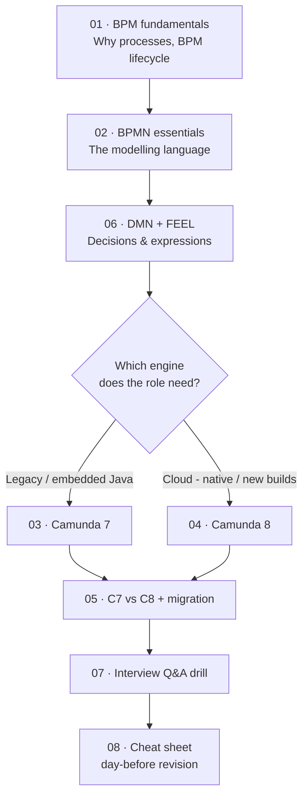

# Camunda Study Kit (BPM → Camunda 7 → Camunda 8)

A self-contained learning + interview-prep pack. **This folder is study material only** — it is not
part of the application build and does not affect the Spring Boot app or any BPMN deployment.

---

## 📚 Contents

| #  | Document                                                         | What it covers                                                                                                                       | Read time |
|----|------------------------------------------------------------------|--------------------------------------------------------------------------------------------------------------------------------------|-----------|
| 00 | **README.md** (this file)                                        | Roadmap, how to study, interview strategy                                                                                            | 5 min     |
| 01 | [`01-bpm-fundamentals.md`](01-bpm-fundamentals.md)               | What BPM is, the BPM lifecycle, BPMN vs DMN vs CMMN, orchestration vs choreography, **how Camunda originated**                       | 25 min    |
| 02 | [`02-bpmn-essentials.md`](02-bpmn-essentials.md)                 | Every BPMN element you need: events, tasks, gateways, subprocesses, pools/lanes, token semantics, patterns & pitfalls                | 45 min    |
| 03 | [`03-camunda-7.md`](03-camunda-7.md)                             | Camunda 7 architecture, engine services, job executor, DB schema, delegates, external tasks, Cockpit/Tasklist/Admin                  | 45 min    |
| 04 | [`04-camunda-8.md`](04-camunda-8.md)                             | Camunda 8 / Zeebe architecture, partitions & Raft, exporters, Operate/Tasklist/Optimize/Identity, job workers, connectors, AI agents | 60 min    |
| 05 | [`05-camunda-7-vs-8.md`](05-camunda-7-vs-8.md)                   | Side-by-side comparison, why the rewrite happened, migration strategy & gotchas                                                      | 25 min    |
| 06 | [`06-dmn-and-feel.md`](06-dmn-and-feel.md)                       | DMN decision tables, DRDs, hit policies, and a practical FEEL expression reference                                                   | 35 min    |
| 07 | [`07-interview-qa.md`](07-interview-qa.md)                       | ~90 interview questions with model answers, grouped by difficulty                                                                    | 60 min    |
| 08 | [`08-glossary-and-cheatsheet.md`](08-glossary-and-cheatsheet.md) | One-page glossary + rapid-recall cheat sheet                                                                                         | 15 min    |

---

## 🗺️ Suggested study path

**If you only have a few hours before the interview:** read `08` → `07` → skim `05`. **If the job
description says "Camunda 8" / "Zeebe":** prioritise `02`, `04`, `05`, `06`. **If it says "Camunda
BPM", "Camunda 7", "embedded engine", "JavaDelegate":** prioritise `02`, `03`, `06`.

---

## 🎯 How to use this for interview prep

1. **Read actively.** Every document has a `❓ Interview angle` callout — those are the exact
   framings interviewers use. Try answering *before* reading the explanation.
2. **Draw the diagrams from memory.** If you can sketch the Camunda 8 architecture (gateway →
   broker → partitions → exporter → Elasticsearch → Operate) on a whiteboard, you're ahead of most
   candidates.
3. **Know the "why", not just the "what".** Nobody is impressed that you know `RuntimeService`
   exists. They're impressed when you explain *why* Camunda 8 dropped the relational database and
   what that bought them (horizontal scale, no lock contention, event sourcing, replay).
4. **Have one war story per topic.** Even from a demo project: "I built an ad-hoc subprocess where a
   worker decided at runtime which branches to activate."
5. **Be honest about version boundaries.** Saying "that's Camunda 7 only — in Camunda 8 you'd model
   it as an ad-hoc subprocess instead of CMMN" scores very well.

---

## ⚠️ Version note

Written against **Camunda 8.8+ / 8.10** conventions (unified *Orchestration Cluster*, REST API v2)
and **Camunda 7.2x**. Camunda ships fast — always verify version-specific details against
[docs.camunda.io](https://docs.camunda.io) (Camunda 8) or
[docs.camunda.org](https://docs.camunda.org) (Camunda 7) before quoting exact numbers, EOL dates, or
API signatures in a real design decision.

Items that are genuinely version-sensitive are flagged inline with 🔶.

---

## 🧩 Diagram rendering

Diagrams use [Mermaid](https://mermaid.js.org/). They render natively on GitHub. In IntelliJ IDEA,
enable **Settings → Languages & Frameworks → Markdown → Mermaid** (install the extension when
prompted). Key architecture diagrams also include an ASCII fallback so nothing is lost in plain
text.

