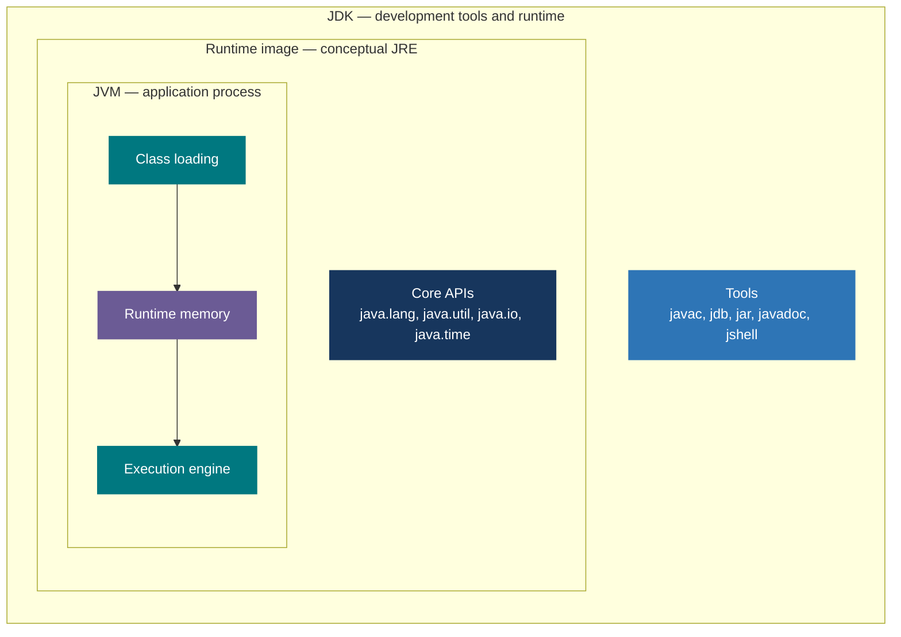
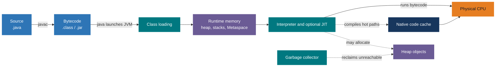
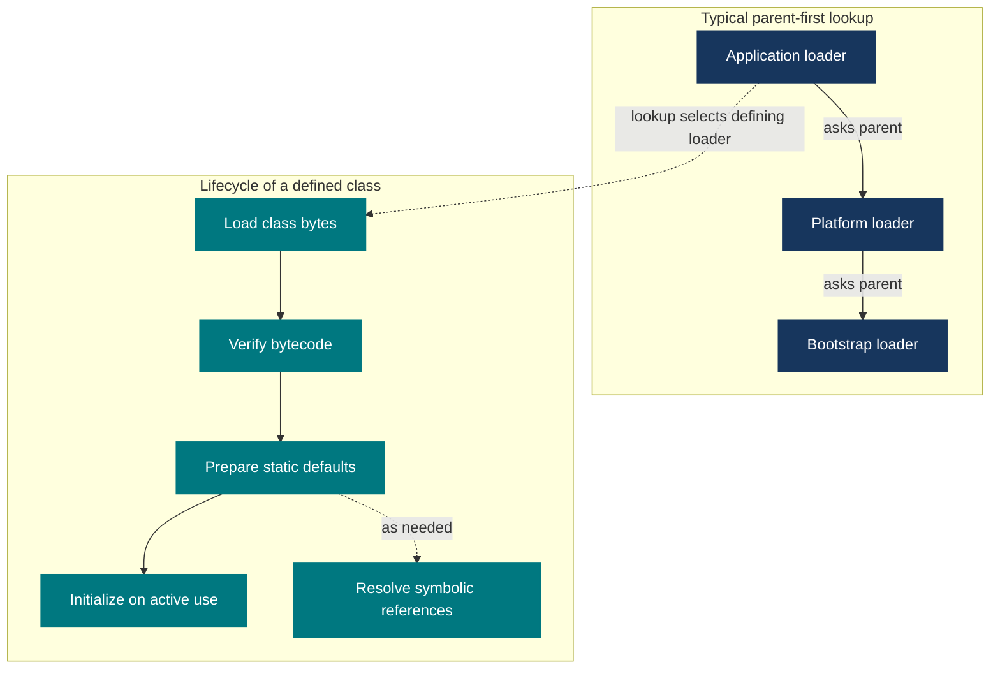
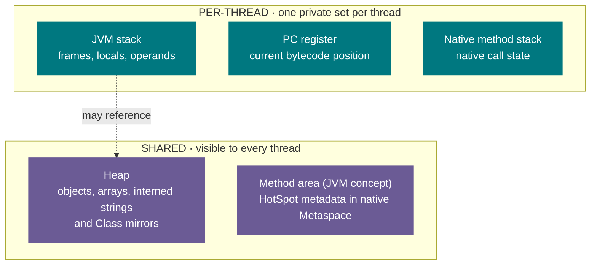
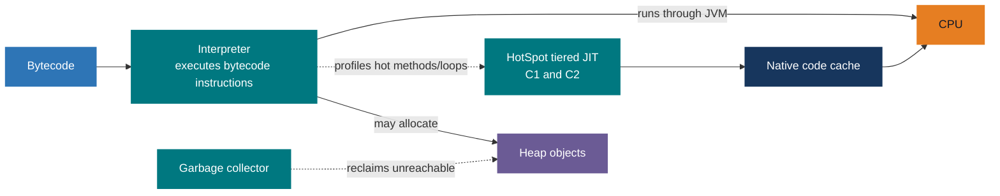
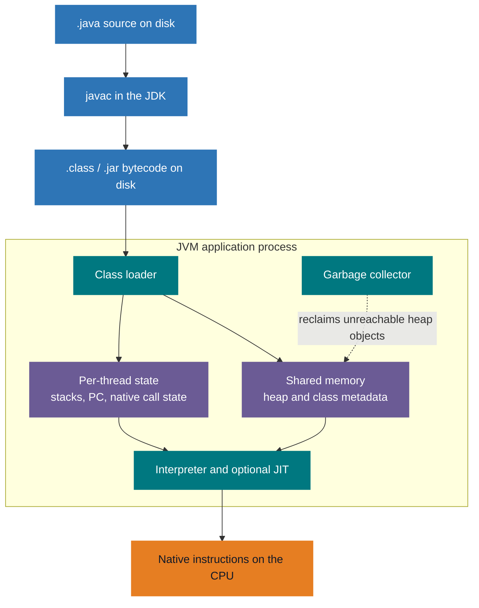

# Java Mastery — The Core Java Map

> **One-liner:** Write once, run anywhere with a **compatible JVM**. Your `.java` source compiles
> to portable bytecode; the JVM version must support that class-file version.
>
> This page is the visual **index** for the numbered Core Java track. Follow the
> [reading order](#reading-order) for all eight topic guides and the cheat sheet.
>
> **Prerequisites:** None. This is the entry point — start here.

**30-second revision:** `javac` builds portable `.class` files; a compatible JVM loads and
executes them. The conceptual layers are JDK → runtime → JVM. HotSpot may JIT-compile hot paths;
GC reclaims unreachable heap objects. Follow the eight topic guides, then the
[interview cheat sheet](09-core-java-cheat-sheet.md).

**Diagram key:** Blue = foundations/build; teal = JVM/runtime; purple = memory; navy =
supporting APIs; orange = outcomes and study priorities. Only nodes have custom fills;
subgraph boxes retain Mermaid's default appearance.

## At a glance

**JDK, runtime, and JVM are conceptual layers, not siblings or necessarily literal directories.**
The runtime was traditionally called the JRE; a separate JRE installation is uncommon today.



- **JDK** — tools to *develop* (`javac`, `jar`, debugger) plus everything needed to run.
- **Runtime / conceptual JRE** — standard libraries and a JVM; `jlink` can build a custom runtime image.
- **JVM** — the actual engine: it loads classes, manages memory, and runs the bytecode.

## Mental model

Think of shipping a parcel that any post office on Earth can deliver.

1. **You write a letter** in one language — `.java` source.
2. **`javac` translates it** into a universal format — `.class` **bytecode**. This is *ahead-of-time*: it happens once, on your machine, before anyone runs it.
3. **A compatible JVM is a local post office.** It interprets bytecode or JIT-compiles hot paths,
   using native instructions for its CPU/OS. Newer class files require a sufficiently new JVM.

That indirection — the JVM in the middle — is the whole trick behind *write once, run anywhere*. You
target the **JVM**, never a specific operating system. Everything else in this track (objects,
collections, threads, GC) is detail that lives *inside* that engine.

Where do the topic guides sit on this map? The architecture you see here is **one branch** —
[02-jvm-memory-gc.md](02-jvm-memory-gc.md). The [Core Java scope](#core-java-scope) section below shows
how much wider the territory is.

## How it works (under the hood)

Follow one program from a text file to the CPU. Four stages: **compile → load → lay out memory →
execute.**

### Stage 1 · Compile: source → bytecode

`javac` compiles ahead of runtime. The output is CPU-independent, but its class-file version
still constrains which JVM releases can load it.



> **Key insight:** `javac` always compiles source; the JIT **may** compile hot bytecode later.
> A short-lived application can run without any JIT-compiled application code.

### Stage 2 · Load: class → usable type

A class isn't usable the instant it's found on disk. It passes through three phases, and loaders
cooperate via **parent-first delegation**.



- **Loading** — find and read the raw `.class` bytes.
- **Linking** — **Verify** bytecode, **Prepare** static defaults, and **Resolve** symbolic names
  into direct references. Resolution can be lazy.
- **Initialization** — run `static {}` blocks and assign static initial values.

> **Delegation rule:** a loader first asks its **parent** to load a class. This keeps core types like
> `java.lang.String` trusted and stops user code from spoofing them.

### Stage 3 · Lay out memory: the runtime data areas

The JVM manages several memory areas. Some are **shared** across threads; others belong to each
thread. The actual memory layout depends on the implementation.



- **Heap** *(shared)* — the big pool of objects; the **Garbage Collector's** main battleground.
- **Method area / HotSpot Metaspace** *(shared)* — class metadata in native memory; static field
  values are associated with heap-resident `Class` mirrors, and interned strings are on the heap.
- **Stack / PC / Native stack** *(per-thread)* — created fresh per thread, so concurrency gets isolated workspaces.

### Stage 4 · Execute: interpreter, JIT, and GC



- **Interpreter** — zero warm-up, starts instantly, but slower per instruction.
- **JIT** — watches for "hot" code, compiles it to native machine code, and caches it for peak speed.
- **GC** — automatically reclaims unreachable Heap objects, so you never manage memory by hand.

Each stage above maps to a question — a handy table for orienting yourself:

| Stage | Question it answers | Go deeper |
|-------|---------------------|-----------|
| Component nesting | *What's actually inside a "Java install"?* | [#at-a-glance](#at-a-glance) |
| Compile-to-run | *What happens between `.java` and the CPU?* | [Build and run flow](README.md#from-java-source-to-a-running-application) |
| Runtime data areas | *Where does memory live while my program runs?* | [Memory areas](02-jvm-memory-gc.md#3-runtime-memory-shared-vs-per-thread) |
| Execution engine | *How does hot bytecode become native code?* | [Build and run flow](README.md#from-java-source-to-a-running-application) |
| Class loading | *How does a class go from file to usable type?* | [Build and run flow](README.md#from-java-source-to-a-running-application) |

## Code example

The whole pipeline above in three commands. This is the smallest program that exercises
**compile → load → execute** end to end.

```java
// Hello.java — one class, one method. The filename must match the public class name.
public class Hello {

    // The JVM looks for this exact signature to start the program.
    public static void main(String[] args) {
        // System.out is a PrintStream; println() is a method on PrintStream.
        System.out.println("Hello, JVM!");
    }
}
```

Build it once, then run it on a compatible JVM:

```bash
javac Hello.java     # Stage 1 — AOT compile: Hello.java  ->  Hello.class (portable bytecode)
java  Hello          # Stages 2-4 — JVM loads & verifies Hello.class, then runs main()
# -> Hello, JVM!

javap -c Hello       # Peek inside: disassemble the .class to see the actual bytecode instructions
```

- `javac` emits portable bytecode — the same `.class` can run across operating systems with
  compatible JVMs (and without incompatible native dependencies).
- `java Hello` starts the JVM, loads and verifies `Hello.class`, and executes `main()`.
  A short run may finish before application code gets hot enough to be JIT-compiled.
- `javap -c` makes the first gotcha below concrete: a `.class` holds **bytecode** instructions, not native machine code.

## Core Java scope

The architecture above is **one branch** (JVM and memory). These eight topic guides cover
the rest; the highlighted gap topics have short examples in the JVM guide.

```mermaid
flowchart TB
    CORE["Core Java interview scope"]
    CORE --> FOUND["Foundations"]
    CORE --> APIS["Collections and APIs"]
    CORE --> SYSTEM["Runtime and evolution"]
    FOUND --> LANG["Language and OOP<br/>values, strings, equality"]
    FOUND --> JVM["JVM memory<br/>collectors, leaks, OOM"]
    APIS --> COLLECTIONS["Collections and generics<br/>maps, sets, wildcards"]
    APIS --> EXCEPTIONS["Exceptions<br/>checked vs unchecked, cleanup"]
    APIS --> FUNCTIONAL["Functional Java<br/>lambdas, streams, Optional"]
    APIS --> IO["IO and files<br/>streams, NIO, serialization"]
    SYSTEM --> CONCURRENCY["Concurrency<br/>JMM, executors, virtual threads"]
    SYSTEM --> MODERN["Modern Java<br/>records, sealed, modules"]
    SYSTEM --> GAPS["Study gaps<br/>java.time, BigDecimal, reflection"]

    classDef build fill:#2E75B6,stroke:#2E75B6,color:#FFFFFF,stroke-width:2px
    classDef runtime fill:#007880,stroke:#007880,color:#FFFFFF,stroke-width:2px
    classDef memory fill:#6B5B95,stroke:#6B5B95,color:#FFFFFF,stroke-width:2px
    classDef support fill:#17365D,stroke:#17365D,color:#FFFFFF,stroke-width:2px
    classDef accent fill:#E67E22,stroke:#E67E22,color:#111827,stroke-width:2px
    class CORE,FOUND,LANG build
    class APIS,COLLECTIONS,EXCEPTIONS,FUNCTIONAL,IO support
    class SYSTEM,CONCURRENCY,MODERN runtime
    class JVM memory
    class GAPS accent
```



## Reading order

| Step | Numbered guide | Focus |
|---|---|---|
| 01 | [Language foundations and OOP](01-language-foundations-oop.md) | Values, strings, methods, equality, OOP. |
| 02 | [JVM memory and GC](02-jvm-memory-gc.md) | Runtime memory, collectors, leaks, OOM analysis and prevention. |
| 03 | [Collections and generics](03-collections-generics.md) | Interfaces, implementations, complexity, type erasure. |
| 04 | [Exceptions](04-exceptions.md) | Hierarchy, checked exceptions, resource cleanup. |
| 05 | [Functional Java](05-functional-java.md) | Lambdas, streams, functional interfaces, Optional. |
| 06 | [Concurrency](06-concurrency.md) | Java Memory Model, executors, virtual threads (Java 21). |
| 07 | [IO and files](07-io-files.md) | Byte/character streams, NIO, serialization. |
| 08 | [Modern Java](08-modern-java.md) | Modules, records, sealed types, pattern matching. |
| 09 | [Interview cheat sheet](09-core-java-cheat-sheet.md) | Final revision and high-priority gaps. |

## Conventions

- **Baseline:** Java 17 (LTS). Features newer than 17 are flagged inline (e.g. *virtual threads* arrived in Java 21).
- **One numbered file per topic.** The index and cheat sheet are short navigational companions.
- **Diagrams are inline Mermaid** with solid, high-contrast node colors and no custom subgraph fills.
- **Links stay within this numbered folder** so it remains usable if the original files are removed.
- **Terms** are introduced in the topic guides and condensed in the [cheat sheet](09-core-java-cheat-sheet.md).

## Gotchas & anti-patterns

- **"I'll just install the JRE to develop."** The JRE can only *run* code — it has no `javac`. You need the **JDK** to compile. (Modern JDKs ship the runtime inside them; a standalone JRE is now rare.)
- **"Bytecode is machine code."** No — bytecode is the *portable* intermediate format. The interpreter executes it; HotSpot may JIT-compile hot paths to native machine code.
- **"Objects live on the stack."** Ordinary objects usually live on the **heap**; a stack frame can hold a reference to one. JIT optimizations may eliminate an allocation.
- **"Static values and strings live in Metaspace."** In HotSpot, class metadata uses native Metaspace; static field values are associated with heap-resident `Class` mirrors, and interned strings live on the heap.
- **Cold-start surprise:** code is fast *after* warm-up. The first calls run **interpreted**; only "hot" paths get JIT-compiled. Benchmarks that ignore warm-up "work in dev, look terrible in the first prod second."

## Interview lens

- **Q: Difference between JDK, JRE, and JVM?**
  Conceptual layers. **JVM** runs bytecode; **runtime/JRE** = JVM + core libraries; **JDK** adds development tools. *Follow-up:* "What belongs in a runtime image?" → the modules and JVM it needs; use a JDK if compiling inside it.

- **Q: How does Java achieve platform independence?**
  Source compiles to portable **bytecode**; a platform-specific **JVM** interprets it or JIT-compiles hot paths. Bytecode needs a compatible JVM version and available dependencies. *Follow-up:* "Is the JVM platform-independent?" → No; its binary is built for an OS/CPU.

- **Q: Interpreter vs JIT — why have both?**
  The **interpreter** starts instantly (no warm-up); the **JIT** compiles frequently-run ("hot") methods to native code for peak throughput. Together: fast startup *and* fast steady state. *Follow-up:* "What are C1 and C2?" → tiered compilers — C1 (client) compiles quickly with light optimization, C2 (server) optimizes aggressively for long-running code.

- **Q: What does a class loader do, and what's parent-first delegation?**
  A loader locates and defines classes; the JVM links and initializes them. Built-in loaders
  usually ask a *parent* first, so user classpath entries do not override core classes.
  *Follow-up:* "Name the loaders" → Bootstrap → Platform → Application.

## 60-second recap

- **Java = bytecode + compatible JVM.** `javac` produces `.class` files; the JVM runs their supported class-file version.
- **JDK ⊃ runtime ⊃ JVM** — conceptual layers, not literal installation directories.
- **JVM pipeline:** Class Loader → Runtime Data Areas → Execution Engine.
- **Memory:** Heap + Metaspace are shared; Stack/PC/Native-stack are per-thread.
- **JIT is optional for a path:** `javac` compiles source; HotSpot can additionally compile hot bytecode to native code.
- **GC** reclaims Heap automatically — no manual `free()`.
- **This page is the map.** Follow the [reading order](#reading-order), then use the [cheat sheet](09-core-java-cheat-sheet.md) for recall.

---

## Appendix A — Complete architecture overview

The former ASCII architecture map is now an inline Mermaid diagram. The JVM's shared and
per-thread memory areas are distinct; GC acts on unreachable heap objects, not on the CPU.


