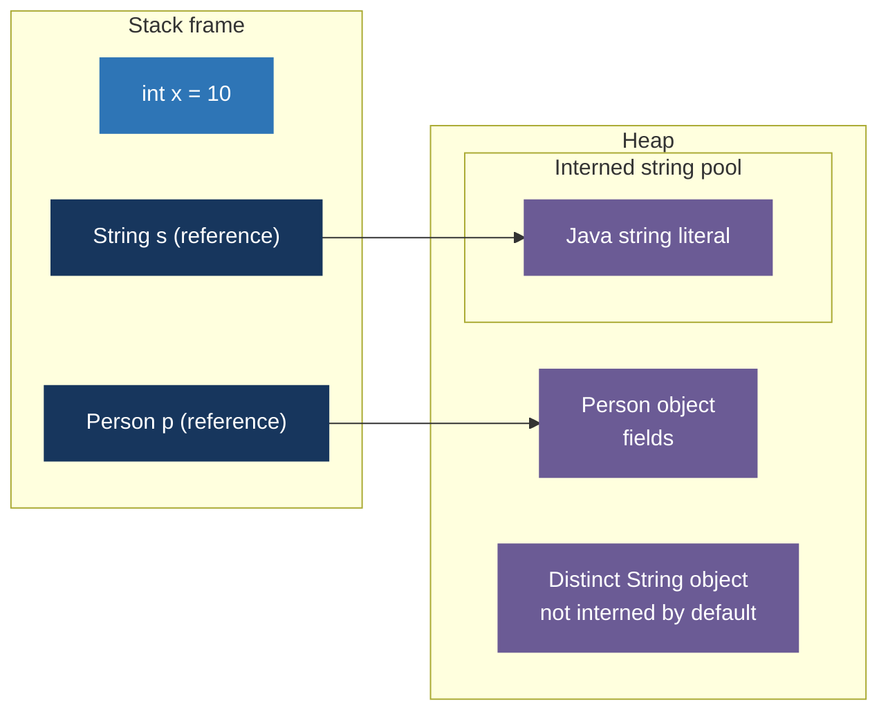

# Java Mastery - Language Foundations and OOP

> Goal: Build strong Java basics fast, then use OOP correctly in real code.
> This doc is a standalone companion to the [numbered Core Java index](00-core-java-index.md).

---

## 0) What this covers

1. How Java stores values: primitive widths, references, stack/heap basics, and typical HotSpot object layouts.
2. How Java code behaves: operators, control flow, methods, arrays.
3. Strings — exhaustive guide: `String`, `StringBuilder`, `StringBuffer`, pool, `intern()`, every interview-relevant method with examples.
4. Wrapper classes and autoboxing/unboxing (including common bugs).
5. OOP done right: class design, encapsulation, inheritance, polymorphism, abstraction, interfaces, the Object class, SOLID principles.
6. Modern OOP types: `record`, `enum`, `sealed`.
7. Interview questions woven throughout every topic.

---

## 1) Primitive vs Reference types (most important mental model)

### Primitive types
- Store the actual value directly (on the stack for local variables).
- Fixed size defined by the Java Language Specification (JLS) — except `boolean`.
- Types: `byte`, `short`, `int`, `long`, `float`, `double`, `char`, `boolean`.

### Memory sizes of primitive types

| Type      | Size              | Range / Notes                          |
|-----------|-------------------|----------------------------------------|
| `byte`    | 8 bits (1 byte)   | −128 to 127                            |
| `short`   | 16 bits (2 bytes) | −32,768 to 32,767                      |
| `int`     | 32 bits (4 bytes) | −2³¹ to 2³¹−1 (~2.1 billion)           |
| `long`    | 64 bits (8 bytes) | −2⁶³ to 2⁶³−1                          |
| `float`   | 32 bits (4 bytes) | IEEE 754 single-precision              |
| `double`  | 64 bits (8 bytes) | IEEE 754 double-precision              |
| `char`    | 16 bits (2 bytes) | 0 to 65,535 (Unicode UTF-16 code unit) |
| `boolean` | JVM-dependent*    | `true` / `false` only                  |

> **Are these sizes fixed?**
> Yes — for every type **except `boolean`**. The JLS specifies exact bit widths for `byte` through `double` and `char`. For `boolean`, the JLS says "the size is not precisely defined." In the HotSpot JVM a standalone `boolean` local variable is stored internally as a 4-byte `int` for word-alignment efficiency. A `boolean[]` array uses 1 byte per element.

### Reference types
- The variable stores a **reference** (a managed pointer) to an object on the heap.
- The reference itself is **4 bytes** with compressed object pointers (the 64-bit JVM default) or 8 bytes without.
- Types: `String`, arrays, all classes, interfaces, enums, records, wrapper classes.

### Memory sizes of wrapper classes

Every wrapper is a full heap object. On a typical 64-bit HotSpot JVM with compressed object pointers (default settings):

| Wrapper     | Primitive size | Object size (approx.) | Overhead vs primitive |
|-------------|----------------|-----------------------|-----------------------|
| `Byte`      | 1 byte         | 16 bytes              | 16×                   |
| `Short`     | 2 bytes        | 16 bytes              | 8×                    |
| `Integer`   | 4 bytes        | 16 bytes              | 4×                    |
| `Long`      | 8 bytes        | 24 bytes              | 3×                    |
| `Float`     | 4 bytes        | 16 bytes              | 4×                    |
| `Double`    | 8 bytes        | 24 bytes              | 3×                    |
| `Character` | 2 bytes        | 16 bytes              | 8×                    |
| `Boolean`   | JVM-dep.       | 16 bytes              | —                     |

> **Why the overhead?** Every Java object carries a 12-byte object header (8-byte mark word + 4-byte compressed class pointer). The actual field value is then padded to an 8-byte alignment boundary.
>
> **Are wrapper sizes fixed?** No — they are JVM-implementation-dependent. They vary based on whether compressed object pointers are enabled (`-XX:+UseCompressedOops`, the default for heaps ≤ 32 GB), the GC algorithm, and the JVM version. The numbers above are representative of OpenJDK/HotSpot on a modern 64-bit system.

**Key takeaway:** A boxed `Integer` costs roughly **4× the memory** of an `int`. In tight loops or large data structures this overhead matters — prefer primitive arrays or specialized collections (Eclipse Collections, Trove) when performance is critical.

### Memory layout (simplified)

- **Stack**: local primitive values and object references; LIFO; fast allocation/deallocation.
- **Heap**: ordinary objects (often created via `new`); managed by the Garbage Collector. JIT optimizations can eliminate some allocations.
- **String pool**: a logical pool of interned strings on the heap, not a separate physical heap region.
- **Metaspace**: HotSpot class metadata in native memory (replaces PermGen since Java 8). Static field values are associated with heap-resident `Class` mirrors.



> Java does not expose raw pointers like C/C++. You work with safe, GC-managed references.

### 🎯 Interview Questions — Primitives & Memory

- **Q: Why is `boolean` size undefined in Java?**
  A: The JLS leaves it to the JVM implementation for flexibility. HotSpot stores a `boolean` local variable as a 4-byte int internally; `boolean[]` elements use 1 byte each.

- **Q: Where are local variables stored — stack or heap?**
  A: Primitive local variables and object references live on the stack. The objects they point to live on the heap.

- **Q: What is the difference between `int` and `Integer`?**
  A: `int` is a primitive (~4 bytes on stack, no null). `Integer` is an object on the heap (~16 bytes, supports null, usable in generics and collections).

- **Q: Can primitives be null?**
  A: No. Only reference types can be null. Assigning null to an unboxed primitive causes a `NullPointerException`.

- **Q: What is the size of an object reference in Java?**
  A: 4 bytes with compressed object pointers (default on 64-bit JVMs for heaps ≤ 32 GB), 8 bytes otherwise.

- **Q: Why do Java collections like `List` and `Map` use wrapper types instead of primitives?**
  A: Java generics are implemented via **type erasure** — at runtime, `List<T>` becomes `List<Object>` internally. Every element must be an `Object`, and primitives (`int`, `double`, etc.) do not extend `Object` — they are not reference types, have no methods, and cannot be stored where an `Object` is required. Wrapper types (`Integer`, `Double`, etc.) bridge this gap. The compiler hides the cost through autoboxing (`list.add(5)` → `list.add(Integer.valueOf(5))`), but each boxed value is a separate heap object (~16 bytes vs. 4 bytes for `int`). **Project Valhalla** (upcoming Java feature) aims to fix this by introducing primitive generics, allowing `List<int>` without boxing.

---

## 2) Variables, conversions, and operators

### Variables and initialization
- Local variables must be initialized before use (compiler enforces).
- Instance fields get default values: `0`, `0.0`, `false`, `'\u0000'`, `null`.
- Static fields also receive defaults.

### Numeric conversion rules
- **Widening (implicit, safe):** `byte → short → int → long → float → double`
- **Narrowing (explicit cast, possible data loss):** `double → int` requires `(int)` cast.

```java
int a = 10;
long b = a;            // widening — automatic
int c = (int) 3.9;     // narrowing — truncates to 3 (not rounded)
byte d = (byte) 200;   // overflow — wraps to -56
```

### Operator essentials

| Category                    | Operators                                |
|-----------------------------|------------------------------------------|
| Arithmetic                  | `+ - * / %`                              |
| Comparison                  | `== != > < >= <=`                        |
| Logical (short-circuit)     | `&& \|\| !`                              |
| Bitwise / non-short-circuit | `& \| ^ ~ << >> >>>`                     |
| Assignment                  | `= += -= *= /= %=`                       |
| Ternary                     | `condition ? valueIfTrue : valueIfFalse` |
| Type check                  | `instanceof`                             |

**Integer division truncates toward zero:**
```java
System.out.println(5 / 2);    // 2
System.out.println(5 / 2.0);  // 2.5
System.out.println(-7 / 2);   // -3  (truncates, does NOT floor)
System.out.println(5 % 2);    // 1
System.out.println(-5 % 2);   // -1  (sign follows dividend in Java)
```

## 3) Control flow and methods

### Control flow
- `if / else if / else`: conditional branching.
- `switch` (classic statement or modern expression): multi-branch selection.
- Loops: `for`, enhanced `for-each`, `while`, `do-while`.
- Loop control: `break`, `continue`, labeled `break`/`continue`, `return`.

**Modern switch expression (Java 14+):**
```java
int day = 3;
String name = switch (day) {
    case 1 -> "Monday";
    case 2 -> "Tuesday";
    case 3 -> "Wednesday";
    default -> "Other";
};
```

### Methods
- Java is **always pass-by-value**.
- For primitives: a copy of the value is passed. The caller variable is unchanged.
- For objects: a copy of the **reference** is passed. Both caller and callee point to the same object — mutations through the reference affect the caller's object, but reassigning the local reference does not.

```java
static void changePrimitive(int x) { x = 99; }          // caller's int unchanged

static void mutateObject(StringBuilder sb) {
    sb.append("!");                                       // caller's object IS mutated
}

static void reassignRef(StringBuilder sb) {
    sb = new StringBuilder("new");                       // caller's reference unchanged
}
```

### Varargs
```java
static int sum(int... numbers) {   // varargs: numbers is treated as int[]
    int total = 0;
    for (int n : numbers) total += n;
    return total;
}
sum(1, 2, 3);    // 6
sum();            // 0 — empty array, not null
```

### 🎯 Interview Questions — Methods

- **Q: Is Java pass-by-value or pass-by-reference?**
  A: Always pass-by-value. For objects, the value passed is a copy of the reference (not a raw memory address exposed by Java). Mutating the object through the reference affects the caller, but reassigning the parameter does not.

- **Q: Can you overload a method by changing only the return type?**
  A: No. The compiler cannot distinguish overloads by return type alone — a call site like `foo()` would be ambiguous.

- **Q: What is the difference between `break` and `continue`?**
  A: `break` exits the loop entirely. `continue` skips the rest of the current iteration and moves to the next.

---

## 4) Strings — Exhaustive Guide

This section consolidates everything about `String`, `StringBuilder`, and `StringBuffer` that matters for coding interviews and real-world Java.

---

### 4.1 String fundamentals

#### Immutability
`String` objects are **immutable** — once created, their character sequence can never change. Every apparent "modification" returns a brand-new `String` object.

```java
String s = "hello";
s.toUpperCase();         // returns new "HELLO"; s is still "hello"
s = s.toUpperCase();     // now s points to "HELLO"
```

**Why immutable?**
- **Thread-safe by default** — no synchronization needed for shared strings.
- **String pool efficiency** — safe to share one pooled object among many references.
- **hashCode caching** — computed once and cached inside the object; crucial for use as `HashMap` keys.
- **Security** — class names, file paths, DB URLs cannot be altered after validation.

#### The String pool (interned strings)
When you write a string literal, the JVM stores it in the **String pool** (a dedicated region of the heap since Java 7; was in PermGen before).

- Subsequent literals with identical value reuse the same pooled object.
- `new String("x")` bypasses the pool and creates a fresh heap object.

```java
String a = "java";
String b = "java";
String c = new String("java");

System.out.println(a == b);       // true  — same pooled object
System.out.println(a == c);       // false — c is a different heap object
System.out.println(a.equals(c));  // true  — same content
```

#### `intern()` — explicitly pooling a string

`intern()` returns the canonical pooled instance for a string's content.
- If the pool already contains an equal string, that pooled reference is returned.
- If not, this string is added to the pool and its reference is returned.

```java
String x = new String("hi");    // heap object, NOT in pool
String y = x.intern();          // adds "hi" to pool (or returns existing entry)
String z = "hi";                // literal — uses same pool entry

System.out.println(x == z);     // false — x is the heap copy
System.out.println(y == z);     // true  — y IS the pooled instance
System.out.println(x.equals(z));// true  — content is the same

// Practical use: deduplicating millions of repeated strings
// e.g., parsing large CSV files where the same value appears many times
String status = rawValue.intern(); // all equal values now share one object
```

> **When to use `intern()`?** Rarely. In modern Java, prefer `equals()` for comparisons. `intern()` is useful only in memory-critical scenarios with huge numbers of repeated strings (e.g., analytics engines parsing logs at scale).

#### `==` vs `equals()` vs `compareTo()`

| Method                | What it checks                                                              |
|-----------------------|-----------------------------------------------------------------------------|
| `==`                  | Reference identity — are they the same object in memory?                    |
| `.equals()`           | Content equality — same character sequence?                                 |
| `.equalsIgnoreCase()` | Content equality ignoring case                                              |
| `.compareTo()`        | Lexicographic order; returns 0 (equal), negative (less), positive (greater) |

```java
String s1 = "Apple";
String s2 = "apple";
System.out.println(s1.equals(s2));             // false
System.out.println(s1.equalsIgnoreCase(s2));   // true
System.out.println(s1.compareTo(s2));          // negative ('A'=65 < 'a'=97 in Unicode)
System.out.println("banana".compareTo("apple")); // positive
System.out.println("cat".compareTo("cat"));    // 0
```

---

### 4.2 Key String methods for coding interviews

#### Length and character access

```java
String s = "Hello, World!";

s.length();           // 13
s.charAt(0);          // 'H'
s.charAt(7);          // 'W'
s.toCharArray();      // ['H','e','l','l','o',',',' ','W','o','r','l','d','!']
s.isEmpty();          // false — true only when length() == 0
s.isBlank();          // false — true when empty or contains only whitespace (Java 11+)

"".isEmpty();         // true
"   ".isEmpty();      // false
"   ".isBlank();      // true
```

#### Searching

```java
String s = "abcabc";

s.indexOf('b');           // 1  — first occurrence index
s.indexOf('b', 2);        // 4  — first occurrence at or after index 2
s.lastIndexOf('b');       // 4  — last occurrence index
s.indexOf("ca");          // 2  — first occurrence of substring
s.contains("bc");         // true
s.startsWith("ab");       // true
s.endsWith("bc");         // true
s.startsWith("bc", 1);    // true — starts with "bc" at position 1

s.indexOf('z');            // -1 — not found
```

#### Extracting substrings

```java
String s = "Hello, World!";

s.substring(7);           // "World!" — from index 7 to end (inclusive start)
s.substring(7, 12);       // "World"  — [7, 12) — start inclusive, end exclusive
s.substring(0, 5);        // "Hello"
```

> **Interview tip:** `substring` range is `[start, end)` — a common source of off-by-one bugs.

#### Case and whitespace

```java
String s = "  Hello World  ";

s.toLowerCase();          // "  hello world  "
s.toUpperCase();          // "  HELLO WORLD  "
s.trim();                 // "Hello World"  — removes leading/trailing ASCII whitespace (≤ '\u0020')
s.strip();                // "Hello World"  — Unicode-aware trim (Java 11+, preferred)
s.stripLeading();         // "Hello World  " (Java 11+)
s.stripTrailing();        // "  Hello World" (Java 11+)
```

#### Replace and regex

```java
String s = "hello world";

// Literal replacement — replaces ALL occurrences
s.replace('l', 'r');                    // "herro worrd"
s.replace("world", "Java");            // "hello Java"

// Regex replacement
"a1b2c3".replaceAll("[0-9]", "");       // "abc"   — remove all digits
"a1b2c3".replaceFirst("[0-9]", "");     // "ab2c3" — remove only the first digit

// replace vs replaceAll:
// replace(CharSequence, CharSequence) — literal string matching, replaces ALL
// replaceAll(String regex, String)    — regex matching, replaces ALL
// replaceFirst(String regex, String)  — regex matching, replaces FIRST only
```

#### Split and join

```java
String csv = "one,two,three";

String[] parts = csv.split(",");           // ["one", "two", "three"]
String[] limited = csv.split(",", 2);      // ["one", "two,three"] — at most 2 parts

// Joining
String.join(", ", "a", "b", "c");          // "a, b, c"
String.join("-", parts);                   // "one-two-three"

// With a list
List<String> words = List.of("foo", "bar");
String.join(" | ", words);                 // "foo | bar"
```

#### Formatting

```java
String.format("Name: %s, Age: %d, GPA: %.2f", "Alice", 20, 3.875);
// "Name: Alice, Age: 20, GPA: 3.88"

// Format specifiers quick reference:
// %s   — String      %d  — int/long    %f  — float/double
// %c   — char        %b  — boolean     %n  — newline (platform-safe)
// %.2f — 2 decimal places              %05d — zero-padded to width 5

// Text blocks (Java 15+) — multi-line strings, no escape hell
String json = """
        {
            "name": "Alice",
            "age": 20
        }
        """;
```

#### Type conversions

```java
// Primitive → String
String.valueOf(42);            // "42"
String.valueOf(3.14);          // "3.14"
String.valueOf(true);          // "true"
String.valueOf('x');           // "x"
Integer.toString(42);          // "42"
Integer.toString(255, 16);     // "ff" — base 16
"" + 42;                       // "42" — concatenation trick (avoid in loops)

// String → Primitive
int i    = Integer.parseInt("42");
long l   = Long.parseLong("9999999999");
double d = Double.parseDouble("3.14");
boolean b = Boolean.parseBoolean("true"); // case-insensitive; "TRUE" → true
char c   = "hello".charAt(0);            // 'h'
```

#### Matching with regex

```java
"hello123".matches("[a-z]+\\d+");   // true  — checks ENTIRE string
"hello".matches("\\d+");           // false
"abc123".matches(".*\\d.*");       // true  — contains at least one digit
```

#### Useful Character utility methods (critical in interview problems)

```java
char ch = 'A';
Character.isLetter(ch);        // true
Character.isDigit('5');        // true
Character.isLetterOrDigit(ch); // true
Character.isWhitespace(' ');   // true
Character.isUpperCase(ch);     // true
Character.isLowerCase(ch);     // false
Character.toUpperCase('a');    // 'A'
Character.toLowerCase('A');    // 'a'

// Converting char ↔ int for frequency array tricks
int idx = 'c' - 'a';          // 2 — index in a 26-element frequency array
char back = (char)('a' + 2);   // 'c'
```

---

### 4.3 String concatenation internals

- **Compile-time literal folding:** `"a" + "b"` → the compiler collapses to `"ab"` at compile time — no runtime allocation.
- **Runtime (Java 9+):** The JVM uses `invokedynamic` + `StringConcatFactory`, which is highly optimized for small, fixed-shape concatenations outside loops.
- **In a loop:** Each `+` creates an intermediate `String`, leading to O(n²) time and memory. Always use `StringBuilder` instead.

```java
// BAD — O(n²): each += copies all previous characters
String result = "";
for (String word : words) result += word;

// GOOD — O(n)
StringBuilder sb = new StringBuilder();
for (String word : words) sb.append(word);
String result = sb.toString();
```

---

### 4.4 StringBuilder — mutable, single-threaded

`StringBuilder` is the go-to tool for building strings dynamically. It maintains an internal `char[]` buffer that grows automatically.

```java
StringBuilder sb  = new StringBuilder();         // empty, default capacity 16
StringBuilder sb2 = new StringBuilder("hello");  // initial content
StringBuilder sb3 = new StringBuilder(128);      // pre-allocate buffer (avoids resizing)
```

#### Core methods

```java
StringBuilder sb = new StringBuilder("Hello");

// ── append ─────────────────────────────────────────────────────────
sb.append(", World");      // "Hello, World"
sb.append('!');            // "Hello, World!"
sb.append(42);             // "Hello, World!42"   — works for any type
sb.append(true);           // "Hello, World!42true"
sb.append(3.14);           // appends "3.14"

// ── insert ─────────────────────────────────────────────────────────
sb.insert(5, " Java");     // inserts at index 5; everything after shifts right

// ── delete ─────────────────────────────────────────────────────────
sb.delete(5, 10);          // removes chars [5, 10) — start inclusive, end exclusive
sb.deleteCharAt(0);        // removes the single char at index 0

// ── replace ────────────────────────────────────────────────────────
sb.replace(0, 5, "Hi");    // replaces chars [0, 5) with "Hi"

// ── reverse ────────────────────────────────────────────────────────
new StringBuilder("abcde").reverse().toString();  // "edcba"

// ── search ─────────────────────────────────────────────────────────
sb.indexOf("World");       // index of first occurrence of substring
sb.lastIndexOf("l");       // index of last occurrence

// ── access and mutate ───────────────────────────────────────────────
sb.charAt(0);              // read char at index
sb.setCharAt(0, 'h');      // overwrite char at index (in-place — no new object)
sb.length();               // current number of characters
sb.capacity();             // current buffer size (always ≥ length)

// ── convert ────────────────────────────────────────────────────────
sb.toString();             // produce the final String — call this last
```

#### Common interview pattern: building result strings

```java
// Reverse a string
String reversed = new StringBuilder("interview").reverse().toString();
// "weivretnI"

// Check palindrome efficiently
boolean isPalindrome(String s) {
    int l = 0, r = s.length() - 1;
    while (l < r) {
        if (s.charAt(l++) != s.charAt(r--)) return false;
    }
    return true;
}

// Build result from char array
char[] chars = {'h', 'e', 'l', 'l', 'o'};
StringBuilder sb = new StringBuilder();
for (char c : chars) sb.append(c);
String result = sb.toString(); // "hello"
```

---

### 4.5 StringBuffer — mutable, thread-safe

`StringBuffer` has an **identical API to `StringBuilder`**, but every method is `synchronized` — safe for concurrent access from multiple threads.

```java
StringBuffer sbuf = new StringBuffer("Hello");
sbuf.append(", World");
System.out.println(sbuf.toString()); // "Hello, World"
// All methods (append, insert, delete, reverse, etc.) are the same as StringBuilder
```

#### Choosing between String, StringBuilder, and StringBuffer

| Feature               | `String`            | `StringBuilder`           | `StringBuffer`               |
|-----------------------|---------------------|---------------------------|------------------------------|
| Mutable               | ❌ No                | ✅ Yes                     | ✅ Yes                        |
| Thread-safe           | ✅ Yes (immutable)   | ❌ No                      | ✅ Yes (synchronized)         |
| Performance           | Slow in loops       | ⚡ Fast                    | Slower than SB               |
| Supports null content | ✅ null ref          | ✅ "null" string           | ✅ "null" string              |
| Use when              | Final, shared value | Building in single thread | Building in multiple threads |

> **Interview tip:** In practice, prefer `StringBuilder` in almost all cases (single-threaded). Use `StringBuffer` only when truly needed for concurrent access — even then, an explicit lock or `ConcurrentLinkedDeque` is often cleaner.

---

### 4.6 String interview questions and coding patterns

- **Q: Why is `String` immutable in Java?**
  A: Security (can't alter after validation), thread safety (no locking needed), String pool efficiency (safe to share), hashCode caching (used as a reliable HashMap key).

- **Q: What is the String pool?**
  A: A cache of string literals in the heap. Two literals with equal content share one object. `new String("x")` bypasses it. `intern()` explicitly registers/retrieves from the pool.

- **Q: What does `intern()` do, and when would you use it?**
  A: It returns the pooled canonical instance for a string's content. After calling `intern()`, two logically equal strings will be `==` equal (same object). Use it in memory-critical applications to deduplicate millions of equal strings.

- **Q: Difference between `String`, `StringBuilder`, and `StringBuffer`?**
  A: `String` is immutable (use for final values). `StringBuilder` is mutable and fast (use for building strings in a single thread). `StringBuffer` is mutable and thread-safe via synchronization (use for multi-threaded building).

- **Q: What is the time complexity of `+` concatenation in a loop?**
  A: O(n²) — each `+=` copies all previous characters into a new `String`. `StringBuilder.append()` is amortized O(1) per call → O(n) total.

- **Q: How do you reverse a String in Java?**
```java
String reversed = new StringBuilder(str).reverse().toString();
```

- **Q: How do you check if a String is a palindrome?**
```java
boolean isPalindrome(String s) {
    int l = 0, r = s.length() - 1;
    while (l < r) {
        if (s.charAt(l++) != s.charAt(r--)) return false;
    }
    return true;
}
```

- **Q: How do you count the occurrences of a character in a String?**
```java
long count = "hello world".chars().filter(c -> c == 'l').count(); // 3
```

- **Q: How do you check if two strings are anagrams?**
```java
boolean areAnagrams(String a, String b) {
    if (a.length() != b.length()) return false;
    int[] freq = new int[26];
    for (char c : a.toCharArray()) freq[c - 'a']++;
    for (char c : b.toCharArray()) freq[c - 'a']--;
    for (int f : freq) if (f != 0) return false;
    return true;
}
```

- **Q: How do you find all unique characters in a String?**
```java
Set<Character> unique = new LinkedHashSet<>();
for (char c : str.toCharArray()) unique.add(c);
```

- **Q: How do you remove duplicate characters from a String?**
```java
String deduped = str.chars()
    .distinct()
    .collect(StringBuilder::new,
             StringBuilder::appendCodePoint,
             StringBuilder::append)
    .toString();
```

- **Q: What does `String.format("%.2f", 3.14159)` produce?**
  A: `"3.14"` — rounds to 2 decimal places.

---

## 5) Wrapper classes, autoboxing, unboxing

Wrapper classes bridge primitives and object-oriented APIs.

| Primitive | Wrapper     | Integer cache range           |
|-----------|-------------|-------------------------------|
| `byte`    | `Byte`      | −128 to 127                   |
| `short`   | `Short`     | −128 to 127                   |
| `int`     | `Integer`   | −128 to 127                   |
| `long`    | `Long`      | −128 to 127                   |
| `float`   | `Float`     | None                          |
| `double`  | `Double`    | None                          |
| `char`    | `Character` | 0 to 127                      |
| `boolean` | `Boolean`   | `TRUE` and `FALSE` singletons |

**Why wrappers exist:**
- Collections (`List<Integer>`) can only store objects, not primitives.
- Generics require reference types.
- APIs return `null` to signal "no value" — impossible with primitives.
- Rich utility methods: `Integer.parseInt()`, `Integer.toBinaryString()`, etc.

### Autoboxing and unboxing

```java
Integer a = 10;      // autoboxing:  Integer.valueOf(10)
int b = a;           // unboxing:    a.intValue()

List<Integer> list = new ArrayList<>();
list.add(5);         // autoboxed
int x = list.get(0); // unboxed
```

### Common pitfalls

**1. Null unboxing → NullPointerException**
```java
Integer n = null;
int v = n;   // NullPointerException — unboxing null
```

**2. Integer cache (-128 to 127)**
```java
Integer i1 = 127, i2 = 127;
Integer i3 = 128, i4 = 128;
System.out.println(i1 == i2);      // true  — cached; same object
System.out.println(i3 == i4);      // false — above cache range; different objects
System.out.println(i3.equals(i4)); // true  — always use equals() for wrappers!
```

**3. Performance: boxing in tight loops**
```java
// Slow — unbox + add + box every iteration (1 million allocations)
Long sum = 0L;
for (long i = 0; i < 1_000_000; i++) sum += i;

// Fast — no boxing
long sum = 0L;
for (long i = 0; i < 1_000_000; i++) sum += i;
```

**4. Comparing wrappers with `==`**
```java
Integer x = 1000;
Integer y = 1000;
System.out.println(x == y);      // false — different objects
System.out.println(x.equals(y)); // true  — correct
```

### Useful wrapper utility methods

```java
Integer.parseInt("42");           // 42
Integer.valueOf("42");            // Integer object (uses cache when possible)
Integer.MAX_VALUE;                // 2_147_483_647
Integer.MIN_VALUE;                // -2_147_483_648
Integer.toBinaryString(10);       // "1010"
Integer.toHexString(255);         // "ff"
Integer.toOctalString(8);         // "10"
Integer.bitCount(7);              // 3 — count of set bits (interview-useful!)
Integer.reverse(1);               // reverses the bit pattern
Integer.highestOneBit(10);        // 8 — highest power of 2 ≤ n
Math.max(a, b);
Math.min(a, b);
Math.abs(-5);
```

### 🎯 Interview Questions — Wrappers

- **Q: What is autoboxing?**
  A: The compiler automatically converts between a primitive and its wrapper type. `Integer i = 5;` compiles to `Integer.valueOf(5)`.

- **Q: Why does `Integer i1 = 127; Integer i2 = 127; i1 == i2` return `true`?**
  A: `Integer.valueOf()` caches instances from −128 to 127. The same cached object is returned both times, so `==` compares the same reference.

- **Q: Can wrappers be used in `switch` statements?**
  A: Yes, but they are unboxed first. If the wrapper is `null`, this throws a `NullPointerException`.

---

## 6) OOP — Complete Guide

Object-Oriented Programming in Java is built on four pillars: **Encapsulation, Inheritance, Polymorphism, Abstraction**. Understanding not just *what* they are but *when* and *why* to apply them is essential for interviews and production code.

---

### 6.1 Class and Object

- **Class**: blueprint/template defining state (fields) and behavior (methods).
- **Object**: a runtime instance of a class with its own state.
- **Constructor**: a special initializer — same name as the class, no return type.

```java
class Person {
    // Fields — state
    private String name;
    private int age;

    // Constructor
    public Person(String name, int age) {
        this.name = name;
        this.age = age;
    }

    // Method — behavior
    public String introduce() {
        return "I'm " + name + ", age " + age;
    }
}

Person alice = new Person("Alice", 30);
System.out.println(alice.introduce()); // "I'm Alice, age 30"
```

#### `this` keyword
- Refers to the current object instance.
- Disambiguates field name from parameter with the same name.
- `this(...)` calls another constructor in the same class (constructor chaining — must be first statement).

```java
class Point {
    int x, y;
    Point()         { this(0, 0); }         // delegates to two-arg constructor
    Point(int x, int y) { this.x = x; this.y = y; }
}
```

#### `static` members
- Belong to the **class**, not to any instance.
- No access to `this` or instance fields inside a static context.

```java
class Counter {
    private static int count = 0;   // one copy shared across all instances
    private int id;

    public Counter() { this.id = ++count; }

    public static int getCount() { return count; }
    public int getId()           { return id; }
}

Counter a = new Counter(); // id = 1
Counter b = new Counter(); // id = 2
System.out.println(Counter.getCount()); // 2
```

#### `final` keyword

| Target           | Effect                                                 |
|------------------|--------------------------------------------------------|
| `final` variable | Must be initialized exactly once; cannot be reassigned |
| `final` method   | Cannot be overridden by subclasses                     |
| `final` class    | Cannot be subclassed (e.g., `String`, `Integer`)       |

```java
final class ImmutablePoint {
    final int x;
    final int y;
    ImmutablePoint(int x, int y) { this.x = x; this.y = y; }
    // No setters — x and y can never change after construction
}
```

---

### 6.2 Encapsulation

Hide internal state. Expose only what consumers need through a controlled public API. Enforce invariants inside the class itself.

**Why it matters:**
- Prevents invalid states (e.g., a negative account balance).
- Internal implementation can change without breaking callers.
- Easier to debug — state changes only happen through known methods.

```java
class BankAccount {
    private String owner;
    private double balance;

    public BankAccount(String owner, double openingBalance) {
        if (openingBalance < 0) throw new IllegalArgumentException("Balance cannot be negative");
        this.owner = owner;
        this.balance = openingBalance;
    }

    public void deposit(double amount) {
        if (amount <= 0) throw new IllegalArgumentException("Deposit must be positive");
        balance += amount;
    }

    public void withdraw(double amount) {
        if (amount <= 0) throw new IllegalArgumentException("Must be positive");
        if (amount > balance) throw new IllegalStateException("Insufficient funds");
        balance -= amount;
    }

    // Getters — read-only access; no direct mutation
    public double getBalance() { return balance; }
    public String getOwner()   { return owner; }
}
```

#### Access modifiers

| Modifier                    | Same class | Same package | Subclass | Anywhere |
|-----------------------------|:----------:|:------------:|:--------:|:--------:|
| `private`                   |     ✅      |      ❌       |    ❌     |    ❌     |
| *(default/package-private)* |     ✅      |      ✅       |    ❌     |    ❌     |
| `protected`                 |     ✅      |      ✅       |    ✅     |    ❌     |
| `public`                    |     ✅      |      ✅       |    ✅     |    ✅     |

**Rule:** Fields should almost always be `private`. Methods should be `public` only if they form part of the intended API; otherwise keep them `private` or `protected`.

---

### 6.3 Inheritance

A subclass (`extends`) inherits all non-private members from its superclass, gaining the ability to reuse and specialize behavior.

- Models a genuine "is-a" relationship.
- Java supports **single class inheritance** only (a class can extend exactly one class).
- A class implicitly extends `Object` if no explicit `extends` is declared.

```java
class Animal {
    protected String name;

    public Animal(String name) { this.name = name; }

    public String speak() { return name + " makes a sound"; }

    @Override
    public String toString() { return "Animal[" + name + "]"; }
}

class Dog extends Animal {
    private String breed;

    public Dog(String name, String breed) {
        super(name);      // ← MUST be the first statement in the constructor
        this.breed = breed;
    }

    @Override
    public String speak() { return name + " says Woof!"; }

    @Override
    public String toString() { return "Dog[" + name + ", " + breed + "]"; }
}

Animal a = new Dog("Rex", "Labrador");
System.out.println(a.speak());    // "Rex says Woof!" — runtime dispatch
System.out.println(a.toString()); // "Dog[Rex, Labrador]"
```

#### `super` keyword
- `super(args)` — calls the parent constructor. Must be the **first line** in the subclass constructor.
- `super.method()` — explicitly calls the parent's version of an overridden method.
- If you don't call `super(...)`, Java implicitly inserts `super()` (no-arg). If the parent has no no-arg constructor, a compile error results.

#### Method overriding vs. overloading

| Aspect | Overriding | Overloading |
|--------|-----------|-------------|
| Where | Subclass redefines parent's method | Same class (or hierarchy), different signature |
| Signature | Same name + same parameters | Same name + **different** parameters |
| Return type | Same, or covariant subtype | Can differ |
| Resolved at | **Runtime** (dynamic dispatch) | **Compile time** |
| Annotation | `@Override` strongly recommended | Not applicable |

```java
// Overriding
class Cat extends Animal {
    @Override
    public String speak() { return name + " says Meow!"; }
}

// Overloading
class Printer {
    void print(String s)           { System.out.println(s); }
    void print(int i)              { System.out.println(i); }
    void print(String s, int n)    { for (int i = 0; i < n; i++) System.out.println(s); }
}
```

**Covariant return types** (an overriding method may return a subtype):
```java
class Animal  { public Animal create()  { return new Animal(); } }
class Dog extends Animal {
    @Override
    public Dog create() { return new Dog("Buddy", "Poodle"); } // Dog is a subtype of Animal — valid
}
```

---

### 6.4 Polymorphism

"Many forms" — the same method call behaves differently depending on the actual (runtime) type of the object.

**Two kinds:**

1. **Runtime polymorphism** (dynamic dispatch / method overriding): the JVM determines which overriding implementation to call at runtime based on the actual object type.
2. **Compile-time polymorphism** (static binding / method overloading): the compiler picks the correct overloaded method at compile time based on the declared parameter types.

```java
// Runtime polymorphism
Animal[] animals = { new Dog("Rex", "Lab"), new Cat("Whiskers"), new Animal("Unnamed") };
for (Animal a : animals) {
    System.out.println(a.speak()); // correct implementation chosen at runtime per actual type
}
// Rex says Woof!
// Whiskers says Meow!
// Unnamed makes a sound
```

#### `instanceof` and safe casting

```java
Animal a = new Dog("Rex", "Poodle");

// Java 16+ pattern matching — cleaner
if (a instanceof Dog d) {
    System.out.println(d.breed); // no explicit cast needed
}

// Classic style
if (a instanceof Dog) {
    Dog d = (Dog) a;
    System.out.println(d.breed);
}
```

> **Danger:** Casting without an `instanceof` check throws `ClassCastException` at runtime.

#### Virtual method dispatch (how it works internally)
Every non-static, non-final, non-private method in Java is "virtual." The JVM uses a **vtable** (virtual method table) per class. When you call `a.speak()` where `a` is declared as `Animal`, the JVM looks up the actual class of the object and calls the entry in *that class's* vtable.

---

### 6.5 Abstraction

Show **what** an object does; hide **how** it does it. Achieved with:
- **Abstract classes** — provide partial implementations; subclasses supply the rest.
- **Interfaces** — define a pure capability contract.

#### Abstract classes

```java
abstract class Shape {
    private String color;

    public Shape(String color) { this.color = color; }

    // Abstract — every concrete subclass MUST implement this
    public abstract double area();

    // Concrete — shared behavior available to all subclasses
    public String describe() {
        return color + " shape with area " + String.format("%.2f", area());
    }
}

class Circle extends Shape {
    private double radius;
    public Circle(String color, double radius) { super(color); this.radius = radius; }
    @Override public double area() { return Math.PI * radius * radius; }
}

class Rectangle extends Shape {
    private double w, h;
    public Rectangle(String color, double w, double h) { super(color); this.w = w; this.h = h; }
    @Override public double area() { return w * h; }
}

// Usage
Shape s = new Circle("red", 5);
System.out.println(s.describe()); // "red shape with area 78.54"
```

> You cannot instantiate `new Shape(...)` directly. But you can create an **anonymous subclass**:
> ```java
> Shape anonymous = new Shape("blue") {
>     @Override public double area() { return 0; }
> };
> ```

---

### 6.6 Interfaces

A contract specifying what a class can do, without dictating how it does it.

```java
interface Drawable {
    void draw();                                        // abstract — must implement

    default void highlight() {                          // default — optional to override (Java 8+)
        System.out.println("Highlighting");
    }

    static Drawable noop() { return () -> {}; }         // static factory method (Java 8+)
}

interface Resizable {
    void resize(double factor);
}

// A class can implement multiple interfaces — Java's answer to multiple inheritance
class Canvas implements Drawable, Resizable {
    @Override public void draw()               { System.out.println("Drawing canvas"); }
    @Override public void resize(double factor) { System.out.println("Resizing by " + factor); }
}
```

#### Functional interfaces and lambdas (Java 8+)
An interface with **exactly one abstract method** is a functional interface. It can be instantiated with a lambda.

```java
@FunctionalInterface
interface Transformer {
    String transform(String input);
}

Transformer upper   = s -> s.toUpperCase();
Transformer reverse = s -> new StringBuilder(s).reverse().toString();

System.out.println(upper.transform("hello"));    // "HELLO"
System.out.println(reverse.transform("hello"));  // "olleh"
```

Common built-in functional interfaces (in `java.util.function`):

| Interface           | Signature           | Example use                  |
|---------------------|---------------------|------------------------------|
| `Predicate<T>`      | `boolean test(T t)` | `x -> x > 0`                 |
| `Function<T,R>`     | `R apply(T t)`      | `s -> s.length()`            |
| `Consumer<T>`       | `void accept(T t)`  | `x -> System.out.println(x)` |
| `Supplier<T>`       | `T get()`           | `() -> new ArrayList<>()`    |
| `BiFunction<T,U,R>` | `R apply(T t, U u)` | `(a, b) -> a + b`            |

#### Abstract class vs Interface — when to use which

| Feature                     | Abstract class      | Interface                            |
|-----------------------------|---------------------|--------------------------------------|
| Instantiation               | ❌ No                | ❌ No                                 |
| State (instance fields)     | ✅ Any type          | Only `public static final` constants |
| Constructors                | ✅ Yes               | ❌ No                                 |
| Method types                | Abstract + concrete | Abstract, `default`, `static`        |
| Multiple inheritance        | ❌ One `extends`     | ✅ Many `implements`                  |
| Access modifiers on methods | Any                 | `public` only (implicit)             |

**Use an interface** when you want to define a *capability* (`Serializable`, `Comparable`, `Runnable`) that unrelated classes should be able to implement.
**Use an abstract class** when you have shared *state* or a partial base implementation plus required customization.

---

### 6.7 The Object class — methods every class inherits

Every Java class implicitly extends `java.lang.Object`. These methods are frequently tested:

```java
class Product {
    private String id;
    private String name;

    public Product(String id, String name) { this.id = id; this.name = name; }

    // equals and hashCode MUST be overridden together
    @Override
    public boolean equals(Object o) {
        if (this == o) return true;
        if (!(o instanceof Product p)) return false;
        return Objects.equals(id, p.id);
    }

    @Override
    public int hashCode() {
        return Objects.hash(id);  // consistent with equals
    }

    @Override
    public String toString() {
        return "Product{id=" + id + ", name=" + name + "}";
    }
}
```

| Method                                | Purpose                                                            |
|---------------------------------------|--------------------------------------------------------------------|
| `equals(Object)`                      | Logical equality — override for value-based comparison             |
| `hashCode()`                          | Must be consistent with `equals`; drives HashMap/HashSet bucketing |
| `toString()`                          | Readable string form — override for meaningful output              |
| `getClass()`                          | Returns the runtime `Class<?>` object                              |
| `clone()`                             | Shallow copy — requires `Cloneable`; use with caution              |
| `wait()` / `notify()` / `notifyAll()` | Low-level thread coordination (requires `synchronized`)            |

**The equals/hashCode contract:**
> If `a.equals(b)` is `true`, then `a.hashCode() == b.hashCode()` must also be `true`.
> The reverse does NOT need to hold (hash collisions are allowed).

Breaking this contract causes objects to "disappear" from `HashMap` and `HashSet`.

---

### 6.8 Composition over inheritance

Prefer building complex behavior by combining simpler objects ("has-a") rather than deep inheritance chains ("is-a").

**Why:**
- Loose coupling — swap implementations at runtime.
- Avoids the **fragile base class problem** — changes to a parent can silently break subclasses.
- Each composed piece is independently testable.
- No risk of the diamond problem (impossible for classes in Java, but still a design smell).

```java
// Engine is a standalone piece — not part of a Car hierarchy
class Engine {
    private String type;
    public Engine(String type) { this.type = type; }
    public void start() { System.out.println(type + " engine starting"); }
}

class GpsModule {
    public String navigate(String destination) {
        return "Navigating to " + destination;
    }
}

// Car composes Engine and GpsModule — does not extend either
class Car {
    private final Engine engine;
    private final GpsModule gps;
    private final String model;

    public Car(String model, Engine engine, GpsModule gps) {
        this.model  = model;
        this.engine = engine;
        this.gps    = gps;
    }

    public void drive(String destination) {
        engine.start();
        System.out.println(gps.navigate(destination));
        System.out.println(model + " is moving");
    }
}

Car car = new Car("Model 3", new Engine("Electric"), new GpsModule());
car.drive("San Francisco");
```

---

### 6.9 SOLID principles

| Principle                     | One-liner                                                                       | Example smell it prevents                                                              |
|-------------------------------|---------------------------------------------------------------------------------|----------------------------------------------------------------------------------------|
| **S** — Single Responsibility | One class, one reason to change                                                 | A `User` class that also handles email sending and DB persistence                      |
| **O** — Open / Closed         | Open for extension, closed for modification                                     | Adding a new payment method shouldn't require editing existing payment code            |
| **L** — Liskov Substitution   | Subtypes must be substitutable for their base type without breaking correctness | `Penguin extends Bird` that throws in `fly()`                                          |
| **I** — Interface Segregation | Don't force classes to implement methods they don't use                         | A `Printable` interface with 10 methods when most implementors only need 2             |
| **D** — Dependency Inversion  | Depend on abstractions, not concretions                                         | `OrderService` wired to `EmailSender` directly vs. to a `NotificationSender` interface |

```java
// Dependency Inversion in practice
interface NotificationSender { void send(String message); }

class EmailSender implements NotificationSender {
    public void send(String msg) { System.out.println("Email: " + msg); }
}
class SmsSender implements NotificationSender {
    public void send(String msg) { System.out.println("SMS: " + msg); }
}

class OrderService {
    private final NotificationSender sender;  // ← depends on abstraction

    public OrderService(NotificationSender sender) { this.sender = sender; }

    public void placeOrder(String item) {
        System.out.println("Order placed: " + item);
        sender.send("Your order for " + item + " is confirmed");
    }
}

// Swap implementations without changing OrderService
OrderService svc = new OrderService(new SmsSender());
svc.placeOrder("Laptop");
```

---

### 6.10 OOP interview questions

- **Q: What are the four pillars of OOP?**
  A: Encapsulation (hide state, expose API), Inheritance (reuse via is-a), Polymorphism (many forms, runtime dispatch), Abstraction (hide implementation detail).

- **Q: Does Java support multiple inheritance?**
  A: Not for classes — a class can `extend` only one class. Yes for interfaces — a class can `implement` many interfaces. This avoids the diamond problem for state while still enabling multiple capability contracts.

- **Q: What is the difference between method overriding and overloading?**
  A: Overriding — subclass provides a new body for an inherited method with the same signature (resolved at runtime). Overloading — same method name with different parameter types/count in the same class (resolved at compile time).

- **Q: What is the difference between an abstract class and an interface?**
  A: Abstract class: can have state, constructors, any access modifiers, abstract + concrete methods; one per class. Interface: only constants and method contracts (`default`/`static` since Java 8); a class can implement many.

- **Q: Can you instantiate an abstract class?**
  A: No. But you can create an anonymous subclass: `new MyAbstractClass() { ... }`.

- **Q: What does `@Override` actually do?**
  A: It's a compile-time annotation that instructs the compiler to verify this method actually overrides a parent method. If the signature doesn't match, compilation fails — invaluable for catching typos.

- **Q: What is the Liskov Substitution Principle?**
  A: Any code using a supertype must work correctly with any subtype. Violating example: `class Square extends Rectangle` where `setWidth` also sets height — breaks callers that assume width and height are independent.

- **Q: What happens if `equals()` is overridden but `hashCode()` is not?**
  A: Objects logically equal by `equals()` will have different hash codes. They'll land in different buckets in `HashMap`/`HashSet`, so `contains()` returns `false` even for "equal" objects — a severe correctness bug.

- **Q: Difference between `final`, `finally`, and `finalize()`?**
  A: `final` — keyword for immutability/non-overridability. `finally` — block in try-catch that always runs (for cleanup). `finalize()` — deprecated method once called by GC before collecting an object; do not use.

- **Q: Can a constructor be private? What is that pattern called?**
  A: Yes. Used in the **Singleton** pattern (prevent external instantiation) and utility classes (e.g., `Math`, `Collections`).

- **Q: How do you implement a thread-safe Singleton in Java?**
```java
// Initialization-on-demand holder idiom — lazy, thread-safe, no synchronization overhead
class Singleton {
    private Singleton() {}
    private static class Holder {
        static final Singleton INSTANCE = new Singleton();
    }
    public static Singleton getInstance() { return Holder.INSTANCE; }
}
```

- **Q: What is the difference between `static` and instance methods?**
  A: Static methods belong to the class (callable without an object; no `this`). Instance methods belong to an object and have access to `this` and instance fields.

- **Q: Can a static method be overridden?**
  A: No. Static methods are hidden (resolved by declared reference type at compile time), not overridden (resolved by runtime type). This is called **method hiding**.

- **Q: What is an anonymous class?**
```java
// Create a one-off implementation on the spot
Runnable r = new Runnable() {
    @Override
    public void run() { System.out.println("Running anonymously"); }
};
// With a lambda (preferred for functional interfaces):
Runnable r2 = () -> System.out.println("Running with lambda");
```

---

## 7) Modern OOP types in Java

### `record` (Java 16+)

Shallowly immutable data carrier — the compiler auto-generates: all-args constructor, accessors (no `get` prefix), `equals`, `hashCode`, `toString`. Mutable component objects must still be copied or otherwise controlled for deep immutability.

```java
record Point(int x, int y) {}

Point p = new Point(3, 4);
p.x();         // 3  — accessor (NOT getX())
p.y();         // 4
System.out.println(p); // Point[x=3, y=4]

// Compact constructor — validate or normalize components
record Range(int min, int max) {
    Range {
        if (min > max) throw new IllegalArgumentException("min > max");
    }
}

// Records CAN implement interfaces
record NamedPoint(String name, int x, int y) implements Comparable<NamedPoint> {
    @Override
    public int compareTo(NamedPoint other) {
        return this.name.compareTo(other.name);
    }
}

// Records are great as Map keys — equals/hashCode are value-based by default
Map<Point, String> grid = new HashMap<>();
grid.put(new Point(0, 0), "origin");
grid.get(new Point(0, 0)); // "origin" — works correctly
```

**When to use `record`:** DTOs, API response/request models, value objects, map keys, `record` components replace verbose POJO boilerplate.

**What records cannot do:**
- Extend another class (they implicitly extend `java.lang.Record`).
- Have mutable fields (`final` fields only).
- Declare instance fields beyond the record components.

---

### `enum` (Java 5+)

A fixed set of named constants with full class features — fields, methods, constructors.

```java
enum Day {
    MONDAY, TUESDAY, WEDNESDAY, THURSDAY, FRIDAY, SATURDAY, SUNDAY;

    public boolean isWeekend() {
        return this == SATURDAY || this == SUNDAY;
    }
}

// Enum with state and behavior
enum Planet {
    MERCURY(3.303e+23, 2.4397e6),
    VENUS  (4.869e+24, 6.0518e6),
    EARTH  (5.976e+24, 6.37814e6);

    private final double mass;
    private final double radius;
    private static final double G = 6.67300E-11;

    Planet(double mass, double radius) { this.mass = mass; this.radius = radius; }

    public double surfaceGravity() { return G * mass / (radius * radius); }
}

// Built-in enum methods
Day.MONDAY.name();        // "MONDAY"
Day.MONDAY.ordinal();     // 0 — declaration order, 0-based
Day.valueOf("FRIDAY");    // Day.FRIDAY — throws IllegalArgumentException if not found
Day[] all = Day.values(); // all constants in declaration order

// Enum in switch — compiler checks exhaustiveness (Java 21 sealed switch)
Day d = Day.SATURDAY;
String type = switch (d) {
    case SATURDAY, SUNDAY -> "Weekend";
    default               -> "Weekday";
};
```

---

### `sealed` classes and interfaces (Java 17+)

Restricts which classes may extend or implement a type. Makes hierarchies explicit and enables exhaustive compiler checks.

```java
sealed interface Shape permits Circle, Rectangle, Triangle {}

final class Circle    implements Shape { double radius; Circle(double r) { radius = r; } }
final class Rectangle implements Shape { double w, h;   Rectangle(double w, double h) { this.w=w; this.h=h; } }
non-sealed class Triangle implements Shape { double base, height; } // can be freely extended

// Pattern matching switch (Java 21) — compiler verifies all permitted types are handled
double area(Shape s) {
    return switch (s) {
        case Circle c    -> Math.PI * c.radius * c.radius;
        case Rectangle r -> r.w * r.h;
        case Triangle t  -> 0.5 * t.base * t.height;
        // No default needed — compiler knows Circle, Rectangle, Triangle are exhaustive
    };
}
```

### 🎯 Interview Questions — Modern Types

- **Q: What is a `record` and when would you use it?**
  A: A compact, immutable class for data carrying. Use for DTOs, value objects, map keys. The compiler generates the constructor, accessors, `equals`, `hashCode`, `toString`.

- **Q: Can a `record` extend a class or be mutable?**
  A: No to both. Records implicitly extend `java.lang.Record` (single inheritance is taken). All fields are implicitly `final`.

- **Q: What is the difference between `enum` and a class with `static final` constants?**
  A: Enums provide type safety (the compiler rejects wrong values), built-in `name()`, `ordinal()`, `values()`, `valueOf()`, correct `equals`/`hashCode`, and work in `switch` with exhaustiveness checking.

- **Q: What is `non-sealed` in the context of sealed types?**
  A: A `non-sealed` class that `implements`/`extends` a sealed type is a "trapdoor" — it reopens the hierarchy, allowing anyone to extend it freely. Necessary when you want most subtypes controlled but one branch open.

---

## 8) Quick checklist to avoid common mistakes

- Use `equals()` for String/object value comparison, never `==` (except intentional identity checks).
- Java is always pass-by-value — reassigning an object parameter inside a method doesn't affect the caller.
- Avoid `new String("...")` — use string literals to leverage the pool.
- Watch for null when unboxing wrapper types — it throws `NullPointerException`.
- Prefer primitives in performance-critical code; use wrappers only when the API requires objects.
- Always override `hashCode()` when you override `equals()`.
- Favor composition over inheritance unless there is a genuine "is-a" relationship.
- Keep fields `private`; preserve class invariants through constructors and methods.
- Use `StringBuilder` instead of `+` in loops.
- Always annotate overriding methods with `@Override` — it catches signature mismatches.
- Don't base `hashCode()` on mutable fields if the object will be used as a Map key.
- Use `String.format()` or text blocks (Java 15+) instead of complex string concatenation.
- Check bounds on `substring()` — range is `[start, end)`, not `[start, end]`.

---
