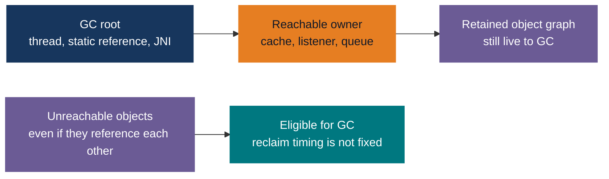
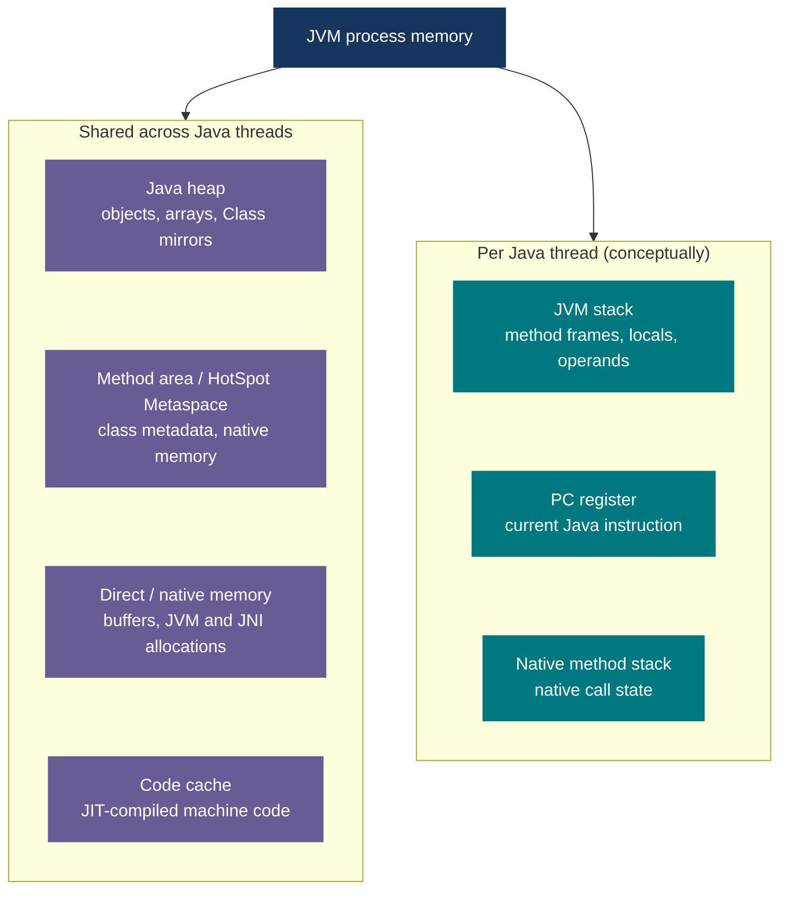
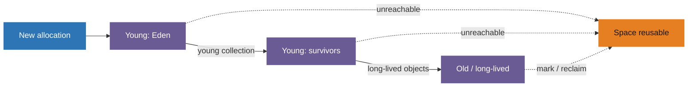

# Java Mastery - JVM Memory, GC, Leaks and OutOfMemoryError

> **Purpose:** Design memory-safe Java services, understand how HotSpot collects memory,
> and diagnose leaks and out-of-memory failures. Start with the
> [Core Java index](00-core-java-index.md) or the [compile-to-run flow](README.md#from-java-source-to-a-running-application)
> if you need the build or class-loading steps first.
>
> **Baseline:** Java 17 and HotSpot unless stated otherwise. The JVM specification
> defines abstract runtime data areas; exact layouts and GC algorithms depend on the JVM,
> release, and collector. Java 21 virtual-thread differences are called out where relevant.

**One-sentence mental model:** GC automatically reclaims *unreachable heap objects*.
It cannot reclaim a reachable object just because the application no longer wants it,
and `OutOfMemoryError` does **not** always mean a Java-heap leak.

## 1. What GC manages (and what it does not)

The Java process uses more than one kind of memory. `-Xmx` caps the **Java heap**, not
the total process footprint. Class metadata, compiled code, direct buffers, thread stacks,
and native/JVM allocations also consume memory. A container or operating system can
terminate a process even if its Java heap has free space.

GC manages reachability and reuse of ordinary heap objects; it is **not** a substitute for
closing files, sockets, JDBC connections, or other resources with an explicit lifecycle.
Nor does a successful GC guarantee that the JVM immediately returns committed memory to
the operating system. High resident memory alone is not proof of a leak.

| Question | Short answer |
|---|---|
| "Can Java leak memory if it has GC?" | Yes. A GC root may still reach objects that are no longer useful. |
| "Does `-Xmx` cap the whole process?" | No. Leave room for native memory and thread stacks. |
| "Does an OOM always mean a leak?" | No. A valid workload can exceed a limit or allocate too quickly. |
| "Can I `free()` a Java object?" | No. Release owning references; the JVM decides when to collect. |

## 2. Object lifetime and GC roots

An object is *reachable* if there is a path to it from a **GC root**. Typical roots include
live thread stack references, references held by static fields of loaded classes, and JNI
global references. A root can reach a whole graph of objects through fields, array slots,
collections, and closures. Cycles with **no** path from a root are collectible.



**The important distinction:** An object in a static `Map` is reachable even after the
request that created it finishes. Removing its entry breaks *that* reference path; if no
other paths remain, the object becomes eligible for GC. Eligibility does not promise
immediate collection, a finalizer call, or a drop in process RSS.

### Reference strengths and cleanup

| Kind | What it means | Practical use / trap |
|---|---|---|
| Strong reference | Prevents collection while the object remains reachable. | Ordinary fields and collections; set an ownership and eviction policy. |
| `WeakReference` | Does not by itself keep the referent alive. | A `ReferenceQueue` can report cleared references. This is **not** a size/TTL policy; `WeakHashMap` values can inadvertently reference their own keys. |
| `SoftReference` | May be cleared under memory pressure. | Do not substitute it for a predictable, bounded production cache. |
| `PhantomReference` / `Cleaner` | Supports post-reachability notification or fallback cleanup. | Cleanup timing is not deterministic; explicitly close resources instead. |

Do not write new code relying on `finalize()` to free resources. Finalization is deprecated,
unreliable for prompt cleanup, and can delay reclamation.

## 3. Runtime memory: shared vs. per-thread

The **method area** is a JVM-specification concept. HotSpot uses native **Metaspace** for
class metadata. HotSpot static field *values* are associated with heap-resident `Class`
mirrors; interned strings also live on the heap. Saying "all static fields and strings
are in Metaspace" is an interview trap.



| Area | Main contents | Limit or common failure |
|---|---|---|
| Java heap (shared) | Ordinary objects and arrays, including `Class` mirrors and interned strings. | `-Xmx`; `OutOfMemoryError: Java heap space` when an allocation cannot succeed. |
| Method area / HotSpot Metaspace (shared) | Class metadata and related JVM structures; stored in native memory in HotSpot. | `-XX:MaxMetaspaceSize` if configured; `OutOfMemoryError: Metaspace` or `Compressed class space`. |
| Direct and other native memory (process-wide) | Direct buffers, JNI/native allocations, and JVM structures. | Process/container memory limits; direct-buffer or native-allocation failures. `-Xmx` does not cover them. |
| Code cache (shared native memory) | JIT-compiled machine code. | If full, compilation may be disabled or limited; this is not necessarily a Java-heap OOM. |
| JVM stack and PC (per Java thread) | Call frames, local variables/references, operand stack, bytecode position for Java methods. | Deep recursion can cause `StackOverflowError`; many platform threads consume native stack memory. |
| Native method stack (per thread conceptually) | State for native/JNI calls. | Native-memory or thread/resource exhaustion. |

Most new objects are allocated in the heap, often via thread-local allocation buffers (TLABs);
a JIT may optimize some allocations away. A stack frame can hold an object **reference** without
placing the object on that stack. Java 21 virtual threads are still Java threads, but are not
each tied to a dedicated OS thread throughout their lifetime; do not budget an OS stack for
every virtual thread as though it were a platform thread.

**Capacity rule:** Budget the entire process, not just `-Xmx`: heap + Metaspace + direct/native
buffers + code cache + thread stacks + JVM/OS overhead + headroom must fit within the host or
container limit. Reserved, committed, and resident memory are different measurements.

## 4. GC architecture and collector tradeoffs

At collection time the JVM identifies live objects reachable from roots and reuses space
occupied by unreachable objects. Depending on the collector, it may mark, sweep, evacuate,
or compact objects. Some work pauses application threads (**stop-the-world**); other work
runs concurrently and uses additional CPU and memory. Even "concurrent" collectors still
have some pauses.

| Basic technique | What it does | Trade-off |
|---|---|---|
| Mark and sweep | Trace reachable objects, then reuse dead objects' space. | Can leave fragmented free space. |
| Copy / evacuate | Move live objects out of a region, then reuse that region. | Moving live data takes CPU and temporary space; references must be updated. |
| Compact | Move survivors together to make contiguous free space. | Reduces fragmentation but may require additional work or pauses. |

Concurrent marking also needs to account for references changed by application threads
while GC runs. Collector-specific barriers and safepoints help maintain correctness;
"concurrent" does not mean "free of pauses."

Generational collectors exploit the observation that many objects die young. The diagram
below is a **simplified generational model**, *not* the physical heap layout of every GC.
G1, for example, organizes heap space into regions; collector and JDK version determine
which generations and phases are present.



| HotSpot collector | Bias / design | Trade-off to discuss in an interview |
|---|---|---|
| Serial | Simple, one GC worker, stop-the-world. | Small heaps or constrained CPUs; pauses grow with live data. |
| Parallel | Multiple stop-the-world GC workers. | Throughput focus; pauses may still be long. |
| G1 | Region-based, concurrent marking plus stop-the-world evacuation. | Balanced throughput/latency; common default on server-class HotSpot since Java 9. |
| ZGC | Largely concurrent, low-pause design. | More concurrent CPU and memory work; no universal pause-time guarantee. |
| Shenandoah | Largely concurrent, low-pause design. | Availability depends on JDK build/platform; assess actual workload. |

**Choose by measured service needs:** throughput, pause percentiles, allocation rate, live
set, heap size, CPU budget, and startup time. Do not treat a fixed pause number or one
collector as universally best. A high allocation rate and frequent young collections
can be normal; repeated long/full collections with little reclaimed space need investigation.
Terms such as "young", "mixed", "major", and "full" are collector-specific; a full GC can
be especially disruptive. In G1, very large ("humongous") allocations occupy special
regions and can increase pressure even when ordinary objects die young.

## 5. Memory leaks and real-world failure modes

A Java **heap leak** is usually *unwanted retention*: something reachable from a root
continues to hold data after its useful lifetime. Not every OOM is a leak: an oversized
batch, a traffic spike, or an undersized memory budget can also exhaust memory.

| Real-world case | Why memory stays used / fails | Design or code response |
|---|---|---|
| Static `Map` or cache keyed by user/request | A long-lived class retains every entry and its object graph. | Bound by size **and** weight; expire/evict entries; monitor hit rate and bytes, not just entry count. |
| `ThreadLocal` on pooled platform threads | The thread outlives a request; stale values can hold sessions, large buffers, or class loaders. | `remove()` in `finally`; avoid putting whole requests in thread locals. |
| Unbounded queue, futures, or task backlog | Requests arrive faster than work completes; each queued task retains input and captured closures. | Bound queue and concurrency; apply backpressure, deadlines, and cancellation. |
| Listeners, callbacks, subscriptions | A global registry retains an object that should have been released. | Pair registration with removal at the owner's lifecycle boundary. |
| Hot reload, plugins, repeated proxy generation | Threads, statics, or registries keep a class loader alive along with its classes. | Stop owned threads, clear references, unregister hooks; inspect loader-retention paths. |
| `readAllBytes`, `readAllLines`, huge JSON, `stream().toList()` | Valid data is materialized in full; multiple copies may coexist. Not necessarily a leak. | Stream, page, batch, limit input size, or spill to disk; budget for peak concurrent requests. |
| Direct buffers or native/JNI resources | Native memory grows outside `-Xmx`; Java heap may look healthy. | Bound buffers, close/release library resources as documented, inspect native usage. |
| Too many platform threads | Each thread and stack consumes native memory; the OS may refuse more threads. | Use bounded executors, monitor thread count, and choose virtual threads for suitable I/O work (Java 21+). |
| Unclosed files/sockets/JDBC connections | GC of Java wrappers does not promptly close OS handles or connections. | `try`-with-resources and clear ownership. File-descriptor exhaustion is not necessarily a Java OOM. |

**Reproduce before guessing.** Compare the amount of *live heap after GC* under similar
traffic at different times. A rising baseline suggests retention; spikes that return
to a stable baseline suggest transient pressure. Then follow the path from a retained
object back to its GC root in a heap dump. A large object by itself is not the root cause.

### Safe coding patterns

Always clean up request-scoped thread-local state, even if processing fails:

```java
final class RequestState {
    private static final ThreadLocal<String> CURRENT_USER = new ThreadLocal<>();

    static void runAs(String user, Runnable work) {
        CURRENT_USER.set(user);
        try {
            work.run();
        } finally {
            CURRENT_USER.remove();
        }
    }
}
```

This pattern assumes one top-level request context per call. If contexts can be nested,
restore the previous thread-local value instead of always removing it.

Read large files incrementally instead of loading all lines into a list (inside a method
that owns `path` and `processLine`):

```java
try (var lines = Files.lines(path, StandardCharsets.UTF_8)) {
    lines.forEach(this::processLine);
}
```

The stream still needs closing. If processing is asynchronous, also bound how much work or
data can remain queued. For concurrent caches, prefer a tested cache with a maximum
size/weight and expiration over an unbounded `ConcurrentHashMap`.

## 6. OutOfMemoryError: diagnose by symptom

Start with the **exact exception detail and memory region**. Increasing `-Xmx` can help a
genuinely undersized heap but can make a native or container-memory problem worse.
`OutOfMemoryError` may leave a service unreliable; do not depend on catching it and
continuing normal operation.

| Symptom | Likely limit or failure | First investigation |
|---|---|---|
| `OutOfMemoryError: Java heap space` | Cannot allocate an object in the Java heap; leak, high live set, large allocation, or small heap. | Heap after GC, allocation rate, object histogram, heap dump and GC-root paths. |
| `OutOfMemoryError: GC overhead limit exceeded` | HotSpot is collecting most of the time while recovering too little. Not a separate memory area. | Live-set size, long/full GC, excessive allocations and retained owners. |
| `OutOfMemoryError: Metaspace` / `Compressed class space` | Class metadata or compressed-class space limit/native memory. | Loaded class count, class loaders, generated classes, `MaxMetaspaceSize`, native budget. |
| `OutOfMemoryError: Direct buffer memory` (wording varies) | Direct buffer/native allocation limit or retained direct buffers. | Buffer pools, native memory, library buffer lifecycle and concurrency. |
| `OutOfMemoryError: unable to create native thread` | OS memory, process/thread limit, or container PID limit. | Platform thread count, thread dumps, stack size (`-Xss`), OS limits. |
| `OutOfMemoryError: Requested array size exceeds VM limit` | Requested single array exceeds the VM limit regardless of free heap. | Array length calculation; stream, chunk, or partition data. |
| Container `OOMKilled` / process terminated | OS/cgroup killed the process; Java may never throw `OutOfMemoryError` or write a heap dump. | Container memory limit, RSS and native usage, termination reason. |
| `StackOverflowError` | Excessive call depth / recursion in a thread. **Not** a heap `OutOfMemoryError`. | Call stack and recursion/cycle; fix algorithm before changing stack size. |

For heap and Metaspace failures, Oracle's troubleshooting guide explicitly notes that an
OOM is **not** by itself evidence of a leak. If the error names a different area, investigate
that area's owner instead of immediately changing heap size.

### Three real-world triage examples

| Situation | Evidence to collect | Root cause and durable fix |
|---|---|---|
| API service grows over days, then reports `Java heap space`. | Heap **after** comparable GC cycles keeps rising; a heap dump's dominator tree leads to a static cache of per-user results. | The cache is still reachable, so GC cannot reclaim it. Bound size/weight, expire unused entries, and measure the retained baseline under load; increasing `-Xmx` only delays failure. |
| A nightly export fails on one very large file, but ordinary requests are healthy. | Heap returns to the same baseline between runs; the failure coincides with `readAllBytes` or collecting all records into a list. | This is peak working-set pressure, not necessarily a leak. Stream or page the export and bound simultaneous jobs and output buffers. |
| Container is `OOMKilled` even though a heap chart is below `-Xmx`. | Compare process RSS and container limit; inspect thread count, direct buffers, Metaspace, and NMT if enabled. No Java exception or heap dump may exist. | Heap is only part of the process. Reduce/bound native usage or platform threads, then set heap and container limits with measured headroom. |

## 7. Measure and investigate safely

Useful measurements include *heap used after GC*, allocation rate, pause duration,
frequency of full collections, class-loader/class count, direct-buffer usage, platform
thread count, process RSS, and the container limit. Watch trends under **comparable**
load. JMX `MemoryMXBean`, buffer-pool MXBeans, and thread metrics can expose several of
these quantities. Committed heap and process RSS need not fall immediately after GC.

These are **illustrative HotSpot options**, not settings to copy blindly into production:

```text
-Xmx2g
-XX:+HeapDumpOnOutOfMemoryError
-XX:HeapDumpPath=heap.hprof
-Xlog:gc*:file=gc.log:time,uptime,level,tags
-XX:NativeMemoryTracking=summary
```

`-Xmx` caps only the heap. Ensure dump/log paths are writable with sufficient free disk
space. Native Memory Tracking (NMT) must be enabled at startup and has overhead; turn it
on deliberately when investigating native growth. A container kill may bypass the
`HeapDumpOnOutOfMemoryError` handler entirely.

To inspect an **authorized, already-running** HotSpot JVM, the following `jcmd` commands
are examples, not commands run as part of this guide:

```text
jcmd <pid> GC.heap_info
jcmd <pid> GC.class_histogram
jcmd <pid> GC.heap_dump heap.hprof
jcmd <pid> VM.native_memory summary
jcmd <pid> Thread.print
```

`VM.native_memory` needs NMT enabled. Histograms and heap dumps can pause a busy
application; `GC.heap_dump` normally requests a full GC. Dumps may include credentials,
personal data, and request contents: restrict access, store them securely, and remove
them under your retention policy. JFR, JDK Mission Control, or a profiler can help
identify allocation hot spots without assuming the biggest allocation is a leak.

**Incident playbook:**

1. Record the exact error, JVM version, collector, flags, container limit, and timeline.
2. Separate Java heap usage from process RSS/native memory and thread count.
3. Compare live heap **after** similar GC cycles or workloads; don't compare only peaks.
4. If heap retention is suspected, capture a safe heap dump or histogram. In an analyzer,
   inspect **retained size**, dominators, and paths to GC roots (not just shallow size).
5. If native memory or threads are suspected, use NMT (if enabled), buffer/thread
   metrics, OS/container data, and thread dumps.
6. Fix the owner or bound of the retaining structure; reproduce under load, compare
   before/after, then set alerts. Raising a limit alone is not evidence of a fix.

## 8. Automatic collection versus explicit GC

The JVM runs GC automatically according to its collector and memory-pressure heuristics.
There is no Java equivalent of C's `free(object)`, and no API to guarantee that a particular
unreachable object is collected immediately. Removing references and closing resources
are application responsibilities; deciding when to reclaim heap storage is the JVM's job.

An explicit request looks like this; **do not rely on it in normal application logic**:

```java
System.gc(); // best-effort request, not a guarantee or a fix for retained objects
```

`System.gc()` and `Runtime.getRuntime().gc()` are effectively equivalent **requests**
to the JVM, not guaranteed collection or a command to free a specific object. The
HotSpot diagnostic command `jcmd <pid> GC.run` calls `System.gc()` and can be disruptive.
An explicit request might cause a large pause, reclaim little, be ignored/configured
away (for example with HotSpot's `-XX:+DisableExplicitGC`), or leave RSS unchanged.
Do **not** put it in a request handler, `finally` block, or cache-eviction routine.

| If you want to... | Do this instead of forcing GC |
|---|---|
| Let a cached object go | Evict it from every owning cache; enforce bounds and expiry. |
| Release files, sockets, or JDBC resources | Use `try`-with-resources or the library's `close()` method. |
| Avoid retaining request state | Scope it narrowly; remove thread locals in `finally`. |
| Reduce peak use | Stream or paginate data and cap concurrency/queue sizes. |
| Return RAM to the OS | Investigate live set, heap commitment and native use; `System.gc()` offers no guarantee of an RSS drop. |

Even `cache.clear()` releases only references owned by *that cache*. Another reference
can still keep each value alive. Conversely, clearing an `ArrayList` removes its element
references but can retain the list's backing-array **capacity** while the list itself lives.

## 9. Production design checklist

- [ ] Budget `-Xmx` **plus** Metaspace, direct/native memory, code cache, platform
      thread stacks, JVM overhead, and headroom inside the actual container limit.
- [ ] Bound caches by size/weight and expiration; define who invalidates entries.
- [ ] Bound thread pools, work queues, requests in flight, buffered messages, and
      futures. Treat virtual threads as cheap threads, not unlimited downstream capacity.
- [ ] Limit request/file/array size; stream or page large results instead of collecting all.
- [ ] Close files, streams, sockets, database connections, and reference-counted buffers
      explicitly at the ownership boundary.
- [ ] Unregister listeners; remove thread locals; stop background tasks and class-loader
      owned threads on shutdown or plugin unload.
- [ ] Monitor heap **after GC**, allocation rate, pauses, class loaders, direct memory,
      thread count, RSS, and container OOM events.
- [ ] Enable GC logs and arrange secure, writable dump storage *before* a hard-to-reproduce
      incident; know that a container kill may not produce a Java heap dump.
- [ ] Load-test realistic concurrency and peak payloads; compare heap profiles and
      retained sizes after changes, not just whether the app starts.
- [ ] Avoid routine `System.gc()` and finalizers; neither establishes correct cleanup.

## 10. Frequently asked interview questions

1. **Heap vs. stack?** Ordinary objects usually live on the shared heap; each Java thread
   has its own conceptual JVM stack of frames, locals, and references. JIT optimizations
   may eliminate physical allocations.
2. **Where are static fields and interned strings?** In HotSpot, static field values are
   associated with heap-resident `Class` mirrors, and interned strings are on the heap.
   Native Metaspace primarily holds class metadata.
3. **What are GC roots?** Starting references used to trace live objects: for example,
   live stack references, static fields of loaded classes, and JNI handles.
4. **Why does GC not fix every memory leak?** A leak can consist of objects *still
   reachable* from a static collection, a thread local, a listener, or a pending task.
5. **Are reference cycles leaks?** Not by themselves. A cycle is collectible when
   no root can reach it.
6. **Does `System.gc()` guarantee collection?** No. It suggests an effort by the JVM;
   it cannot target an object or promise a completion time or returned OS memory.
7. **Young vs. old generation?** In generational collectors, new objects typically
   enter young space and survivors may move to old space. It is not a universal JVM
   memory layout.
8. **Stop-the-world vs. concurrent GC?** Stop-the-world pauses application threads for
   some collector work. Concurrent GC performs more work while they run; it still has
   pauses and costs CPU/memory.
9. **G1 vs. ZGC?** G1 is a region-based balanced default on many HotSpot servers; ZGC
   emphasizes low pauses with more concurrent work. Choose with measured workload data.
10. **Does `OutOfMemoryError: Java heap space` prove a leak?** No. Check live set,
    allocation size, workload, heap limit, and reference paths before deciding.
11. **What if heap is low but process RSS is high?** Look at Metaspace, direct buffers,
    code cache, native allocations, platform thread stacks, and container limits.
12. **What does `-Xmx` control?** The maximum Java heap, not the full JVM process.
13. **`StackOverflowError` vs. `OutOfMemoryError`?** The first commonly indicates
    excessive recursion/frame depth; the second can name a heap, metadata, direct,
    native-thread, or other allocation failure.
14. **How do you find the owner of retained objects?** Inspect a heap dump's dominator
    tree, retained sizes, and paths to GC roots; correlate with code and lifecycle.
15. **Should you `null` every variable?** No. Most locals leave scope naturally.
    Fix long-lived owners (caches, fields, queues, listeners) and close resources.

## Official references

- [JVM Specification: runtime data areas](https://docs.oracle.com/javase/specs/jvms/se17/html/jvms-2.html#jvms-2.5)
- [HotSpot GC tuning and collector options](https://docs.oracle.com/en/java/javase/17/gctuning/available-collectors.html)
- [Troubleshoot memory leaks and OutOfMemoryError](https://docs.oracle.com/en/java/javase/17/troubleshoot/troubleshooting-memory-leaks.html)
- [`System.gc()` API contract](https://docs.oracle.com/en/java/javase/17/docs/api/java.base/java/lang/System.html#gc())
- [`jcmd` diagnostic commands and impact](https://docs.oracle.com/en/java/javase/17/docs/specs/man/jcmd.html)
