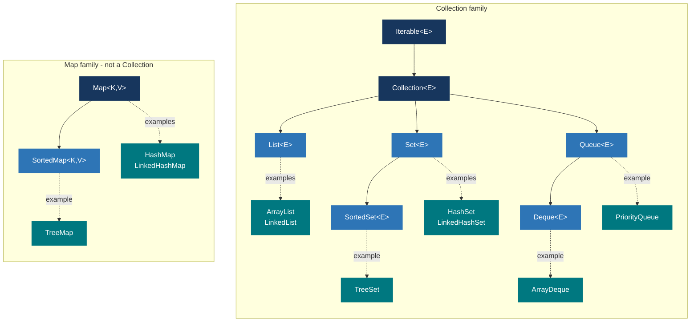

# Java Mastery — Collections & Generics

> **Goal:** Master Java's built-in data structures and understand how generics make them type-safe and reusable.
> This doc is a standalone companion to the [numbered Core Java index](00-core-java-index.md). Prerequisites: Language Foundations + OOP.

---

## 0) What this covers

1. The Collections Framework hierarchy — interfaces, abstract classes, concrete implementations.
2. Lists: `ArrayList`, `LinkedList`, `CopyOnWriteArrayList`.
3. Sets: `HashSet`, `LinkedHashSet`, `TreeSet`.
4. Maps: `HashMap`, `LinkedHashMap`, `TreeMap`, `ConcurrentHashMap`.
5. Queues and Deques: `PriorityQueue`, `ArrayDeque`.
6. Iterators and the enhanced for-each loop.
7. Sorting with `Comparable` and `Comparator`.
8. Generics: type parameters, bounds, wildcards, type erasure.
9. Interview questions and common pitfalls.

---

## 1) Collections Framework Overview

The Java Collections Framework (JCF) provides a unified architecture for storing and manipulating groups of objects.



**Key design principle:** program to the interface, not the implementation:

```java
List<String>         list = new ArrayList<>();   // declared as List, not ArrayList
Set<Integer>         set  = new HashSet<>();
Map<String, Integer> map  = new HashMap<>();
```

---

## 2) List — Ordered, Allows Duplicates

A `List` is an ordered collection that allows duplicates and provides positional access.

### 2.1 ArrayList — dynamic array

```java
List<String> list = new ArrayList<>();
list.add("apple");           // append to end    — O(1) amortized
list.add(0, "banana");       // insert at index  — O(n) (shifts elements)
list.get(1);                 // "apple"           — O(1) random access
list.set(0, "cherry");       // replace at index  — O(1)
list.remove(0);              // remove by index   — O(n)
list.remove("apple");        // remove by value (first match) — O(n)
list.size();
list.isEmpty();
list.contains("apple");      // O(n) linear scan
list.indexOf("apple");       // first index, -1 if not found
list.lastIndexOf("apple");   // last index
list.subList(1, 3);          // live view of [1, 3) — mutations reflect back
list.clear();

// Bulk operations
List<String> more = List.of("x", "y");
list.addAll(more);
list.removeAll(more);
list.retainAll(more);        // keep only elements present in 'more'
list.containsAll(more);

// Conversion
Object[] arr = list.toArray();
String[] strArr = list.toArray(new String[0]);
```

**Capacity and resizing:**
```java
// Pre-size when you know the expected count — avoids multiple resize cycles
List<Integer> big = new ArrayList<>(1_000_000);
```

**Internal behavior:** backed by `Object[]`. When full, a new array of ~1.5× capacity is created and all elements are copied — O(n) for that single resize, but amortized O(1) per `add`.

### 2.2 LinkedList — doubly linked list

```java
LinkedList<String> ll = new LinkedList<>();
ll.addFirst("first");    // O(1)
ll.addLast("last");      // O(1)
ll.getFirst();           // O(1)
ll.getLast();            // O(1)
ll.removeFirst();        // O(1)
ll.removeLast();         // O(1)
ll.get(2);               // O(n) — must traverse from head
```

### ArrayList vs LinkedList

| Operation                | `ArrayList` | `LinkedList` |
|--------------------------|------------|-------------|
| Random access `get(i)`   | O(1)       | O(n)        |
| `add` at end             | O(1)†      | O(1)        |
| `add`/`remove` at front  | O(n)       | O(1)        |
| `add`/`remove` in middle | O(n)       | O(n)‡       |
| Memory overhead          | Low        | High (node pointers) |

† amortized; ‡ O(n) to find the node, O(1) to re-link

> **Practical rule:** prefer `ArrayList` for almost everything. Use `LinkedList` only for frequent insertions/removals at the **front** and rare random access.

### 2.3 Unmodifiable and immutable lists

```java
// Java 9+ — compact, immutable, null-disallowing
List<String> immutable = List.of("a", "b", "c");

// Wraps a mutable list — throws UnsupportedOperationException on mutation
List<String> unmod = Collections.unmodifiableList(mutableList);

// Java 10+ — create from any collection
List<String> copy = List.copyOf(existingList);
```

### 🎯 Interview Questions — List

- **Q: What is the difference between `ArrayList` and `LinkedList`?**
  A: `ArrayList` is backed by a dynamic array — O(1) random access, O(n) insert/remove at arbitrary positions. `LinkedList` is a doubly-linked list — O(1) insert/remove at head/tail, O(n) random access. Use `ArrayList` by default.

- **Q: How does `ArrayList` resize internally?**
  A: When full, a new array of ~1.5× capacity is allocated and all elements are copied — O(n) for that one resize step, amortized O(1) per `add`.

- **Q: How do you make a List thread-safe?**
  A: `Collections.synchronizedList(list)` (coarse lock on every operation) or `CopyOnWriteArrayList` (snapshot-on-write — efficient for read-heavy scenarios with rare writes).

- **Q: What is the difference between `remove(int index)` and `remove(Object o)` in a List of Integers?**
  A: `remove(0)` removes by index (removes the first element). `remove(Integer.valueOf(0))` removes by value. The ambiguity is a classic pitfall — always box when intending value-based removal.

---

## 3) Set — No Duplicates

A `Set` is a collection with **no duplicate elements**. Equality is determined by `equals()` and `hashCode()`.

### 3.1 HashSet — hash table, O(1) average

```java
Set<String> set = new HashSet<>();
set.add("apple");
set.add("apple");      // duplicate — silently ignored; add() returns false
set.add("banana");
set.contains("apple"); // true — O(1) average
set.remove("apple");   // O(1) average
set.size();            // 1
set.isEmpty();

// Iteration order is UNDEFINED and may vary between runs/JVM versions
for (String s : set) System.out.println(s);
```

### 3.2 LinkedHashSet — insertion order preserved

```java
Set<String> lhs = new LinkedHashSet<>();
lhs.add("banana");
lhs.add("apple");
lhs.add("cherry");
// Always iterates: banana → apple → cherry (insertion order guaranteed)
```

### 3.3 TreeSet — sorted

```java
Set<Integer> ts = new TreeSet<>();
ts.add(5); ts.add(1); ts.add(3);
// Iterates: 1 → 3 → 5 (sorted ascending by natural order)

// With a custom comparator
TreeSet<String> byLength = new TreeSet<>(Comparator.comparingInt(String::length));

// NavigableSet API (TreeSet implements NavigableSet)
TreeSet<Integer> nav = new TreeSet<>(List.of(1, 3, 5, 7));
nav.first();            // 1   — minimum
nav.last();             // 7   — maximum
nav.floor(4);           // 3   — greatest element ≤ 4
nav.ceiling(4);         // 5   — smallest element ≥ 4
nav.lower(3);           // 1   — strictly less than 3
nav.higher(3);          // 5   — strictly greater than 3
nav.headSet(5);         // [1, 3]    — elements < 5
nav.tailSet(3);         // [3, 5, 7] — elements ≥ 3
nav.subSet(2, 6);       // [3, 5]    — elements ≥ 2 and < 6
nav.descendingSet();    // reversed view
```

### Set comparison

| Feature              | `HashSet`   | `LinkedHashSet` | `TreeSet`                     |
|----------------------|-------------|-----------------|-------------------------------|
| Iteration order      | None        | Insertion order | Sorted (natural/comparator)   |
| `contains` / `add`  | O(1) avg    | O(1) avg        | O(log n)                      |
| Null element         | ✅ One null  | ✅ One null      | ❌ (null breaks comparisons)   |
| Extra API            | —           | —               | `floor`, `ceiling`, `headSet` |

### 🎯 Interview Questions — Set

- **Q: How does `HashSet` detect duplicates?**
  A: It calls `hashCode()` to locate the bucket and then `equals()` to confirm identity within that bucket. Both methods must be consistently overridden when storing custom objects.

- **Q: Can a `HashSet` contain `null`?**
  A: Yes — exactly one `null` element is allowed. `TreeSet` cannot contain `null` under natural ordering (throws `NullPointerException` on comparison).

- **Q: What happens if you mutate an object stored in a `HashSet`?**
  A: If the mutation changes `hashCode()`, the object lands in a different bucket on the next lookup but stays in its original bucket — it becomes permanently unreachable (lost in the set). Never mutate fields used in `equals`/`hashCode` while an object is in a hash-based collection.

---

## 4) Map — Key-Value Pairs

A `Map` maps **unique keys** to values. A key maps to exactly one value; values may repeat.

### 4.1 HashMap — hash table

```java
Map<String, Integer> map = new HashMap<>();
map.put("alice", 30);
map.put("bob", 25);
map.put("alice", 31);          // returns old value 30; replaces with 31

map.get("alice");               // 31
map.get("nobody");              // null — key absent
map.getOrDefault("nobody", 0);  // 0 — safer than get()
map.containsKey("bob");         // true — O(1) average
map.containsValue(25);          // true — O(n)
map.remove("bob");              // removes entry; returns old value 25
map.size();

// Iteration patterns
for (Map.Entry<String, Integer> e : map.entrySet()) {
    System.out.println(e.getKey() + " → " + e.getValue());
}
map.forEach((k, v) -> System.out.println(k + " → " + v)); // Java 8+
map.keySet();   // Set of keys
map.values();   // Collection of values

// Compute helpers (Java 8+)
map.putIfAbsent("carol", 22);                       // insert only if key absent
map.computeIfAbsent("dave", k -> k.length());       // compute + insert if absent
map.computeIfPresent("alice", (k, v) -> v + 1);     // update only if key present
map.compute("alice", (k, v) -> v == null ? 1 : v + 1);
map.merge("alice", 1, Integer::sum);                // insert 1 or sum with existing

// Frequency count pattern
String[] words = {"a", "b", "a", "c", "b", "a"};
Map<String, Integer> freq = new HashMap<>();
for (String w : words) freq.merge(w, 1, Integer::sum);
// {a=3, b=2, c=1}
```

**Internal structure:** an array of "bins" (linked lists by default). Default load factor = 0.75; when `size > capacity × loadFactor` the table rehashes into a 2× array. Since Java 8, bins with > 8 entries and a table of ≥ 64 bins convert to **red-black trees** for O(log n) worst-case — defense against adversarial hash collisions.

### 4.2 LinkedHashMap — insertion/access-order preserved

```java
// Insertion order (default)
Map<String, Integer> lhm = new LinkedHashMap<>();

// Access order — useful for LRU caches
Map<String, Integer> accessOrder = new LinkedHashMap<>(16, 0.75f, true);
```

**LRU Cache pattern:**
```java
class LRUCache<K, V> extends LinkedHashMap<K, V> {
    private final int capacity;

    LRUCache(int capacity) {
        super(capacity, 0.75f, true);  // access-order mode
        this.capacity = capacity;
    }

    @Override
    protected boolean removeEldestEntry(Map.Entry<K, V> eldest) {
        return size() > capacity;  // evict least-recently-used when over capacity
    }
}

LRUCache<Integer, String> cache = new LRUCache<>(3);
cache.put(1, "one"); cache.put(2, "two"); cache.put(3, "three");
cache.get(1);         // access key 1 — moves it to most-recently-used
cache.put(4, "four"); // evicts key 2 (least recently used)
```

### 4.3 TreeMap — sorted by key

```java
TreeMap<String, Integer> tm = new TreeMap<>();
tm.put("banana", 2); tm.put("apple", 1); tm.put("cherry", 3);
// Iterates: apple → banana → cherry (alphabetical key order)

tm.firstKey();        // "apple"
tm.lastKey();         // "cherry"
tm.floorKey("b");     // "banana" — greatest key ≤ "b"
tm.ceilingKey("b");   // "banana" — smallest key ≥ "b"
tm.headMap("cherry"); // {"apple"→1, "banana"→2} — keys strictly < "cherry"
tm.tailMap("banana"); // {"banana"→2, "cherry"→3} — keys ≥ "banana"
```

### 4.4 ConcurrentHashMap — thread-safe map

```java
ConcurrentHashMap<String, Integer> chm = new ConcurrentHashMap<>();
chm.put("x", 1);
chm.putIfAbsent("x", 2);                  // atomic — no overwrite; returns current 1
chm.computeIfAbsent("y", k -> k.length()); // atomic compute
chm.merge("x", 1, Integer::sum);           // atomic merge

// Bulk operations (Java 8+)
chm.forEach(1, (k, v) -> System.out.println(k + "=" + v));
chm.reduce(1, (k, v) -> v, Integer::sum);  // parallel reduce over values
```

**vs `Collections.synchronizedMap`:** `ConcurrentHashMap` uses fine-grained bucket-level locking — reads never block, writes only contend on the affected segment. `synchronizedMap` uses a single global lock on every operation.

### Map comparison

| Feature         | `HashMap`   | `LinkedHashMap`  | `TreeMap`              | `ConcurrentHashMap` |
|-----------------|-------------|-----------------|------------------------|---------------------|
| Key order       | None        | Insertion/Access | Sorted                 | None                |
| `get`/`put`     | O(1) avg    | O(1) avg         | O(log n)               | O(1) avg            |
| Null key        | ✅ One null  | ✅ One null       | ❌ (natural ordering)   | ❌                   |
| Thread-safe     | ❌           | ❌                | ❌                      | ✅                   |
| Extra API       | —           | `removeEldest`  | `floorKey`, `headMap`  | `reduce`, `forEach` |

### 🎯 Interview Questions — Map

- **Q: How does `HashMap` handle hash collisions?**
  A: Multiple keys in the same bucket form a linked list. Since Java 8, when a bucket's list exceeds 8 entries and the table has ≥ 64 buckets, the list converts to a red-black tree for O(log n) worst-case — defending against deliberate hash-flooding attacks.

- **Q: What is the load factor in `HashMap`?**
  A: The ratio `size / capacity` at which the map rehashes. Default is 0.75 — 75% full triggers a rebuild at 2× capacity. Lower load factor = fewer collisions but more memory; higher = more collisions but less memory.

- **Q: What happens if you use a mutable object as a `HashMap` key?**
  A: If the mutation changes `hashCode()`, the entry is in the wrong bucket and can never be retrieved — it's effectively lost. Keys must be immutable or at least have stable `hashCode()` values.

- **Q: What is the difference between `HashMap` and `Hashtable`?**
  A: `Hashtable` is legacy, synchronized on every method (slow), and disallows `null` keys and values. `HashMap` is unsynchronized, allows one `null` key, and is much faster. Use `ConcurrentHashMap` for thread-safety in modern code.

- **Q: How do you iterate over a Map efficiently?**
  A: Use `map.entrySet()` for key-value pairs (single traversal), `map.forEach((k,v)->...)` for Java 8+ style, `map.keySet()` for keys only, `map.values()` for values only.

---

## 5) Queue and Deque

### 5.1 Queue — FIFO (first-in, first-out)

```java
Queue<String> q = new ArrayDeque<>();   // ArrayDeque preferred over LinkedList for queues

// Enqueue
q.offer("a");   // returns false if capacity exceeded — preferred
q.add("b");     // throws IllegalStateException if capacity exceeded

// Inspect front
q.peek();       // returns null if empty
q.element();    // throws NoSuchElementException if empty

// Dequeue
q.poll();       // removes and returns head — null if empty
q.remove();     // removes and returns head — throws if empty

q.size();
q.isEmpty();
```

### 5.2 PriorityQueue — min-heap

```java
PriorityQueue<Integer> minHeap = new PriorityQueue<>();
minHeap.offer(5); minHeap.offer(1); minHeap.offer(3);
minHeap.peek();   // 1 — smallest (min-heap by default)
minHeap.poll();   // removes and returns 1

// Max-heap using reversed comparator
PriorityQueue<Integer> maxHeap = new PriorityQueue<>(Comparator.reverseOrder());

// Custom comparator — e.g., sort tasks by priority field
record Task(String name, int priority) {}
PriorityQueue<Task> taskQueue = new PriorityQueue<>(
    Comparator.comparingInt(Task::priority)
);
```

**Internal structure:** a binary min-heap stored as an array. `offer`/`poll` — O(log n); `peek` — O(1). Does **not** support O(1) `contains` — use a separate `HashSet` as an index if needed.

### 5.3 Deque — double-ended queue

```java
Deque<String> deque = new ArrayDeque<>();

// Add/remove from both ends
deque.offerFirst("a");  deque.offerLast("b");
deque.peekFirst();      deque.peekLast();
deque.pollFirst();      deque.pollLast();

// Use as a stack (LIFO) — preferred over Stack class
Deque<String> stack = new ArrayDeque<>();
stack.push("a");   // addFirst
stack.pop();       // removeFirst
stack.peek();      // peekFirst
```

> **Always prefer `ArrayDeque` over `Stack`:** `Stack` extends `Vector` (legacy, synchronized on every method — unnecessary overhead). `ArrayDeque` is faster, unsynchronized, and O(1) amortized for all stack/queue operations.

### 🎯 Interview Questions — Queue / Deque

- **Q: When would you use a `PriorityQueue`?**
  A: When you need efficient access to the min or max element — e.g., Dijkstra's algorithm, task scheduling by priority, finding the k largest/smallest elements.

- **Q: What is the difference between `offer()` and `add()` in a `Queue`?**
  A: For capacity-bounded queues, `add()` throws `IllegalStateException` on failure; `offer()` returns `false`. For unbounded queues (`PriorityQueue`, `ArrayDeque`), they behave identically. Prefer `offer`/`poll`/`peek` for safe, exception-free code.

- **Q: How do you implement a min-heap and max-heap in Java?**
  A: `PriorityQueue<Integer>` gives a min-heap by default. `new PriorityQueue<>(Comparator.reverseOrder())` gives a max-heap.

---

## 6) Iterators

Every `Collection` implements `Iterable<E>`, which provides an `Iterator<E>`.

```java
List<String> list = new ArrayList<>(List.of("a", "b", "c", "d"));

// Enhanced for-each — syntactic sugar over Iterator
for (String s : list) System.out.println(s);

// Explicit iterator — required when removing elements during traversal
Iterator<String> it = list.iterator();
while (it.hasNext()) {
    String s = it.next();
    if (s.equals("b")) it.remove(); // safe removal; avoids ConcurrentModificationException
}
// list is now: ["a", "c", "d"]

// Java 8+ — cleanest removal pattern
list.removeIf(s -> s.startsWith("a"));

// Java 8+ — forEach
list.forEach(System.out::println);

// ListIterator — bidirectional; supports set() and add()
ListIterator<String> lit = list.listIterator(list.size()); // start from end
while (lit.hasPrevious()) {
    System.out.println(lit.previous()); // reverse iteration
}
```

> **Never modify a collection directly inside a for-each loop** — most iterators are **fail-fast**: they throw `ConcurrentModificationException` if the collection is structurally modified (element added or removed) during iteration. Use `Iterator.remove()`, `removeIf()`, or collect indices and remove after the loop.

---

## 7) Sorting — Comparable and Comparator

### 7.1 Comparable — natural ordering (intrinsic)

Implement `Comparable<T>` in your class to define its "natural" sort order. `compareTo()` returns:
- **negative** — `this` comes before `other`
- **zero** — equal
- **positive** — `this` comes after `other`

```java
class Student implements Comparable<Student> {
    String name;
    double gpa;

    Student(String name, double gpa) { this.name = name; this.gpa = gpa; }

    @Override
    public int compareTo(Student other) {
        // Descending by GPA
        return Double.compare(other.gpa, this.gpa);
    }
}

List<Student> students = new ArrayList<>(List.of(
    new Student("Alice", 3.8),
    new Student("Bob",   3.5),
    new Student("Carol", 3.9)
));
Collections.sort(students);
// Order: Carol (3.9) → Alice (3.8) → Bob (3.5)
```

> **Never use subtraction as a comparator:** `return a - b;` overflows for large values. Always use `Integer.compare(a, b)` or `Double.compare(a, b)`.

### 7.2 Comparator — external ordering

Use `Comparator` when you need multiple sort orders or cannot modify the class.

```java
// Simple comparator — by name ascending
Comparator<Student> byName = Comparator.comparing(s -> s.name);

// Multi-field — by GPA descending, then by name ascending as tiebreaker
Comparator<Student> byGpaThenName = Comparator
    .comparingDouble(Student::gpa)
    .reversed()
    .thenComparing(Student::name);

students.sort(byGpaThenName);   // List.sort() — preferred over Collections.sort()

// Null-safe comparators
Comparator<String> nullsFirst = Comparator.nullsFirst(Comparator.naturalOrder());
Comparator<String> nullsLast  = Comparator.nullsLast(Comparator.naturalOrder());
```

### 7.3 Sorting APIs

```java
// List
list.sort(comparator);                       // preferred (Java 8+)
Collections.sort(list);                     // natural order
Collections.sort(list, comparator);

// Array
Arrays.sort(arr);                            // primitives or Comparable — natural order
Arrays.sort(arr, comparator);               // objects + Comparator
Arrays.sort(arr, fromIndex, toIndex);       // partial range sort

// Reverse
list.sort(Comparator.reverseOrder());
Arrays.sort(arr, Comparator.reverseOrder()); // only for Object[] not int[]
```

### 🎯 Interview Questions — Sorting

- **Q: What is the difference between `Comparable` and `Comparator`?**
  A: `Comparable` defines the class's own natural ordering (implemented inside the class). `Comparator` is an external comparison strategy (implemented outside). Use `Comparable` for the single default order; `Comparator` for alternate orderings or when the class cannot be modified.

- **Q: How does `Collections.sort()` / `List.sort()` work internally?**
  A: Uses **TimSort** — a hybrid of merge sort and insertion sort. O(n log n) worst/average; **stable** (equal elements retain their original relative order).

- **Q: Why should you not use `return a - b` as a comparator?**
  A: Integer subtraction overflows for extreme values (e.g., `Integer.MIN_VALUE - 1`), producing wrong sign. Always use `Integer.compare(a, b)`.

---

## 8) Generics

Generics allow types to be parameters so you write type-safe, reusable code without explicit casting.

### 8.1 Generic class

```java
class Box<T> {
    private T value;

    Box(T value)     { this.value = value; }
    T get()          { return value; }
    void set(T val)  { this.value = val; }
}

Box<String>  sBox = new Box<>("hello");
Box<Integer> iBox = new Box<>(42);
String s = sBox.get();   // no cast needed — type-safe at compile time
```

### 8.2 Generic methods

```java
// T is the method's own type parameter — inferred from arguments
public static <T> List<T> repeat(T item, int times) {
    List<T> result = new ArrayList<>(times);
    for (int i = 0; i < times; i++) result.add(item);
    return result;
}

List<String>  words   = repeat("hi", 3);  // ["hi", "hi", "hi"]
List<Integer> numbers = repeat(0, 5);     // [0, 0, 0, 0, 0]

// Generic swap
public static <T> void swap(T[] arr, int i, int j) {
    T temp = arr[i]; arr[i] = arr[j]; arr[j] = temp;
}
```

### 8.3 Bounded type parameters

```java
// Upper bound — T must be a Number or a subtype of Number
public static <T extends Number> double sum(List<T> list) {
    double total = 0;
    for (T item : list) total += item.doubleValue();
    return total;
}

sum(List.of(1, 2, 3));     // 6.0  (Integer extends Number)
sum(List.of(1.5, 2.5));    // 4.0  (Double extends Number)

// Multiple bounds — T must extend Comparable AND implement Cloneable
public static <T extends Comparable<T> & Cloneable> T max(T a, T b) {
    return a.compareTo(b) >= 0 ? a : b;
}
```

### 8.4 Wildcards

Wildcards allow accepting a range of generic types rather than a single exact type.

```java
// ? — unbounded wildcard — any List regardless of element type
void printAll(List<?> list) {
    for (Object o : list) System.out.println(o);
    // list.add("x"); // compile error — type unknown; only null is safe to add
}

// ? extends T — upper-bounded (covariant) — READ elements as T
double sumNumbers(List<? extends Number> list) {
    return list.stream().mapToDouble(Number::doubleValue).sum();
}
sumNumbers(List.of(1, 2, 3));       // Integer extends Number ✅
sumNumbers(List.of(1.5, 2.5));      // Double extends Number ✅
// list.add(1);  // compile error — cannot write (type could be List<Double>)

// ? super T — lower-bounded (contravariant) — WRITE elements of type T
void addIntegers(List<? super Integer> list) {
    list.add(1); list.add(2); list.add(3);  // safe: Integer fits in any supertype
}
List<Number> numList = new ArrayList<>();
addIntegers(numList);   // Number is a supertype of Integer ✅
// Integer x = list.get(0); // compile error — can only read as Object
```

**The PECS rule — Producer Extends, Consumer Super:**
- If the collection **produces** (you read from it) → use `? extends T`
- If the collection **consumes** (you write to it) → use `? super T`

```java
// Classic example — copy from source to dest
public static <T> void copy(List<? extends T> source, List<? super T> dest) {
    for (T item : source) dest.add(item);
}
```

### 8.5 Type erasure

At runtime, generic type information is **erased**. `List<String>` becomes just `List`. This preserves backward compatibility but has implications:

```java
// Cannot use instanceof with parameterized types
// if (list instanceof List<String>) { }   // COMPILE ERROR

// Can only check the raw type
if (list instanceof List<?> l) { }         // OK

// Cannot create generic arrays
// T[] arr = new T[10];   // COMPILE ERROR — T is unknown at runtime
T[] arr = (T[]) new Object[10];           // workaround with unchecked cast

// Overloading on generic types is impossible (same erasure)
// void process(List<String> s) { }
// void process(List<Integer> i) { }  // COMPILE ERROR: same erasure List

// Type check
List<String>  s = new ArrayList<>();
List<Integer> i = new ArrayList<>();
System.out.println(s.getClass() == i.getClass()); // true — same raw Class
```

### Generics quick reference

| Syntax                    | Meaning                                        |
|---------------------------|------------------------------------------------|
| `<T>`                     | Unconstrained type parameter                   |
| `<T extends Foo>`         | T must be Foo or a subtype                     |
| `<T extends Foo & Bar>`   | T must extend Foo AND implement Bar            |
| `<?>`                     | Unknown type — read as `Object`; no adds       |
| `<? extends Foo>`         | Read elements as Foo; no writes (except null)  |
| `<? super Foo>`           | Write Foo elements; read elements as `Object`  |

### 🎯 Interview Questions — Generics

- **Q: What is type erasure?**
  A: The compiler removes all generic type information at compile time, replacing type parameters with `Object` (or the upper bound). At runtime, `List<String>` is just `List`. This ensures backward compatibility with pre-generics bytecode but prevents generic type checks and generic array creation at runtime.

- **Q: Is `List<Dog>` a subtype of `List<Animal>`?**
  A: No. Java generics are **invariant**. Even though `Dog extends Animal`, `List<Dog>` and `List<Animal>` are unrelated types. If this were allowed, you could add a `Cat` through a `List<Animal>` reference into a `List<Dog>` — violating type safety. Use `List<? extends Animal>` for read-only covariance.

- **Q: Explain the PECS principle.**
  A: **P**roducer **E**xtends, **C**onsumer **S**uper. If a collection produces elements you read → `? extends T`. If it consumes elements you add → `? super T`. Example: `copy(List<? extends T> src, List<? super T> dst)`.

- **Q: Why can't you create a generic array like `new T[]`?**
  A: Arrays are **reifiable** — they know their component type at runtime. Generics are not (type erasure). Creating `new T[]` would be unsound because the JVM can't enforce the array-store check. Use `List<T>` instead, or cast `(T[]) new Object[n]` with an unchecked warning.

---

## 9) Utility Classes — Collections and Arrays

```java
// ── Collections ──────────────────────────────────────────────────────
Collections.sort(list);
Collections.sort(list, comparator);
Collections.reverse(list);
Collections.shuffle(list);
Collections.shuffle(list, new Random(42));    // deterministic for tests
Collections.min(collection);
Collections.max(collection);
Collections.frequency(collection, element);  // count occurrences
Collections.nCopies(5, "x");               // immutable ["x","x","x","x","x"]
Collections.disjoint(c1, c2);              // true if no common elements
Collections.singletonList(item);           // immutable 1-element list
Collections.emptyList();                   // immutable empty list
Collections.unmodifiableList(list);
Collections.synchronizedList(list);        // thread-safe wrapper

// ── Arrays ───────────────────────────────────────────────────────────
Arrays.sort(arr);
Arrays.sort(arr, fromIndex, toIndex);
Arrays.binarySearch(sortedArr, key);       // O(log n) — array MUST be sorted!
Arrays.fill(arr, value);
Arrays.fill(arr, fromIndex, toIndex, value);
Arrays.copyOf(arr, newLength);             // fills with zeros if newLength > arr.length
Arrays.copyOfRange(arr, from, to);
Arrays.equals(arr1, arr2);
Arrays.deepEquals(arr2D1, arr2D2);         // compares nested arrays
Arrays.toString(arr);                      // "[1, 2, 3]"
Arrays.deepToString(arr2D);               // "[[1, 2], [3, 4]]"
List<String> list = Arrays.asList("a","b"); // fixed-size List backed by array
List<String> mutable = new ArrayList<>(Arrays.asList("a","b")); // fully mutable copy
```

---

## 10) Quick Checklist — Collections & Generics

- Program to the interface (`List`, `Set`, `Map`) — not the implementation.
- Use `List.of()`, `Set.of()`, `Map.of()` for small immutable collections (Java 9+).
- Override both `equals()` and `hashCode()` when storing custom objects in `HashSet` or as `HashMap` keys.
- Never mutate fields used in `hashCode`/`equals` while an object is in a hash-based collection.
- Use `Iterator.remove()` or `removeIf()` — never `list.remove()` inside a for-each loop.
- Prefer `ArrayDeque` over `Stack`; prefer `ArrayDeque` over `LinkedList` for queue/deque needs.
- Use `Comparator.comparing()` + `thenComparing()` for multi-field sorting.
- Always use `Integer.compare()` / `Double.compare()` in comparators — never subtraction.
- Apply PECS (`? extends` / `? super`) when designing flexible generic APIs.
- Pre-size `ArrayList`/`HashMap` when you know the approximate count to avoid multiple resizes.
- For thread safety: `ConcurrentHashMap` > `Collections.synchronizedMap()` > legacy `Hashtable`.
- `Arrays.binarySearch()` requires a **sorted** array — results are undefined on unsorted data.
- `Arrays.asList()` returns a **fixed-size** list — cannot add or remove; use `new ArrayList<>()` wrapper for full mutability.
