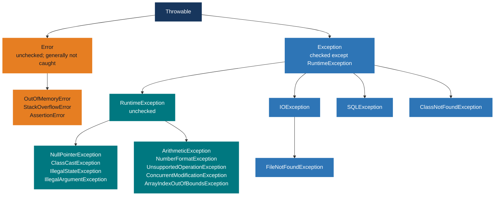

# Java Mastery — Exceptions

> **Goal:** Write robust, failure-proof Java by mastering the exception hierarchy, handling strategies, and custom exception design.
> This doc is a standalone companion to the [numbered Core Java index](00-core-java-index.md). Prerequisites: Language Foundations + OOP.

---

## 0) What this covers

1. The exception hierarchy — `Throwable`, `Error`, `Exception`, `RuntimeException`.
2. Checked vs unchecked exceptions — rules and rationale.
3. `try-catch-finally` — execution semantics in every scenario.
4. `try-with-resources` — automatic resource management (Java 7+).
5. `multi-catch` and exception chaining.
6. Designing and throwing custom exceptions.
7. Best practices and common anti-patterns.
8. Global exception handling — thread-level, JVM-wide, and Spring Boot.
9. Exception performance notes.
10. Quick checklist.

---

## 1) Exception Hierarchy

Every throwable in Java descends from `Throwable`.



The grouped names are **examples of descendants**, not necessarily direct subclasses.

| Category              | Examples                                              | Must declare/catch? |
|-----------------------|-------------------------------------------------------|---------------------|
| **Error**             | `OutOfMemoryError`, `StackOverflowError`              | No — don't catch    |
| **Checked Exception** | `IOException`, `SQLException`, `ClassNotFoundException` | **Yes** — compiler enforces |
| **Unchecked (RuntimeException)** | `NullPointerException`, `IllegalArgumentException` | No — optional |

---

## 2) Checked vs Unchecked Exceptions

### Checked exceptions

The compiler **forces** you to either handle them (`try-catch`) or declare them (`throws`). Represent recoverable conditions the caller should know about.

```java
// Must handle or declare — IOException is checked
public String readFile(String path) throws IOException {
    return Files.readString(Path.of(path));  // throws IOException
}

// Caller must handle or propagate
try {
    String content = readFile("data.txt");
} catch (IOException e) {
    System.err.println("File error: " + e.getMessage());
}
```

### Unchecked exceptions (RuntimeException)

No compiler enforcement. Represent programming bugs that should be fixed at the source, not caught.

```java
// These are bugs — fix the code, don't wrap in try-catch
int[] arr = {1, 2, 3};
arr[5];              // ArrayIndexOutOfBoundsException — bad index
String s = null;
s.length();          // NullPointerException — null dereference
int x = 5 / 0;      // ArithmeticException  — division by zero
Object o = "hello";
Integer i = (Integer) o; // ClassCastException — invalid cast
```

### The debate — when to use which

| Use checked when...                                         | Use unchecked when...                                     |
|-------------------------------------------------------------|-----------------------------------------------------------|
| The caller can reasonably recover (retry, use a default)    | The failure is a programming bug (fix the code)           |
| The failure is an external condition (file missing, network) | The cause is bad input from within the same layer        |
| You want the API to document possible failures explicitly    | You don't want to pollute every caller with `throws`      |

> **Modern Java tendency:** many frameworks (Spring, Hibernate) wrap checked exceptions in unchecked ones to avoid boilerplate. The `@Transactional` rollback, for example, is triggered by `RuntimeException` by default.

### 🎯 Interview Questions — Hierarchy & Types

- **Q: What is the difference between `Error` and `Exception`?**
  A: `Error` represents JVM-level failures that are generally unrecoverable (`OutOfMemoryError`, `StackOverflowError`) — do not catch. `Exception` represents recoverable application-level failures.

- **Q: What is the difference between checked and unchecked exceptions?**
  A: Checked exceptions (subclasses of `Exception` excluding `RuntimeException`) must be declared or caught — the compiler enforces this. Unchecked exceptions (`RuntimeException` and its subclasses, plus `Error`) are optional — they represent bugs or irrecoverable failures.

- **Q: Can you catch an `Error`?**
  A: Syntactically yes, but you almost never should. `Error` types signal unrecoverable JVM failures. Catching `OutOfMemoryError`, for instance, won't help if there's no memory to run recovery logic.

---

## 3) `try-catch-finally` — Execution Semantics

```java
try {
    // 1. Code that may throw
    riskyOperation();
} catch (SpecificException e) {
    // 2. Only runs if that specific exception (or subclass) is thrown
    handleSpecific(e);
} catch (AnotherException | YetAnother e) {
    // 3. Multi-catch — handles multiple unrelated types (Java 7+)
    handleMultiple(e);
} catch (Exception e) {
    // 4. Broader catch — catches anything not caught above
    handleGeneral(e);
} finally {
    // 5. ALWAYS runs — exception or not, return or not
    cleanup();   // close files, release locks, etc.
}
```

### Execution order in all scenarios

| Scenario                        | `try` | `catch` | `finally` | Return value |
|--------------------------------|:-----:|:-------:|:---------:|:------------:|
| No exception thrown             | ✅    | ❌       | ✅         | `try` return |
| Exception caught                | ✅†   | ✅       | ✅         | `catch` return |
| Exception thrown, not caught    | ✅†   | ❌       | ✅         | propagates   |
| `return` inside `try`           | ✅    | ❌       | ✅         | `try` return (finally can override it!) |
| `return` inside `finally`       | ✅    | —        | ✅         | **`finally` return overrides** |
| `System.exit()` called          | ✅†   | —        | ❌         | JVM exits    |

† up to the point of the exception

```java
// Warning: return inside finally overrides any return in try or catch
int tricky() {
    try {
        return 1;
    } finally {
        return 2;   // ← returns 2, silently swallows the return 1
    }
}
// tricky() == 2
```

> **Never put `return` inside `finally`** — it silently discards any exception or return value from `try`/`catch`.

### Catching and re-throwing

```java
try {
    riskyOperation();
} catch (IOException e) {
    log.error("IO failed", e);
    throw e;                           // re-throw same exception (preserves stack trace)
}

// Wrap in a different exception type (exception chaining)
try {
    repository.save(entity);
} catch (SQLException e) {
    throw new DataAccessException("Failed to save entity", e); // cause preserved
}

// Retrieve the cause
try {
    /* ... */
} catch (DataAccessException e) {
    Throwable root = e.getCause(); // the original SQLException
}
```

### 🎯 Interview Questions — try-catch-finally

- **Q: Does `finally` always execute?**
  A: Almost always. The only exceptions are: `System.exit()` is called, the JVM crashes, or the thread running the code is forcibly killed. Even a `return` statement inside `try` or `catch` does not skip `finally`.

- **Q: What happens if both `catch` and `finally` throw an exception?**
  A: The `finally` exception propagates, and the `catch` exception is **silently suppressed**. This is why `try-with-resources` (which uses suppressed exceptions) is preferred.

- **Q: What is exception chaining?**
  A: Wrapping a caught exception in a new exception to add context while preserving the original cause: `throw new ServiceException("Context", e)`. The cause is accessible via `getCause()` and appears in the full stack trace.

---

## 4) `try-with-resources` — Automatic Resource Management (Java 7+)

Any object implementing `AutoCloseable` (or `Closeable`) is automatically closed at the end of a `try-with-resources` block — even if an exception is thrown.

```java
// Classic style — verbose and error-prone
FileReader fr = null;
try {
    fr = new FileReader("file.txt");
    // use fr
} catch (IOException e) {
    // handle
} finally {
    if (fr != null) {
        try { fr.close(); } catch (IOException ignored) {}
    }
}

// try-with-resources — clean and safe
try (FileReader fr = new FileReader("file.txt");
     BufferedReader br = new BufferedReader(fr)) {
    String line;
    while ((line = br.readLine()) != null) {
        System.out.println(line);
    }
} catch (IOException e) {
    System.err.println("Error: " + e.getMessage());
}
// br and fr are closed automatically in REVERSE order (fr first, then br... wait)
// Actually: resources declared last are closed first — br closed, then fr closed
```

**Close order:** resources are closed in **reverse declaration order** — the last declared resource is closed first.

### Suppressed exceptions

If an exception is thrown in the `try` block AND `close()` also throws, the `close()` exception is added as a **suppressed exception** (not lost) on the original exception.

```java
class FailingResource implements AutoCloseable {
    public void use()   throws Exception { throw new Exception("use failed"); }
    public void close() throws Exception { throw new Exception("close failed"); }
}

try (FailingResource r = new FailingResource()) {
    r.use();
} catch (Exception e) {
    System.out.println("Primary:    " + e.getMessage());       // "use failed"
    System.out.println("Suppressed: " + e.getSuppressed()[0]); // "close failed"
}
```

### Implementing AutoCloseable in custom resources

```java
class DatabaseConnection implements AutoCloseable {
    private final String url;

    DatabaseConnection(String url) {
        this.url = url;
        System.out.println("Connected to " + url);
    }

    public void query(String sql) { System.out.println("Executing: " + sql); }

    @Override
    public void close() {
        System.out.println("Closing connection to " + url);
    }
}

try (DatabaseConnection conn = new DatabaseConnection("jdbc:h2:mem:test")) {
    conn.query("SELECT * FROM users");
} // "Closing connection to jdbc:h2:mem:test" printed automatically
```

### Java 9+ effectively-final variable in try-with-resources

```java
// Java 9+: can use an effectively-final variable — no need to re-declare
DatabaseConnection conn = new DatabaseConnection("jdbc:h2:mem:test");
try (conn) {
    conn.query("SELECT 1");
}
```

### 🎯 Interview Questions — try-with-resources

- **Q: What does `try-with-resources` require?**
  A: The resource must implement `java.lang.AutoCloseable` (or `java.io.Closeable`). Its `close()` method is called automatically at the end of the block.

- **Q: In what order are multiple resources closed in `try-with-resources`?**
  A: In **reverse declaration order** — the last-declared resource is closed first. This mirrors constructor/destructor LIFO semantics.

- **Q: What are suppressed exceptions?**
  A: If the `try` body throws exception A and `close()` throws exception B, then B is attached to A as a suppressed exception via `Throwable.addSuppressed()`. Retrievable with `e.getSuppressed()`. This prevents silently losing the primary exception.

---

## 5) Multi-catch and Exception Chaining

### Multi-catch (Java 7+)

```java
// Before Java 7 — repetitive
try { riskyOp(); }
catch (IOException e)     { log(e); throw new ServiceException(e); }
catch (SQLException e)    { log(e); throw new ServiceException(e); }

// Java 7+ multi-catch — cleaner; e is implicitly final
try { riskyOp(); }
catch (IOException | SQLException e) {
    log(e);
    throw new ServiceException(e);
}

// Note: cannot catch related types (supertype + subtype) in same multi-catch
// catch (Exception | IOException e) — COMPILE ERROR (IOException ⊂ Exception)
```

### Exception chaining

```java
// Layer exceptions with context — preserve the original cause
public User findUser(int id) {
    try {
        return userRepository.find(id);
    } catch (SQLException e) {
        // Business layer wraps technical detail
        throw new UserNotFoundException("User " + id + " not found", e);
    }
}

// Stack trace will show both the UserNotFoundException and its cause (SQLException)
```

---

## 6) Custom Exceptions

### 6.1 Checked custom exception

```java
// Checked — callers must handle or declare
public class InsufficientFundsException extends Exception {

    private final double amount;
    private final double balance;

    public InsufficientFundsException(double amount, double balance) {
        super(String.format("Cannot withdraw %.2f; balance is %.2f", amount, balance));
        this.amount  = amount;
        this.balance = balance;
    }

    // Cause-accepting constructor — always provide for exception chaining
    public InsufficientFundsException(double amount, double balance, Throwable cause) {
        super(String.format("Cannot withdraw %.2f; balance is %.2f", amount, balance), cause);
        this.amount  = amount;
        this.balance = balance;
    }

    public double getAmount()  { return amount; }
    public double getBalance() { return balance; }
}

// Usage
public void withdraw(double amount) throws InsufficientFundsException {
    if (amount > balance) throw new InsufficientFundsException(amount, balance);
    balance -= amount;
}
```

### 6.2 Unchecked custom exception

```java
// Unchecked — for programming errors / API misuse
public class InvalidOrderStateException extends RuntimeException {

    private final String orderId;
    private final String currentState;

    public InvalidOrderStateException(String orderId, String currentState) {
        super(String.format("Order %s cannot be processed in state '%s'",
                            orderId, currentState));
        this.orderId      = orderId;
        this.currentState = currentState;
    }

    public InvalidOrderStateException(String orderId, String currentState, Throwable cause) {
        super(String.format("Order %s in invalid state '%s'", orderId, currentState), cause);
        this.orderId      = orderId;
        this.currentState = currentState;
    }

    public String getOrderId()      { return orderId; }
    public String getCurrentState() { return currentState; }
}
```

### 6.3 Exception hierarchy for a module

```java
// Base exception for the payment module — all payment errors share a common type
public class PaymentException extends RuntimeException {
    public PaymentException(String message) { super(message); }
    public PaymentException(String message, Throwable cause) { super(message, cause); }
}

// Specific subtypes
public class PaymentDeclinedException extends PaymentException {
    private final String declineCode;
    public PaymentDeclinedException(String declineCode) {
        super("Payment declined: " + declineCode);
        this.declineCode = declineCode;
    }
    public String getDeclineCode() { return declineCode; }
}

public class PaymentGatewayException extends PaymentException {
    public PaymentGatewayException(String message, Throwable cause) {
        super(message, cause);
    }
}
```

### Custom exception design checklist

```
✅ Extends Exception (checked) or RuntimeException (unchecked) — never Throwable directly
✅ Provides a message constructor: MyException(String message)
✅ Provides a cause constructor: MyException(String message, Throwable cause)
✅ Provides a cause-only constructor: MyException(Throwable cause)
✅ Adds domain-specific fields with getters (orderId, errorCode, etc.)
✅ Named after the problem, not the component: UserNotFoundException, not UserDaoException
✅ Serializable (auto-inherited) — mark custom fields serialVersionUID if needed
```

### 🎯 Interview Questions — Custom Exceptions

- **Q: When should you create a custom exception?**
  A: When you want to (1) add domain-specific context (fields, error codes), (2) distinguish a specific error in `catch` by type, or (3) create a module-level hierarchy (e.g., `PaymentException` → `DeclinedException`). Don't create one just to rename an existing exception.

- **Q: What constructors should every custom exception provide?**
  A: At minimum: `(String message)` and `(String message, Throwable cause)`. The cause constructor enables exception chaining. Optionally `(Throwable cause)` for wrapping.

- **Q: Should you extend `Exception` or `RuntimeException`?**
  A: Extend `Exception` (checked) if the caller can meaningfully recover and should be forced to handle it. Extend `RuntimeException` (unchecked) for programming errors, API misuse, or when you don't want to burden every caller with `throws` declarations. Modern practice leans toward unchecked.

---

## 7) Best Practices and Anti-Patterns

### ✅ Best practices

```java
// 1. Catch the most specific exception type first
try { /* ... */ }
catch (FileNotFoundException e) { /* specific */ }
catch (IOException e)           { /* more general */ }

// 2. Always log or handle — never silently swallow
catch (Exception e) {
    logger.error("Unexpected error in processOrder", e);
    throw e;   // or rethrow as appropriate
}

// 3. Include context in the message
throw new IllegalArgumentException(
    "Age must be between 0 and 150, but was: " + age);

// 4. Use try-with-resources for any AutoCloseable
try (Connection conn = dataSource.getConnection();
     PreparedStatement ps = conn.prepareStatement(sql)) {
    // ...
}

// 5. Fail fast with precondition checks
public void setAge(int age) {
    if (age < 0 || age > 150)
        throw new IllegalArgumentException("Invalid age: " + age);
    this.age = age;
}

// 6. Use Objects.requireNonNull for null checks
public User(String name) {
    this.name = Objects.requireNonNull(name, "name must not be null");
}
```

### ❌ Anti-patterns to avoid

```java
// ❌ 1. Empty catch — swallows exceptions silently
try {
    riskyOperation();
} catch (Exception e) { }  // NEVER do this

// ❌ 2. Catching Throwable / Exception too broadly
try {
    normalOperation();
} catch (Exception e) {    // catches NullPointerException, ClassCastException, etc.
    // masks real bugs
}

// ❌ 3. Using exceptions for control flow (very slow — exceptions build stack traces)
try {
    int value = Integer.parseInt(input);
} catch (NumberFormatException e) {
    value = 0;  // prefer: if (isNumeric(input)) to validate first
}

// ❌ 4. Losing the original cause
catch (SQLException e) {
    throw new ServiceException("DB error");  // e is lost — chain it!
    // correct: throw new ServiceException("DB error", e);
}

// ❌ 5. Checked exception declared but never actually thrown
public void doSomething() throws IOException { // misleads callers
    System.out.println("nothing exceptional here");
}

// ❌ 6. return inside finally (overrides try/catch return or swallows exception)
finally {
    return result;  // NEVER — silently discards exceptions
}
```

---

## 8) Global Exception Handling

Global exception handling lets you intercept unhandled exceptions at the application, thread, or framework level — instead of wrapping every call site in `try-catch`.

---

### 8.1 `Thread.UncaughtExceptionHandler` — Per-thread global handler

Catches exceptions that propagate out of a thread's `run()` without being caught.

```java
// Define a handler
Thread.UncaughtExceptionHandler handler = (thread, throwable) -> {
    System.err.printf("[Thread: %s] Uncaught exception: %s%n",
                      thread.getName(), throwable.getMessage());
    // log, alert, restart, etc.
};

// Attach to a specific thread
Thread t = new Thread(() -> {
    throw new RuntimeException("Something went wrong");
});
t.setUncaughtExceptionHandler(handler);
t.start();

// Or set a JVM-wide default for ALL threads
Thread.setDefaultUncaughtExceptionHandler(handler);
```

With `ExecutorService` threads, you set the handler via a custom `ThreadFactory`:

```java
ThreadFactory factory = runnable -> {
    Thread t = new Thread(runnable);
    t.setUncaughtExceptionHandler((thread, ex) ->
        System.err.println("Pool thread error: " + ex.getMessage()));
    return t;
};

ExecutorService executor = Executors.newFixedThreadPool(4, factory);
```

> **Note:** `UncaughtExceptionHandler` does NOT catch exceptions from `Callable` tasks submitted to `ExecutorService` — those are wrapped in `ExecutionException` and retrieved from the `Future`. It only fires for exceptions that escape `Thread.run()` entirely.

---

### 8.2 JVM Shutdown Hook for last-resort cleanup

```java
// Runs on JVM shutdown (normal exit, SIGTERM) — NOT on kill -9 or crashes
Runtime.getRuntime().addShutdownHook(new Thread(() -> {
    System.out.println("JVM shutting down — flushing buffers, closing connections...");
    // flush logs, close DB connections, etc.
}));
```

---

### 8.3 Spring Boot — `@ControllerAdvice` / `@RestControllerAdvice`

The most common global exception handling pattern in Spring MVC / Spring Boot. A single class handles exceptions thrown from any `@Controller` or `@RestController`.

```java
@RestControllerAdvice   // = @ControllerAdvice + @ResponseBody
public class GlobalExceptionHandler {

    // Handle a specific custom exception
    @ExceptionHandler(UserNotFoundException.class)
    @ResponseStatus(HttpStatus.NOT_FOUND)
    public ErrorResponse handleUserNotFound(UserNotFoundException ex) {
        return new ErrorResponse("USER_NOT_FOUND", ex.getMessage());
    }

    // Handle validation errors (Bean Validation)
    @ExceptionHandler(MethodArgumentNotValidException.class)
    @ResponseStatus(HttpStatus.BAD_REQUEST)
    public ErrorResponse handleValidation(MethodArgumentNotValidException ex) {
        String details = ex.getBindingResult().getFieldErrors().stream()
            .map(fe -> fe.getField() + ": " + fe.getDefaultMessage())
            .collect(Collectors.joining(", "));
        return new ErrorResponse("VALIDATION_FAILED", details);
    }

    // Handle payment module exceptions (base type catches all subtypes)
    @ExceptionHandler(PaymentException.class)
    @ResponseStatus(HttpStatus.UNPROCESSABLE_ENTITY)
    public ErrorResponse handlePayment(PaymentException ex) {
        return new ErrorResponse("PAYMENT_ERROR", ex.getMessage());
    }

    // Fallback — catch everything else
    @ExceptionHandler(Exception.class)
    @ResponseStatus(HttpStatus.INTERNAL_SERVER_ERROR)
    public ErrorResponse handleAll(Exception ex) {
        // log the full stack trace internally
        log.error("Unhandled exception", ex);
        return new ErrorResponse("INTERNAL_ERROR", "An unexpected error occurred");
    }
}

// Simple error response DTO
public record ErrorResponse(String code, String message) {}
```

**How Spring routes exceptions:**

1. Spring looks for the **most specific** `@ExceptionHandler` that matches the thrown type.
2. If multiple handlers match, the closest in the type hierarchy wins.
3. The fallback `Exception.class` handler catches anything not matched above.

---

### 8.4 Spring Boot — `ResponseEntityExceptionHandler`

Extend this base class to also handle Spring MVC's own internal exceptions (e.g., `HttpMessageNotReadableException`, `MethodNotAllowedException`) alongside your custom ones.

```java
@RestControllerAdvice
public class GlobalExceptionHandler extends ResponseEntityExceptionHandler {

    @ExceptionHandler(UserNotFoundException.class)
    public ResponseEntity<ErrorResponse> handleUserNotFound(UserNotFoundException ex) {
        return ResponseEntity.status(HttpStatus.NOT_FOUND)
            .body(new ErrorResponse("USER_NOT_FOUND", ex.getMessage()));
    }

    // Override Spring MVC's handler for malformed JSON body
    @Override
    protected ResponseEntity<Object> handleHttpMessageNotReadable(
            HttpMessageNotReadableException ex, HttpHeaders headers,
            HttpStatusCode status, WebRequest request) {
        return ResponseEntity.badRequest()
            .body(new ErrorResponse("MALFORMED_JSON", "Request body is not readable"));
    }
}
```

---

### 8.5 Servlet Filter / `HandlerInterceptor` level (Spring)

Exceptions thrown **before** reaching a controller (e.g., in a `Filter`) are NOT caught by `@ControllerAdvice`. Handle them in the filter itself or configure a custom `ErrorController`.

```java
@Component
public class JwtAuthFilter extends OncePerRequestFilter {

    @Override
    protected void doFilterInternal(HttpServletRequest req,
                                    HttpServletResponse res,
                                    FilterChain chain) throws ServletException, IOException {
        try {
            // validate JWT, set SecurityContext
            chain.doFilter(req, res);
        } catch (JwtExpiredException ex) {
            // Must write the response directly — @ControllerAdvice won't see this
            res.setStatus(HttpServletResponse.SC_UNAUTHORIZED);
            res.getWriter().write("{\"error\": \"Token expired\"}");
        }
    }
}
```

---

### 8.6 Plain Java — `ProcessHandle` / top-level `main` catch-all

For non-framework applications, catch at the top-most entry point:

```java
public class Application {

    public static void main(String[] args) {
        // JVM-wide default handler for any thread
        Thread.setDefaultUncaughtExceptionHandler((thread, ex) -> {
            System.err.println("[FATAL] Uncaught in " + thread.getName() + ": " + ex);
            System.exit(1);
        });

        try {
            new Application().run(args);
        } catch (Exception e) {
            System.err.println("Application failed to start: " + e.getMessage());
            System.exit(1);
        }
    }
}
```

---

### 8.7 Global Exception Handling — Summary Table

| Scope | Mechanism | Catches |
|---|---|---|
| All threads (JVM-wide) | `Thread.setDefaultUncaughtExceptionHandler()` | Unhandled exceptions escaping any `Thread.run()` |
| Single thread | `Thread.setUncaughtExceptionHandler()` | Same, scoped to one thread |
| Thread pool | Custom `ThreadFactory` with handler | Pool threads' unhandled exceptions |
| Spring MVC controllers | `@RestControllerAdvice` + `@ExceptionHandler` | Exceptions from `@Controller` methods |
| Spring MVC + framework | `ResponseEntityExceptionHandler` subclass | Spring's own MVC exceptions too |
| Before controllers (Filters) | Exception handling inside the `Filter` | Filter-layer exceptions |
| Application entry point | `main()` top-level try-catch | Startup / top-level failures |

---

### 🎯 Interview Questions — Global Exception Handling

- **Q: How do you handle exceptions globally in a Spring Boot REST API?**
  A: Use `@RestControllerAdvice` with `@ExceptionHandler` methods. Each method declares which exception type(s) it handles. Spring routes thrown exceptions to the most-specific matching handler. Extend `ResponseEntityExceptionHandler` to also intercept Spring MVC's own built-in exceptions.

- **Q: Does `@ControllerAdvice` catch exceptions thrown inside a Servlet Filter?**
  A: No. `@ControllerAdvice` only intercepts exceptions from the Spring MVC dispatcher layer (i.e., from controllers, `@Service` calls made through controllers, etc.). Exceptions in filters must be handled within the filter or by a custom `ErrorController`.

- **Q: What is `Thread.setDefaultUncaughtExceptionHandler` and when do you use it?**
  A: It registers a JVM-wide fallback handler invoked when an exception propagates out of any thread's `run()` without being caught. Useful for logging fatal errors, sending alerts, or performing last-resort cleanup in standalone applications.

- **Q: Why don't uncaught exceptions from `ExecutorService` tasks trigger the `UncaughtExceptionHandler`?**
  A: Because `ExecutorService` wraps submitted tasks internally and catches their exceptions, storing them in the `Future`. The thread itself doesn't "see" the exception propagate — so the handler never fires. You must call `future.get()` and catch `ExecutionException` to retrieve task failures.

---

## 9) Exception Performance Notes

- Creating an exception is **expensive** — the JVM captures the full **stack trace** at construction time (not at throw time). This is why exceptions are for exceptional conditions, not control flow.
- `fillInStackTrace()` can be overridden to return `this` (no-op) in performance-critical custom exceptions where the trace isn't needed.
- Throwing and catching exceptions is relatively cheap once the object is created.

```java
// Performance-optimized exception (used in frameworks for flow control)
public class FlowControlException extends RuntimeException {
    public FlowControlException(String message) { super(message); }

    @Override
    public synchronized Throwable fillInStackTrace() {
        return this;  // skip stack trace capture — much faster construction
    }
}
```

---

## 10) Quick Checklist — Exceptions

- Use `try-with-resources` for every `AutoCloseable` — eliminates finally boilerplate and handles suppressed exceptions correctly.
- Catch the **most specific** exception type first; broader types last.
- Never swallow exceptions silently — always log or rethrow.
- Always pass the cause when wrapping: `throw new MyException("msg", e)`.
- Include meaningful context in exception messages (actual vs. expected values).
- Prefer unchecked exceptions for programming errors; checked for recoverable external failures.
- Validate inputs eagerly at method boundaries — fail fast.
- Never use `return` inside `finally` — it silently overrides `try`/`catch` return values and suppresses exceptions.
- Don't use exceptions for normal control flow — they are expensive to construct.
- Name custom exceptions after the problem, not the component.
- Provide both `(String message)` and `(String message, Throwable cause)` constructors in custom exceptions.
