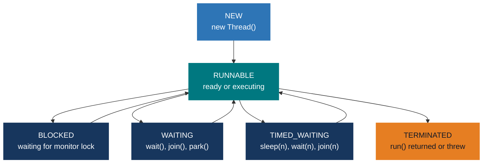
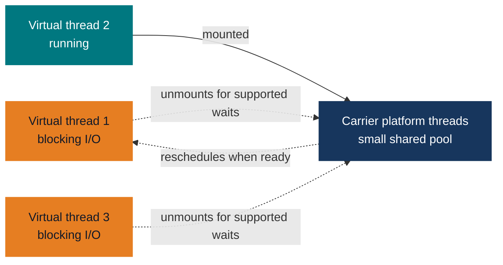

# Java Mastery — Concurrency

> **Goal:** Write correct, thread-safe, high-performance concurrent Java programs.
> This doc is a standalone companion to the [numbered Core Java index](00-core-java-index.md). Prerequisites: Language Foundations + OOP + Functional Java.

---

## 0) What this covers

1. Threads and the `Runnable`/`Callable` contract.
2. `synchronized`, intrinsic locks, and the Java Memory Model.
3. `volatile` — visibility guarantee.
4. The `java.util.concurrent` toolkit — locks, atomic variables, concurrent collections.
5. Executors and thread pools.
6. `CompletableFuture` — async/non-blocking pipelines.
7. Virtual threads (Project Loom — JDK 21+).
8. Common concurrency bugs and how to avoid them.
9. Interview questions woven throughout.

---

## 1) Threads and Runnable / Callable

### 1.1 Creating and starting threads

```java
// Option 1 — extend Thread (rarely preferred)
class MyThread extends Thread {
    @Override
    public void run() { System.out.println("Thread: " + getName()); }
}
new MyThread().start();

// Option 2 — implement Runnable (preferred — separates task from execution)
Runnable task = () -> System.out.println("Running: " + Thread.currentThread().getName());
Thread t = new Thread(task, "worker-1");
t.start();    // start() schedules the thread — run() would execute synchronously on THIS thread

// Option 3 — Callable (returns a value, may throw)
Callable<Integer> computation = () -> {
    Thread.sleep(100);
    return 42;
};
```

### 1.2 Thread lifecycle



### 1.3 Key Thread methods

```java
Thread t = new Thread(task, "worker");

t.start();                      // schedule for execution — do NOT call run() directly
t.join();                       // wait for t to finish (current thread blocks)
t.join(5000);                   // wait at most 5 s
t.interrupt();                  // set interrupt flag — signals t to stop
t.isInterrupted();              // check flag (does NOT clear it)
Thread.interrupted();           // static — checks AND clears interrupt flag
Thread.sleep(1000);             // sleep current thread 1 s (throws InterruptedException)
Thread.yield();                 // hint to scheduler to switch to another thread
Thread.currentThread();         // reference to current thread
Thread.currentThread().getName();

t.setDaemon(true);              // daemon threads die when all non-daemons finish (e.g., GC thread)
t.setPriority(Thread.MAX_PRIORITY); // 1–10; hint to scheduler
t.getState();                   // Thread.State enum

// Interrupt-safe sleep pattern
try {
    Thread.sleep(1000);
} catch (InterruptedException e) {
    Thread.currentThread().interrupt();  // restore interrupt flag — NEVER swallow!
    return;
}
```

### 🎯 Interview Questions — Threads

- **Q: What is the difference between `start()` and `run()`?**
  A: `start()` creates a new OS thread and schedules `run()` for execution on it. Calling `run()` directly executes it on the current thread — no new thread is created.

- **Q: What does `Thread.sleep()` do to the lock?**
  A: `Thread.sleep()` does **not** release any held locks. The sleeping thread keeps all monitors. Compare with `Object.wait()`, which releases the intrinsic lock of the object waited on.

- **Q: What is a daemon thread?**
  A: A daemon thread (e.g., GC, JIT) is a background thread that the JVM terminates automatically when all non-daemon threads have finished. Set with `t.setDaemon(true)` before `start()`.

---

## 2) Synchronization and Intrinsic Locks

Every Java object has an **intrinsic lock** (monitor). The `synchronized` keyword acquires that lock.

### 2.1 Synchronized methods

```java
class BankAccount {
    private double balance;

    // Acquires the lock on 'this' — only one thread at a time can execute ANY synchronized method
    public synchronized void deposit(double amount) {
        balance += amount;
    }

    public synchronized void withdraw(double amount) {
        if (amount > balance) throw new IllegalStateException("Insufficient funds");
        balance -= amount;
    }

    public synchronized double getBalance() { return balance; }
}
```

### 2.2 Synchronized blocks — finer granularity

```java
class SafeCounter {
    private final Object lock = new Object();  // dedicated lock object (private)
    private int count = 0;

    public void increment() {
        synchronized (lock) {
            count++;
        }
        // non-synchronized work outside the block — reduces contention
    }

    public int get() {
        synchronized (lock) { return count; }
    }
}

// Static synchronized — acquires lock on Class object (shared across all instances)
class IdGenerator {
    private static int nextId = 0;

    public static synchronized int next() { return ++nextId; }
}
```

### 2.3 Race conditions

A **race condition** occurs when the outcome depends on the non-deterministic interleaving of threads.

```java
// BROKEN — not thread-safe; check-then-act is not atomic
class BrokenSingleton {
    private static BrokenSingleton instance;

    public static BrokenSingleton getInstance() {
        if (instance == null) {               // Thread A and B both see null
            instance = new BrokenSingleton(); // both create separate instances!
        }
        return instance;
    }
}

// CORRECT — double-checked locking with volatile (see volatile section)
```

### 2.4 Deadlock

A deadlock occurs when two or more threads each hold a lock the other needs, and all are waiting indefinitely.

```java
// Classic deadlock — thread 1 locks A then B; thread 2 locks B then A
Object lockA = new Object();
Object lockB = new Object();

Thread t1 = new Thread(() -> {
    synchronized (lockA) {
        Thread.sleep(50);         // allow t2 to acquire lockB
        synchronized (lockB) { /* work */ }  // waits forever for lockB
    }
});

Thread t2 = new Thread(() -> {
    synchronized (lockB) {
        synchronized (lockA) { /* work */ }  // waits forever for lockA
    }
});

// Prevention: always acquire locks in the SAME global order
```

### 🎯 Interview Questions — Synchronized

- **Q: What is the difference between a `synchronized` method and a `synchronized` block?**
  A: A `synchronized` method acquires the lock on `this` (or the class for static). A `synchronized` block allows specifying any object as the lock and narrows the critical section, reducing contention and improving throughput.

- **Q: Can two threads call different synchronized methods of the same object simultaneously?**
  A: No. Both methods share the same intrinsic lock (on `this`). Only one thread can hold that lock at a time, so the second thread blocks until the first releases it.

- **Q: What is a deadlock, and how do you prevent it?**
  A: A deadlock is a circular wait — thread A holds lock X and waits for Y; thread B holds Y and waits for X. Prevention: (1) always acquire multiple locks in the same global order, (2) use `tryLock()` with a timeout (`ReentrantLock`), (3) minimize lock scope.

---

## 3) Java Memory Model (JMM) and `volatile`

### 3.1 The problem — CPU caches and reordering

On modern CPUs, each thread has its own cache. Without synchronization, one thread's writes may not be visible to another thread. Also, the JVM and CPU may **reorder** instructions for optimization.

```java
// BROKEN — without volatile, reader may never see the update
class Flag {
    boolean ready = false;
    int value = 0;

    void writer() { value = 42; ready = true; }       // write value, then signal
    void reader() {
        while (!ready) {}                              // may spin forever!
        System.out.println(value);                    // may print 0 (reordering)
    }
}
```

### 3.2 `volatile` — visibility + ordering guarantee

Declaring a field `volatile` guarantees:
1. **Visibility:** every write is immediately flushed to main memory; every read fetches from main memory.
2. **Ordering:** writes to volatile variables cannot be reordered relative to preceding writes; reads cannot be reordered relative to following reads (happens-before relationship).

`volatile` does **not** make compound operations atomic (e.g., `volatile int count; count++` is still not atomic — it's read-modify-write, three operations).

```java
class Flag {
    volatile boolean ready = false;
    int value = 0;   // safe because volatile ready establishes happens-before

    void writer() { value = 42; ready = true; }       // correct with volatile
    void reader() {
        while (!ready) {}
        System.out.println(value);    // guaranteed to print 42
    }
}

// Double-checked locking — needs volatile on instance
class Singleton {
    private static volatile Singleton instance;

    public static Singleton getInstance() {
        if (instance == null) {                       // first check (no lock)
            synchronized (Singleton.class) {
                if (instance == null) {               // second check (with lock)
                    instance = new Singleton();
                }
            }
        }
        return instance;
    }
}
```

### volatile vs synchronized

| Aspect             | `volatile`                            | `synchronized`                          |
|--------------------|---------------------------------------|-----------------------------------------|
| Visibility         | ✅ Guaranteed                          | ✅ Guaranteed                            |
| Atomicity          | ❌ Only for reads/writes (not compound)| ✅ Entire synchronized block is atomic   |
| Mutual exclusion   | ❌                                     | ✅                                       |
| Performance        | Faster                                | Slower (lock acquisition)               |
| Use when           | Simple flag / status                  | Compound check-then-act; invariants      |

---

## 4) `java.util.concurrent` — Advanced Concurrency Toolkit

### 4.1 `ReentrantLock` — explicit lock

```java
import java.util.concurrent.locks.*;

ReentrantLock lock = new ReentrantLock();

// Basic usage
lock.lock();
try {
    // critical section
} finally {
    lock.unlock();  // ALWAYS in finally — ensures release even if exception thrown
}

// tryLock — non-blocking; returns false immediately if lock unavailable
if (lock.tryLock()) {
    try { /* critical section */ }
    finally { lock.unlock(); }
} else {
    // do something else — avoid deadlock
}

// tryLock with timeout
if (lock.tryLock(100, TimeUnit.MILLISECONDS)) {
    try { /* ... */ }
    finally { lock.unlock(); }
}

// Reentrant — same thread can lock multiple times without deadlocking
lock.lock();
lock.lock();   // second acquisition — lock count = 2
lock.unlock(); // count = 1
lock.unlock(); // count = 0 — actually released

// Fair lock — longest-waiting thread gets the lock first (reduces starvation)
ReentrantLock fairLock = new ReentrantLock(true);
```

### 4.2 `ReadWriteLock` — concurrent reads, exclusive write

```java
ReadWriteLock rwLock = new ReentrantReadWriteLock();
Lock readLock  = rwLock.readLock();
Lock writeLock = rwLock.writeLock();

// Multiple readers can hold the read lock simultaneously
readLock.lock();
try { return data; }
finally { readLock.unlock(); }

// Only one writer, and no readers, can hold the write lock
writeLock.lock();
try { data = newValue; }
finally { writeLock.unlock(); }

// Use when reads vastly outnumber writes (e.g., caches, config)
```

### 4.3 `StampedLock` — optimistic reads (Java 8+)

```java
StampedLock sl = new StampedLock();

// Optimistic read — no lock; validate afterward
long stamp = sl.tryOptimisticRead();
int localX = x, localY = y;               // read without acquiring lock
if (!sl.validate(stamp)) {                // another thread may have written
    stamp = sl.readLock();                // fall back to read lock
    try { localX = x; localY = y; }
    finally { sl.unlockRead(stamp); }
}
// Use localX, localY safely

// Write lock
long writeStamp = sl.writeLock();
try { x = newX; y = newY; }
finally { sl.unlockWrite(writeStamp); }
```

### 4.4 Atomic variables — lock-free compound operations

`java.util.concurrent.atomic` provides atomic operations via CPU CAS (compare-and-swap) instructions — no locking required.

```java
AtomicInteger counter = new AtomicInteger(0);

counter.get();                          // read
counter.set(10);                        // write
counter.incrementAndGet();              // ++counter (atomic)
counter.getAndIncrement();              // counter++ (atomic)
counter.addAndGet(5);                   // counter += 5 (atomic)
counter.compareAndSet(10, 20);          // if current == 10, set to 20; returns boolean

AtomicLong    atomicLong    = new AtomicLong(0L);
AtomicBoolean atomicBool    = new AtomicBoolean(false);
AtomicReference<String> ref = new AtomicReference<>("initial");

// LongAdder — better throughput than AtomicLong under high contention
LongAdder adder = new LongAdder();
adder.increment();
adder.add(5);
adder.sum();  // get total
```

### 4.5 Concurrent collections

```java
// ConcurrentHashMap — thread-safe Map with segment locking
ConcurrentHashMap<String, Integer> chm = new ConcurrentHashMap<>();
chm.putIfAbsent("key", 1);      // atomic
chm.computeIfAbsent("key", k -> k.length());

// CopyOnWriteArrayList — reads never block; writes create a copy
CopyOnWriteArrayList<String> cowList = new CopyOnWriteArrayList<>();
cowList.add("hello");
for (String s : cowList) { /* safe even if modified concurrently */ }
// ✅ Read-heavy, rare-write scenarios (event listener lists)
// ❌ High-write scenarios — each write copies the entire array

// BlockingQueue — producer-consumer with blocking semantics
BlockingQueue<Task> queue = new ArrayBlockingQueue<>(100); // bounded
queue.put(task);                // blocks if full
queue.take();                   // blocks if empty
queue.offer(task, 1, TimeUnit.SECONDS);   // timed offer
queue.poll(1, TimeUnit.SECONDS);           // timed poll

// Other blocking queues
LinkedBlockingQueue<Task> unbounded = new LinkedBlockingQueue<>();    // optionally bounded
PriorityBlockingQueue<Task> prioritized = new PriorityBlockingQueue<>();
SynchronousQueue<Task> sync = new SynchronousQueue<>();  // no capacity — handoff only
```

---

## 5) Executors and Thread Pools

Creating threads is expensive. Thread pools reuse threads, control concurrency, and manage lifecycle.


### 5.1 Creating thread pools

```java
import java.util.concurrent.*;

// Fixed — n threads always alive; new tasks queue if all busy
ExecutorService fixed = Executors.newFixedThreadPool(4);

// Cached — grows unboundedly on demand; idle threads recycled after 60 s
// ⚠ Risk: can create thousands of threads under load
ExecutorService cached = Executors.newCachedThreadPool();

// Single — exactly one thread; tasks execute sequentially
ExecutorService single = Executors.newSingleThreadExecutor();

// Scheduled — run tasks after delay or at fixed rate
ScheduledExecutorService scheduler = Executors.newScheduledThreadPool(2);

// Custom — full control over all parameters
ExecutorService custom = new ThreadPoolExecutor(
    4,                            // corePoolSize — always alive
    16,                           // maximumPoolSize — max threads under load
    60, TimeUnit.SECONDS,         // keepAliveTime for idle threads above core
    new ArrayBlockingQueue<>(100),// work queue — bounds the queue
    Executors.defaultThreadFactory(),
    new ThreadPoolExecutor.CallerRunsPolicy()  // rejection policy when queue full
);
```

**Rejection policies:**

| Policy | Behavior when queue is full |
|--------|----------------------------|
| `AbortPolicy` (default) | Throws `RejectedExecutionException` |
| `CallerRunsPolicy` | Caller thread runs the task (back-pressure) |
| `DiscardPolicy` | Silently drops the task |
| `DiscardOldestPolicy` | Drops the oldest queued task, retries |

### 5.2 Submitting tasks

```java
ExecutorService exec = Executors.newFixedThreadPool(4);

// Runnable — fire and forget
exec.execute(() -> System.out.println("Task running"));

// Callable — returns a Future
Future<Integer> future = exec.submit(() -> {
    Thread.sleep(500);
    return 42;
});

// Future API
future.isDone();                 // non-blocking check
future.get();                    // blocking — waits for result; throws ExecutionException/InterruptedException
future.get(2, TimeUnit.SECONDS); // blocking with timeout; throws TimeoutException
future.cancel(true);             // attempt to cancel; true = interrupt if running

// invokeAll — submit multiple, wait for ALL to complete
List<Callable<Integer>> tasks = List.of(() -> 1, () -> 2, () -> 3);
List<Future<Integer>> futures = exec.invokeAll(tasks);

// invokeAny — submit multiple, return FIRST to complete, cancel others
Integer first = exec.invokeAny(tasks);
```

### 5.3 Lifecycle and shutdown

```java
exec.shutdown();              // stop accepting new tasks; wait for running tasks to finish
exec.awaitTermination(10, TimeUnit.SECONDS);  // wait up to 10 s for shutdown
exec.shutdownNow();           // interrupt running tasks; returns queued tasks
exec.isShutdown();
exec.isTerminated();

// Recommended shutdown pattern
exec.shutdown();
try {
    if (!exec.awaitTermination(60, TimeUnit.SECONDS)) {
        exec.shutdownNow();
        if (!exec.awaitTermination(60, TimeUnit.SECONDS))
            System.err.println("Pool did not terminate");
    }
} catch (InterruptedException e) {
    exec.shutdownNow();
    Thread.currentThread().interrupt();
}
```

### 5.4 ForkJoinPool and parallel streams

```java
// ForkJoinPool — work-stealing pool; ideal for recursive divide-and-conquer
ForkJoinPool pool = new ForkJoinPool(4);

// RecursiveTask — returns a value
class SumTask extends RecursiveTask<Long> {
    private final int[] arr;
    private final int from, to;
    static final int THRESHOLD = 1000;

    SumTask(int[] arr, int from, int to) {
        this.arr = arr; this.from = from; this.to = to;
    }

    @Override
    protected Long compute() {
        if (to - from <= THRESHOLD) {
            long sum = 0;
            for (int i = from; i < to; i++) sum += arr[i];
            return sum;
        }
        int mid = (from + to) / 2;
        SumTask left  = new SumTask(arr, from, mid);
        SumTask right = new SumTask(arr, mid, to);
        left.fork();                // submit left to pool
        return right.compute()     // compute right on current thread
             + left.join();        // wait for left
    }
}

long total = pool.invoke(new SumTask(data, 0, data.length));

// parallelStream() uses the common ForkJoinPool by default
// Use a custom pool to control parallelism:
pool.submit(() ->
    largeList.parallelStream()
             .mapToInt(Integer::intValue)
             .sum()
).get();
```

### 🎯 Interview Questions — Executors

- **Q: What is the difference between `execute()` and `submit()`?**
  A: `execute(Runnable)` is fire-and-forget — no return value, exceptions are thrown to the thread's uncaught exception handler. `submit(Callable/Runnable)` returns a `Future` — lets you retrieve the result, check completion, or catch exceptions via `future.get()`.

- **Q: Why should you avoid `Executors.newCachedThreadPool()` in production?**
  A: It creates threads on demand with no upper bound. Under high load it may spawn thousands of threads, exhausting JVM memory. Always use a bounded pool (`newFixedThreadPool` or custom `ThreadPoolExecutor`) with a bounded queue and an appropriate rejection policy.

- **Q: What is work-stealing in `ForkJoinPool`?**
  A: Each thread has its own deque of tasks. When a thread's deque is empty, it "steals" tasks from the tail of another thread's deque. This maximizes CPU utilization for recursive divide-and-conquer workloads.

---

## 6) CompletableFuture — Async / Non-blocking Pipelines (Java 8+)

`CompletableFuture<T>` is a `Future` that can be manually completed and supports chaining async operations.

### 6.1 Creating

```java
// Already-completed future
CompletableFuture<String> done = CompletableFuture.completedFuture("result");

// Run asynchronously (uses common ForkJoinPool by default)
CompletableFuture<Void>   cf1 = CompletableFuture.runAsync(() -> doWork());
CompletableFuture<String> cf2 = CompletableFuture.supplyAsync(() -> fetchData());

// With custom executor
ExecutorService exec = Executors.newFixedThreadPool(4);
CompletableFuture<String> cf3 = CompletableFuture.supplyAsync(() -> fetchData(), exec);
```

### 6.2 Chaining

```java
CompletableFuture<String> pipeline = CompletableFuture
    .supplyAsync(() -> fetchUserJson())          // async: produce JSON string
    .thenApply(json -> parseUser(json))          // sync transform: JSON → User
    .thenApply(user -> user.getName())           // sync transform: User → String
    .thenCompose(name -> fetchProfile(name))     // async flatMap: String → CF<Profile>
    .thenApply(profile -> profile.toString());

// thenApply  — sync function on result            (like Stream.map)
// thenCompose — async function returning CF       (like Stream.flatMap)
// thenAccept — consume result (void)
// thenRun    — run Runnable after completion (no access to result)
// thenApplyAsync / thenAcceptAsync / thenRunAsync — run the fn on an executor
```

### 6.3 Combining futures

```java
// Run two futures in parallel and combine results when BOTH complete
CompletableFuture<String> nameF    = CompletableFuture.supplyAsync(() -> "Alice");
CompletableFuture<Integer> ageF    = CompletableFuture.supplyAsync(() -> 30);

CompletableFuture<String> combined = nameF.thenCombine(ageF,
    (name, age) -> name + " is " + age);
combined.get(); // "Alice is 30"

// Wait for ANY of multiple futures to complete (first wins)
CompletableFuture<Object> anyOf = CompletableFuture.anyOf(cf1, cf2, cf3);

// Wait for ALL futures to complete
CompletableFuture<Void> allOf = CompletableFuture.allOf(cf1, cf2, cf3);
allOf.get(); // blocks until all done
```

### 6.4 Error handling

```java
CompletableFuture<String> result = CompletableFuture
    .supplyAsync(() -> riskyOp())
    .exceptionally(ex -> {
        System.err.println("Error: " + ex.getMessage());
        return "fallback";       // provide a default value on failure
    });

// handle — runs regardless of success or failure (like try-catch-finally)
.handle((value, ex) -> {
    if (ex != null) return "error: " + ex.getMessage();
    return "ok: " + value;
});

// whenComplete — like handle but doesn't transform the result
.whenComplete((value, ex) -> {
    if (ex != null) log.error("Failed", ex);
    else log.info("Result: " + value);
    // does not change the result
});
```

### 6.5 Manual completion

```java
CompletableFuture<String> manual = new CompletableFuture<>();
// On another thread or callback:
manual.complete("result");               // complete successfully
manual.completeExceptionally(new RuntimeException("failed"));
manual.cancel(true);                     // cancel

// Timeout (Java 9+)
manual.orTimeout(5, TimeUnit.SECONDS);           // throws TimeoutException if not done
manual.completeOnTimeout("default", 5, TimeUnit.SECONDS); // complete with default
```

### 🎯 Interview Questions — CompletableFuture

- **Q: What is the difference between `thenApply()` and `thenCompose()`?**
  A: `thenApply(fn)` maps the result synchronously — fn returns a plain value (like `Stream.map`). `thenCompose(fn)` maps to another `CompletableFuture` and flattens it (like `Stream.flatMap`). Use `thenCompose` when the next step is itself asynchronous.

- **Q: What is the difference between `exceptionally()` and `handle()`?**
  A: `exceptionally(fn)` only runs when the future completes with an exception — provides a fallback value. `handle(bifunction)` always runs — receives either the value (or null) and the exception (or null), and can handle both success and failure in one place.

- **Q: What executor does `supplyAsync()` use by default?**
  A: The **common `ForkJoinPool`** (`ForkJoinPool.commonPool()`). For production, supply your own executor to isolate task types, control pool size, and avoid starving other tasks sharing the common pool.

---

## 7) Virtual Threads (Project Loom — JDK 21+)

Traditional (platform) threads map 1-to-1 to OS threads — expensive to create (MB of stack), limited to thousands per JVM. **Virtual threads** are lightweight — managed by the JVM, mapped to carrier threads from a pool. Millions can exist simultaneously.

### 7.1 Creating virtual threads

```java
// Create and start a single virtual thread
Thread vt = Thread.ofVirtual().name("vt-1").start(() -> {
    System.out.println("Running on: " + Thread.currentThread());
});

// Via factory
ThreadFactory vtFactory = Thread.ofVirtual().factory();
Thread vt2 = vtFactory.newThread(() -> System.out.println("virtual"));
vt2.start();

// Executor backed by virtual threads (preferred for servers)
ExecutorService vtExec = Executors.newVirtualThreadPerTaskExecutor();
// Each submitted task gets its own virtual thread; bound I/O and external resources separately
try (vtExec) {
    for (int i = 0; i < 100_000; i++) {
        vtExec.submit(() -> blockingWork()); // only safe if downstream capacity is controlled
    }
}
```

### 7.2 How virtual threads work



For supported blocking operations, a virtual thread **unmounts** from its carrier, freeing it
for other work. When runnable again, it can mount on an available carrier. Some operations
(including certain native calls, and `synchronized` blocking in JDK 21) can pin a carrier.
Carrier-pool size is configurable; it is not always exactly the number of CPU cores.

### 7.3 Virtual thread best practices

```java
// ✅ Perfect for: high-throughput I/O bound servers (REST APIs, DB calls)
try (var exec = Executors.newVirtualThreadPerTaskExecutor()) {
    List<Future<String>> futures = urls.stream()
        .map(url -> exec.submit(() -> httpGet(url)))  // 1 VT per request
        .toList();
    for (var f : futures) System.out.println(f.get());
}

// ❌ Avoid synchronized blocks holding virtual threads — "pinning" (JDK 21)
//    synchronized blocks pin the VT to its carrier even when blocked
//    Prefer ReentrantLock instead
ReentrantLock lock = new ReentrantLock();
lock.lock();
try { doBlockingWork(); }    // VT can unmount safely
finally { lock.unlock(); }

// ❌ Virtual threads are NOT faster for CPU-bound work — use platform threads + ForkJoinPool
// ❌ Don't pool virtual threads — they're cheap to create; pooling defeats the purpose
```

### 🎯 Interview Questions — Virtual Threads

- **Q: What problem do virtual threads solve?**
  A: Traditional platform threads are expensive (1–2 MB stack, OS-level context switch). Under the "one thread per request" model, servers saturate at ~10K concurrent requests. Virtual threads are cheap (KB of stack, JVM-managed), enabling millions of concurrent tasks without blocking OS threads during I/O.

- **Q: Are virtual threads faster than platform threads for CPU-bound work?**
  A: No. Virtual threads improve scalability for **I/O-bound** work (they free the carrier thread while waiting). For CPU-intensive tasks, platform threads in a `ForkJoinPool` remain the better choice.

- **Q: What is "thread pinning" in virtual threads?**
  A: When a virtual thread is inside a `synchronized` block and performs a blocking operation, it cannot unmount from its carrier — it "pins" it. This reduces scalability. Avoid long blocking inside `synchronized`; use `ReentrantLock` instead (JDK 23+ is improving this).

---

## 8) Common Concurrency Bugs

### 8.1 Bug catalog

```java
// 1. RACE CONDITION — unsynchronized compound read-modify-write
int count = 0;
// Thread A and B both read 0, both write 1 → result is 1, not 2
// Fix: AtomicInteger, synchronized, or Lock

// 2. VISIBILITY — stale cache read
boolean done = false;
// Reader thread may cache 'done' and never see the write
// Fix: volatile boolean done;

// 3. DEADLOCK — circular lock dependency (see Section 2.4)
// Fix: consistent lock ordering, tryLock with timeout

// 4. LIVELOCK — threads keep reacting to each other without progress
// Fix: random backoff, priority ordering

// 5. STARVATION — low-priority thread never gets CPU
// Fix: fair locks, priority caps, work queues

// 6. MISSED SIGNALS (wait/notify without while loop)
synchronized (lock) {
    if (!condition) lock.wait();   // ❌ spurious wakeup — condition may still be false
    // Fix:
    while (!condition) lock.wait(); // ✅ always recheck in a while loop
    doWork();
}

// 7. EXCEPTION SWALLOWING in threads
new Thread(() -> {
    try { riskyWork(); }
    catch (Exception e) { }  // ❌ silent — exception lost, thread dies quietly
}).start();
// Fix: always log; set an UncaughtExceptionHandler
Thread t = new Thread(() -> riskyWork());
t.setUncaughtExceptionHandler((thread, ex) -> log.error("Thread failed", ex));
```

---

## 9) Synchronization Objects Quick Reference

| Tool | Use case | Blocks? | Notes |
|------|----------|---------|-------|
| `synchronized` | Simple mutual exclusion | Yes | Reentrant; auto-release |
| `ReentrantLock` | Need `tryLock`, fairness, multiple conditions | Yes | Must call `unlock()` in finally |
| `ReadWriteLock` | Many readers, few writers | Yes (writers) | High-read throughput |
| `StampedLock` | Optimistic reads | Sometimes | Not reentrant; fastest reads |
| `volatile` | Single flag/status variable | No | Visibility only; no atomicity for compounds |
| `AtomicInteger` etc. | Lock-free counters and CAS | No | CAS-based; very fast under low contention |
| `LongAdder` | High-contention counter | No | Better than AtomicLong under contention |
| `CountDownLatch` | Wait for N events (one-shot) | Yes | Cannot be reset |
| `CyclicBarrier` | N threads rendezvous (reusable) | Yes | Resets after each cycle |
| `Semaphore` | Limit concurrent access (n permits) | Yes | Useful for rate limiting |
| `Phaser` | Flexible multi-phase barrier | Yes | Replaces Latch + Barrier |
| `BlockingQueue` | Producer-consumer handoff | Yes | Built-in wait on empty/full |

### CountDownLatch, CyclicBarrier, Semaphore

```java
// CountDownLatch — main thread waits for N workers to finish
CountDownLatch latch = new CountDownLatch(3);
for (int i = 0; i < 3; i++) {
    int id = i;
    exec.submit(() -> {
        doWork(id);
        latch.countDown();
    });
}
latch.await();  // blocks until count reaches 0
System.out.println("All done");

// CyclicBarrier — N threads all wait until they've each reached the barrier
CyclicBarrier barrier = new CyclicBarrier(3, () -> System.out.println("Phase complete"));
// Each of 3 threads calls barrier.await(); when all 3 arrive, barrier action runs

// Semaphore — limit concurrent access to a resource
Semaphore semaphore = new Semaphore(5);  // at most 5 threads in the section
semaphore.acquire();   // blocks if 0 permits
try { accessResource(); }
finally { semaphore.release(); }
```

---

## 10) Quick Checklist — Concurrency

- Always call `unlock()` in a `finally` block when using `ReentrantLock`.
- Use `volatile` for simple flags/status; use `AtomicXxx` for compound atomic operations.
- Never catch and swallow `InterruptedException` — restore the interrupt flag with `Thread.currentThread().interrupt()`.
- Acquire multiple locks in a consistent global order to prevent deadlocks.
- Use `while` (not `if`) when checking conditions inside `synchronized(obj) { wait(); }` — guards against spurious wakeups.
- Prefer `Executors`/`CompletableFuture` over raw `Thread` for application-level concurrency.
- Always shut down `ExecutorService` — call `shutdown()` + `awaitTermination()`.
- For thread-safe counters: prefer `LongAdder` under high contention over `AtomicLong`.
- Avoid `synchronized` blocks inside virtual threads (JDK 21) — use `ReentrantLock` to allow unmounting during blocking calls.
- Don't pool virtual threads — create one per task via `newVirtualThreadPerTaskExecutor()`.
- Test concurrent code with stress tests and tools like `jcstress` or `ThreadSanitizer`.
- Set `UncaughtExceptionHandler` on threads so failures are never silently discarded.
