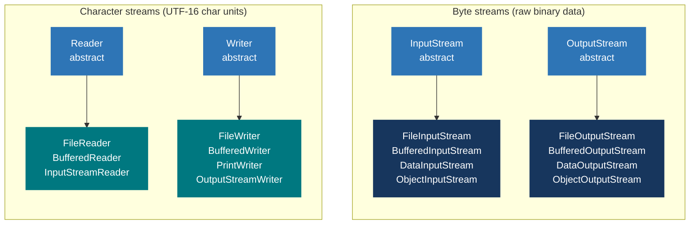

# Java Mastery — IO & Files

> **Goal:** Read, write, and manipulate files, byte streams, character streams, and the modern NIO.2 Files API.
> This doc is a standalone companion to the [numbered Core Java index](00-core-java-index.md). Prerequisites: Language Foundations + OOP + Exceptions.

---

## 0) What this covers

1. The IO stream hierarchy — bytes vs characters.
2. `java.io` byte streams: `InputStream` / `OutputStream`.
3. `java.io` character streams: `Reader` / `Writer`.
4. Buffered streams and `PrintWriter`.
5. NIO.2 — `Path`, `Paths`, `Files` API (Java 7+).
6. NIO channels and buffers — `FileChannel`, `ByteBuffer`.
7. Serialization — `Serializable`, `transient`, `ObjectOutputStream`.
8. Interview questions woven throughout.

---

## 1) IO Stream Hierarchy

Java IO is organized around the concept of streams — sequences of data flowing between a source and a destination.



The cards group **stream family examples**, not a literal `extends` hierarchy. Buffered
wrappers and adapters compose streams and can have intermediate superclasses.

| Feature            | Byte streams (`InputStream`/`OutputStream`) | Character streams (`Reader`/`Writer`) |
|--------------------|---------------------------------------------|---------------------------------------|
| Unit               | 1 byte at a time                            | 1 char (UTF-16) at a time             |
| Use for            | Images, audio, binary files, network data   | Text files, source code, CSV, JSON    |
| Encoding aware     | No — raw bytes                              | Choose a charset when converting bytes to characters (for example with `InputStreamReader`) |
| Bridge class       | —                                           | `InputStreamReader` / `OutputStreamWriter` |

---

## 2) Byte Streams — `InputStream` / `OutputStream`

### 2.1 `FileInputStream` and `FileOutputStream`

```java
// Read binary file byte by byte — use try-with-resources for auto-close
try (InputStream in = new FileInputStream("image.png");
     OutputStream out = new FileOutputStream("copy.png")) {

    byte[] buffer = new byte[8192];   // 8 KB buffer — much faster than 1 byte at a time
    int bytesRead;
    while ((bytesRead = in.read(buffer)) != -1) {
        out.write(buffer, 0, bytesRead);
    }
}

// Core InputStream methods
int  b    = in.read();              // read 1 byte (0–255), returns -1 at EOF
int  n    = in.read(buffer);        // fill buffer; returns bytes read or -1
int  n2   = in.read(buffer, off, len); // fill buffer[off..off+len]
long skip = in.skip(100);           // skip 100 bytes
int  avail= in.available();         // estimated bytes available without blocking
in.close();                         // always close (use try-with-resources)

// Core OutputStream methods
out.write(65);                       // write 1 byte (ASCII 'A')
out.write(buffer);                   // write entire buffer
out.write(buffer, 0, bytesRead);     // write portion of buffer
out.flush();                         // force buffered bytes to underlying stream
out.close();
```

### 2.2 `BufferedInputStream` / `BufferedOutputStream`

Wrapping with a buffer drastically reduces system calls:

```java
// Without buffer: read() → system call for every byte (very slow)
// With buffer: fills an 8KB internal array per system call
try (InputStream  in  = new BufferedInputStream(new FileInputStream("data.bin"), 16384);
     OutputStream out = new BufferedOutputStream(new FileOutputStream("out.bin"), 16384)) {
    byte[] buf = new byte[1024];
    int n;
    while ((n = in.read(buf)) != -1) out.write(buf, 0, n);
}
// Always call flush() or close() — BufferedOutputStream holds data until buffer is full
```

### 2.3 `DataInputStream` / `DataOutputStream` — typed primitives

```java
// Write typed data
try (DataOutputStream dos = new DataOutputStream(
        new BufferedOutputStream(new FileOutputStream("data.bin")))) {
    dos.writeInt(42);
    dos.writeDouble(3.14);
    dos.writeBoolean(true);
    dos.writeUTF("Hello");          // length-prefixed UTF-8 string
}

// Read typed data — MUST read in the SAME ORDER as written
try (DataInputStream dis = new DataInputStream(
        new BufferedInputStream(new FileInputStream("data.bin")))) {
    int     i = dis.readInt();      // 42
    double  d = dis.readDouble();   // 3.14
    boolean b = dis.readBoolean();  // true
    String  s = dis.readUTF();      // "Hello"
}
```

---

## 3) Character Streams — `Reader` / `Writer`

### 3.1 `FileReader` / `FileWriter`

```java
// FileReader uses the platform's default charset — may not be what you want!
// Prefer InputStreamReader with an explicit charset
try (Reader reader = new InputStreamReader(new FileInputStream("text.txt"),
                                           StandardCharsets.UTF_8)) {
    int c;
    while ((c = reader.read()) != -1) {
        System.out.print((char) c);   // read 1 char at a time
    }
}

// FileWriter — appends if second arg is true
try (Writer writer = new OutputStreamWriter(
        new FileOutputStream("output.txt", true), StandardCharsets.UTF_8)) {
    writer.write("Hello, World!\n");
    writer.write(new char[]{'H', 'i'});
}
```

### 3.2 `BufferedReader` / `BufferedWriter` — line-oriented text IO

```java
// Reading lines — most common pattern
try (BufferedReader br = new BufferedReader(
        new InputStreamReader(new FileInputStream("input.txt"), StandardCharsets.UTF_8))) {
    String line;
    while ((line = br.readLine()) != null) {  // returns null at EOF
        System.out.println(line);
    }
}

// Reading all lines into a List (fine for moderate-sized files)
try (BufferedReader br = Files.newBufferedReader(Path.of("input.txt"), StandardCharsets.UTF_8)) {
    List<String> lines = br.lines().toList(); // Stream<String> from reader
}

// Writing lines
try (BufferedWriter bw = new BufferedWriter(
        new OutputStreamWriter(new FileOutputStream("output.txt"), StandardCharsets.UTF_8))) {
    bw.write("Line 1");
    bw.newLine();     // platform-appropriate line separator
    bw.write("Line 2");
    bw.flush();
}
```

### 3.3 `PrintWriter` — formatted text output

```java
try (PrintWriter pw = new PrintWriter(new BufferedWriter(
        new OutputStreamWriter(new FileOutputStream("log.txt"), StandardCharsets.UTF_8)))) {
    pw.println("Hello");            // write + newline
    pw.printf("Value: %d%n", 42);   // formatted output
    pw.format("%.2f%n", 3.14159);   // same as printf
    // ⚠ PrintWriter swallows exceptions — call checkError() to detect them
    if (pw.checkError()) System.err.println("Write failed");
}
```

### 🎯 Interview Questions — IO Streams

- **Q: What is the difference between byte streams and character streams?**
  A: Byte streams (`InputStream`/`OutputStream`) handle raw binary data — one byte at a time, no encoding awareness. Character streams (`Reader`/`Writer`) handle text — one `char` (UTF-16) at a time, with charset conversion. Use byte streams for binary data (images, audio); character streams for text.

- **Q: Why should you always wrap streams in a `BufferedReader`/`BufferedWriter`?**
  A: Unbuffered streams make a system call for every single byte/char read or written, which is extremely slow. Buffered wrappers accumulate data in an internal array (default 8 KB) and make far fewer system calls.

- **Q: What does `readLine()` return at end-of-file?**
  A: `null`. The condition `while ((line = br.readLine()) != null)` is the canonical line-reading pattern.

---

## 4) NIO.2 — Modern Files API (Java 7+)

`java.nio.file` (NIO.2) provides a much richer, cleaner API than the legacy `java.io.File`. Always prefer it for new code.

### 4.1 `Path` and `Paths`

```java
import java.nio.file.*;

Path p1 = Path.of("src/main/java/Main.java");         // Java 11+
Path p2 = Paths.get("src", "main", "java", "Main.java"); // Java 7+
Path abs = p1.toAbsolutePath();
Path norm = abs.normalize();                           // resolve .. and .
Path rel  = Path.of("/a/b").relativize(Path.of("/a/b/c/d")); // "c/d"

// Path components
p1.getFileName();           // Main.java
p1.getParent();             // src/main/java
p1.getRoot();               // null for relative; "/" for absolute on Unix
p1.getNameCount();          // 4
p1.getName(0);              // "src"
p1.subpath(1, 3);           // "main/java"

// Combining paths
Path combined = Path.of("src").resolve("main/Main.java"); // "src/main/Main.java"
Path sibling  = p1.resolveSibling("Other.java");          // "src/main/java/Other.java"

// Comparison
p1.startsWith("src/main");
p1.endsWith("Main.java");
p1.equals(p2);
```

### 4.2 `Files` — high-level file operations

```java
import java.nio.file.*;
import java.nio.charset.StandardCharsets;

// ── Existence and type checks ─────────────────────────────────────
Files.exists(path);
Files.notExists(path);
Files.isRegularFile(path);
Files.isDirectory(path);
Files.isReadable(path);
Files.isWritable(path);
Files.isExecutable(path);
Files.isHidden(path);

// ── Read ──────────────────────────────────────────────────────────
// Read entire file as String (small files — loads entirely into memory)
String content = Files.readString(path);                         // Java 11+
String content2 = Files.readString(path, StandardCharsets.UTF_8);

// Read all bytes
byte[] bytes = Files.readAllBytes(path);

// Read all lines
List<String> lines = Files.readAllLines(path, StandardCharsets.UTF_8);

// Read as a lazy Stream<String> — efficient for large files
try (Stream<String> stream = Files.lines(path, StandardCharsets.UTF_8)) {
    long count = stream.filter(s -> s.contains("ERROR")).count();
}

// Buffered reader/writer via Files
try (BufferedReader br = Files.newBufferedReader(path, StandardCharsets.UTF_8)) {
    // ...
}

// ── Write ─────────────────────────────────────────────────────────
// Write String to file — creates or overwrites
Files.writeString(path, "content");                              // Java 11+
Files.writeString(path, "content", StandardOpenOption.APPEND);  // append mode

// Write bytes
Files.write(path, byteArray);

// Write lines
Files.write(path, List.of("line 1", "line 2"), StandardCharsets.UTF_8);

// Buffered writer
try (BufferedWriter bw = Files.newBufferedWriter(path, StandardCharsets.UTF_8,
        StandardOpenOption.CREATE, StandardOpenOption.APPEND)) {
    bw.write("line");
    bw.newLine();
}

// ── Copy, Move, Delete ────────────────────────────────────────────
Files.copy(source, target);
Files.copy(source, target, StandardCopyOption.REPLACE_EXISTING,
                            StandardCopyOption.COPY_ATTRIBUTES);
Files.copy(inputStream, target);                // write stream content to file

Files.move(source, target);
Files.move(source, target, StandardCopyOption.REPLACE_EXISTING,
                            StandardCopyOption.ATOMIC_MOVE);    // atomic on supported FS

Files.delete(path);         // throws NoSuchFileException if absent
Files.deleteIfExists(path); // returns false if absent — no exception

// ── Directory operations ──────────────────────────────────────────
Files.createDirectory(path);         // throws if parent missing
Files.createDirectories(path);       // creates parent dirs as needed

// List directory contents (non-recursive)
try (Stream<Path> entries = Files.list(dir)) {
    entries.filter(Files::isRegularFile).forEach(System.out::println);
}

// Walk directory tree (recursive)
try (Stream<Path> tree = Files.walk(dir)) {
    tree.filter(Files::isRegularFile)
        .filter(p -> p.toString().endsWith(".java"))
        .forEach(System.out::println);
}
// With max depth
try (Stream<Path> tree = Files.walk(dir, 2)) { /* max 2 levels deep */ }

// Walk with visitor pattern
Files.walkFileTree(dir, new SimpleFileVisitor<>() {
    @Override
    public FileVisitResult visitFile(Path file, BasicFileAttributes attrs) {
        System.out.println(file);
        return FileVisitResult.CONTINUE;  // or SKIP_SIBLINGS, SKIP_SUBTREE, TERMINATE
    }

    @Override
    public FileVisitResult preVisitDirectory(Path dir, BasicFileAttributes attrs) {
        System.out.println("Dir: " + dir);
        return FileVisitResult.CONTINUE;
    }
});

// Glob matching — find files by pattern
try (DirectoryStream<Path> ds = Files.newDirectoryStream(dir, "*.java")) {
    for (Path p : ds) System.out.println(p);
}
PathMatcher matcher = FileSystems.getDefault().getPathMatcher("glob:**/*.{java,kt}");
try (Stream<Path> tree = Files.walk(dir)) {
    tree.filter(matcher::matches).forEach(System.out::println);
}

// ── Metadata ──────────────────────────────────────────────────────
long size = Files.size(path);
FileTime modified = Files.getLastModifiedTime(path);
Files.setLastModifiedTime(path, FileTime.fromMillis(System.currentTimeMillis()));
BasicFileAttributes attrs = Files.readAttributes(path, BasicFileAttributes.class);
attrs.isDirectory();
attrs.isRegularFile();
attrs.size();
attrs.creationTime();
attrs.lastModifiedTime();

// ── Temp files ────────────────────────────────────────────────────
Path tmp = Files.createTempFile("prefix", ".txt");
Path tmpDir = Files.createTempDirectory("workdir");
tmp.toFile().deleteOnExit();   // delete when JVM exits
```

### 4.3 Standard Open Options

```java
StandardOpenOption.READ           // open for reading (default for read methods)
StandardOpenOption.WRITE          // open for writing
StandardOpenOption.CREATE         // create if not exists; open if exists
StandardOpenOption.CREATE_NEW     // create; fail if exists
StandardOpenOption.APPEND         // append to existing content
StandardOpenOption.TRUNCATE_EXISTING // overwrite existing content (default on write)
StandardOpenOption.DELETE_ON_CLOSE   // delete when closed
StandardOpenOption.SYNC           // sync content+metadata to storage on write
StandardOpenOption.DSYNC          // sync content only
```

### 🎯 Interview Questions — NIO.2

- **Q: What is the difference between `java.io.File` and `java.nio.file.Path`?**
  A: `File` is legacy — limited API, no exception on most failures (returns `false`), no symlink handling. `Path`/`Files` (NIO.2, Java 7+) provides rich operations, proper exceptions, symbolic link control, atomic moves, and filesystem independence. Always prefer NIO.2.

- **Q: How do you read a large file efficiently in Java?**
  A: Use `Files.lines(path)` which returns a lazy `Stream<String>` — reads line by line without loading the whole file into memory. Wrap in try-with-resources to close the underlying reader.

- **Q: What is the difference between `Files.copy()` and `Files.move()`?**
  A: `copy()` duplicates the file — source is preserved. `move()` renames/relocates — source no longer exists. With `ATOMIC_MOVE` option, `move()` is guaranteed to be atomic on supported filesystems (prevents partial-move state on failure).

---

## 5) NIO Channels and Buffers

NIO (Non-blocking IO) — introduced in Java 1.4 — adds channel-based IO with explicit buffers, supporting both blocking and non-blocking modes.

### 5.1 `ByteBuffer`

A `ByteBuffer` is a fixed-size array of bytes with three key state variables:

```
position ≤ limit ≤ capacity

capacity — total buffer size (fixed)
limit     — current readable/writable boundary
position  — current read/write cursor
```

```java
// Allocate
ByteBuffer buf = ByteBuffer.allocate(1024);     // heap buffer
ByteBuffer dir = ByteBuffer.allocateDirect(1024); // off-heap (faster for native IO)
ByteBuffer wrap = ByteBuffer.wrap(byteArray);   // wrap existing array

// Write into buffer (position advances)
buf.put((byte) 65);
buf.putInt(42);
buf.putDouble(3.14);
buf.put("hi".getBytes(StandardCharsets.UTF_8));

// Flip: prepare buffer for reading (limit = position; position = 0)
buf.flip();

// Read from buffer (position advances)
byte b = buf.get();
int  i = buf.getInt();

// Rewind: re-read from the beginning (position = 0; limit unchanged)
buf.rewind();

// Clear: prepare for fresh write (position = 0; limit = capacity)
buf.clear();

// Compact: discard already-read bytes; move unread bytes to start
buf.compact();

// Query
buf.remaining();  // limit - position (bytes available to read/write)
buf.hasRemaining();
buf.capacity();
buf.limit();
buf.position();

// Mark and reset
buf.mark();       // save current position
buf.reset();      // restore to last mark
```

### 5.2 `FileChannel` — fast file IO

```java
// Read with FileChannel
try (FileChannel fc = FileChannel.open(Path.of("data.bin"), StandardOpenOption.READ)) {
    ByteBuffer buf = ByteBuffer.allocate(8192);
    while (fc.read(buf) != -1) {
        buf.flip();
        // process buf.array() from 0 to buf.limit()
        buf.clear();
    }
}

// Write with FileChannel
try (FileChannel fc = FileChannel.open(Path.of("out.bin"),
        StandardOpenOption.WRITE, StandardOpenOption.CREATE, StandardOpenOption.TRUNCATE_EXISTING)) {
    ByteBuffer buf = ByteBuffer.wrap("Hello NIO!".getBytes(StandardCharsets.UTF_8));
    while (buf.hasRemaining()) fc.write(buf);
}

// Memory-mapped file — entire file mapped to virtual memory (zero-copy for large files)
try (FileChannel fc = FileChannel.open(Path.of("large.bin"), StandardOpenOption.READ)) {
    MappedByteBuffer mmap = fc.map(FileChannel.MapMode.READ_ONLY, 0, fc.size());
    // Access like a ByteBuffer — OS manages paging
    byte first = mmap.get(0);
}

// Efficient file-to-file transfer (zero-copy — uses OS sendfile)
try (FileChannel src  = FileChannel.open(source, StandardOpenOption.READ);
     FileChannel dest = FileChannel.open(target,
             StandardOpenOption.WRITE, StandardOpenOption.CREATE)) {
    src.transferTo(0, src.size(), dest);   // fast — may avoid kernel↔user copy
}
```

### 🎯 Interview Questions — NIO

- **Q: What is the difference between `java.io` and `java.nio`?**
  A: `java.io` is stream-based and blocking — a `read()` call blocks until data arrives. `java.nio` is buffer-oriented and supports non-blocking I/O via `Selector` + `Channel` — one thread can multiplex thousands of connections. NIO is also faster for large file transfers via memory-mapped files and `transferTo`.

- **Q: What is a memory-mapped file?**
  A: `FileChannel.map()` maps a file (or part of it) directly into the process's virtual address space. The OS handles paging — data is loaded on demand and written back transparently. Ideal for randomly accessing large files without loading them entirely into heap.

---

## 6) Serialization

**Serialization** converts an object's state into a byte stream so it can be saved to disk or transmitted over a network. **Deserialization** reconstructs the object.

### 6.1 Making a class serializable

```java
import java.io.*;

// Mark with Serializable — marker interface (no methods)
class Employee implements Serializable {
    // Required for safe deserialization when class changes
    private static final long serialVersionUID = 1L;

    private String name;
    private int    age;
    transient String password;   // transient — NOT serialized (excluded)
    static int     count;        // static — NOT serialized (belongs to class, not instance)

    Employee(String name, int age, String password) {
        this.name = name; this.age = age; this.password = password;
    }
}
```

### 6.2 Serializing and deserializing

```java
// Serialize — write object to file
try (ObjectOutputStream oos = new ObjectOutputStream(
        new BufferedOutputStream(new FileOutputStream("employee.ser")))) {
    oos.writeObject(new Employee("Alice", 30, "secret"));
}

// Deserialize — read object from file
try (ObjectInputStream ois = new ObjectInputStream(
        new BufferedInputStream(new FileInputStream("employee.ser")))) {
    Employee emp = (Employee) ois.readObject();
    System.out.println(emp.name);      // "Alice"
    System.out.println(emp.password);  // null — transient field not restored
}
```

### 6.3 `serialVersionUID`

```java
// Without serialVersionUID, Java computes it from the class structure.
// Any structural change (add/remove field, change method) changes the computed UID
// → InvalidClassException on deserialization of old data.
// Always declare it explicitly to control compatibility:
private static final long serialVersionUID = 42L;
```

### 6.4 Custom serialization

```java
class SecureEmployee implements Serializable {
    private static final long serialVersionUID = 1L;
    private String name;
    private transient String hashedPassword;

    private void writeObject(ObjectOutputStream oos) throws IOException {
        oos.defaultWriteObject();   // serialize non-transient fields
        oos.writeObject(encrypt(hashedPassword));   // custom encryption
    }

    private void readObject(ObjectInputStream ois) throws IOException, ClassNotFoundException {
        ois.defaultReadObject();    // deserialize non-transient fields
        this.hashedPassword = decrypt((String) ois.readObject());
    }

    private String encrypt(String s) { return Base64.getEncoder().encodeToString(s.getBytes()); }
    private String decrypt(String s) { return new String(Base64.getDecoder().decode(s)); }
}
```

### 6.5 Serialization caveats

```java
// ❌ Security risk: deserialization of untrusted data can execute arbitrary code
//    (gadget chains in Apache Commons Collections, etc.)
// ✅ Use an ObjectInputFilter (Java 9+) to whitelist allowed classes:
ObjectInputStream ois = new ObjectInputStream(fis);
ois.setObjectInputFilter(info -> {
    if (info.serialClass() == Employee.class) return ObjectInputFilter.Status.ALLOWED;
    return ObjectInputFilter.Status.REJECTED;
});

// ❌ Performance: Java serialization is slow and verbose
// ✅ For modern code: prefer JSON (Jackson, Gson), Protocol Buffers, or Avro
//    — faster, cross-language, schema-evolved
```

### 🎯 Interview Questions — Serialization

- **Q: What is `serialVersionUID` and why is it important?**
  A: A unique ID used during deserialization to verify that the sender and receiver of a serialized object have loaded classes that are compatible. If not declared, Java computes it from the class structure — any structural change produces a different UID, breaking deserialization of older data.

- **Q: What does `transient` mean in serialization?**
  A: A `transient` field is excluded from serialization — its value is not written to the stream. On deserialization, the field is set to its default value (`null` for objects, `0` for numbers, `false` for booleans). Use it for sensitive data, derived/computed fields, or non-serializable references.

- **Q: Is serialization thread-safe?**
  A: `ObjectOutputStream` and `ObjectInputStream` are not thread-safe. Do not share them across threads. Synchronize externally if needed.

---

## 7) IO Recipes — Common Patterns

```java
// 1. Read entire file as String (Java 11+)
String content = Files.readString(Path.of("file.txt"), StandardCharsets.UTF_8);

// 2. Write String to file (overwrite)
Files.writeString(Path.of("out.txt"), "content", StandardCharsets.UTF_8);

// 3. Append to file
Files.writeString(Path.of("log.txt"), "new line\n", StandardCharsets.UTF_8,
    StandardOpenOption.CREATE, StandardOpenOption.APPEND);

// 4. Copy file
Files.copy(Path.of("src.txt"), Path.of("dst.txt"),
    StandardCopyOption.REPLACE_EXISTING);

// 5. Count lines matching a pattern (lazy — no full load)
try (Stream<String> lines = Files.lines(Path.of("big.log"))) {
    long errors = lines.filter(l -> l.contains("ERROR")).count();
}

// 6. List all .java files recursively
try (Stream<Path> tree = Files.walk(Path.of("src"))) {
    List<Path> javaFiles = tree
        .filter(p -> p.toString().endsWith(".java"))
        .toList();
}

// 7. Read from classpath resource (e.g., in a test or JAR)
try (InputStream is = MyClass.class.getResourceAsStream("/config.properties")) {
    Properties props = new Properties();
    props.load(is);
}

// 8. Read CSV line by line
try (BufferedReader br = Files.newBufferedReader(Path.of("data.csv"),
                                                 StandardCharsets.UTF_8)) {
    String header = br.readLine();
    br.lines()
      .map(line -> line.split(","))
      .forEach(fields -> System.out.println(fields[0]));
}

// 9. Write objects as binary data
try (DataOutputStream dos = new DataOutputStream(
        new BufferedOutputStream(Files.newOutputStream(Path.of("data.bin"))))) {
    dos.writeInt(42);
    dos.writeUTF("hello");
}

// 10. Efficient file copy with FileChannel
try (FileChannel src  = FileChannel.open(source, StandardOpenOption.READ);
     FileChannel dest = FileChannel.open(dest, StandardOpenOption.WRITE,
                            StandardOpenOption.CREATE, StandardOpenOption.TRUNCATE_EXISTING)) {
    long pos = 0, remaining = src.size();
    while (remaining > 0) {
        long transferred = src.transferTo(pos, remaining, dest);
        pos += transferred; remaining -= transferred;
    }
}
```

---

## 8) Quick Checklist — IO & Files

- Always use `try-with-resources` for any `Closeable`/`AutoCloseable` — streams, channels, readers, writers.
- Wrap raw file streams in `Buffered` variants to reduce system calls.
- Specify charset explicitly (`StandardCharsets.UTF_8`) — never rely on the platform default.
- Prefer the NIO.2 `Files` API over legacy `java.io.File` for all new code.
- Use `Files.readString()` / `Files.writeString()` for small files; `Files.lines()` for large files (lazy stream).
- Use `Files.createDirectories()` (not `createDirectory()`) to create parent directories automatically.
- `Files.lines()` returns a `Stream<String>` that holds an open file handle — always wrap in try-with-resources.
- Declare `serialVersionUID` explicitly in every `Serializable` class.
- Mark sensitive, derived, or non-serializable fields as `transient`.
- Do not deserialize untrusted byte streams without an `ObjectInputFilter` — it's a common attack vector.
- For production data exchange, prefer JSON/Protobuf/Avro over Java serialization.
- Use `FileChannel.transferTo()` for large file copies — it leverages zero-copy OS optimization.
