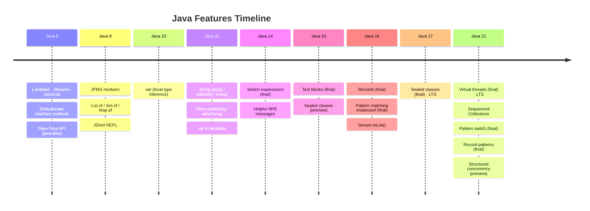

# Java Mastery — Modern Java (Java 9–21)

> **Goal:** Master the modern Java features that make code safer, more expressive, and more maintainable.
> This doc is a standalone companion to the [numbered Core Java index](00-core-java-index.md). Prerequisites: All earlier sections.
> **Scope:** Feature timeline through Java 21; newer releases are not catalogued here. Preview
> examples require the corresponding JDK and preview enabled.

---

## 0) What this covers

1. Java Module System (JPMS) — Java 9.
2. `var` — local variable type inference — Java 10.
3. Text blocks — Java 15.
4. Records — Java 16.
5. Sealed classes and interfaces — Java 17.
6. Pattern matching — `instanceof`, `switch` — Java 16/21.
7. Switch expressions — Java 14.
8. Helpful NullPointerExceptions — Java 14.
9. Sequenced Collections — Java 21.
10. Other notable improvements (Java 9–21).
11. Interview questions woven throughout.

---

## 1) Java Module System (JPMS) — Java 9

The **Java Platform Module System** (Project Jigsaw) brings strong encapsulation and explicit dependency declaration to JARs.

### 1.1 The problem JPMS solves

Before modules:
- Any class on the classpath could access any other class (even `sun.*` internals).
- No way to declare which packages are part of your public API.
- JAR files had no explicit dependency declarations at the JVM level.
- Large applications became monoliths — impossible to split cleanly.

### 1.2 Module descriptor — `module-info.java`

Every module has one `module-info.java` at its root:

```java
// module-info.java
module com.example.myapp {
    // Declare dependencies on other modules
    requires java.base;           // implicit — always included
    requires java.sql;
    requires com.example.utils;

    // Require a module but don't expose it to your consumers
    requires transitive java.logging;   // consumers of myapp also see java.logging
    requires static com.example.optional; // compile-time only (optional at runtime)

    // Export packages to everyone
    exports com.example.myapp.api;

    // Export packages to specific modules only (qualified export)
    exports com.example.myapp.internal to com.example.plugin;

    // Open packages for deep reflection (e.g., for frameworks like Spring/Hibernate)
    opens com.example.myapp.model;
    opens com.example.myapp.config to com.example.framework;

    // Declare services this module provides
    provides com.example.spi.DataSource with com.example.myapp.MySQLDataSource;

    // Declare services this module consumes
    uses com.example.spi.DataSource;
}
```

### 1.3 Key module commands

```shell
# Compile with module path
javac --module-source-path src -d out $(find src -name "*.java")

# Run module
java --module-path out -m com.example.myapp/com.example.myapp.Main

# Check dependencies
jdeps --module-path out -m com.example.myapp

# Create a custom runtime image (only needed modules — ~30 MB instead of 200 MB)
jlink --module-path $JAVA_HOME/jmods:out \
      --add-modules com.example.myapp \
      --output myapp-runtime
```

### 1.4 Named vs unnamed vs automatic modules

| Module type | Descriptor? | Source | Encapsulation |
|-------------|-------------|--------|---------------|
| **Named** | ✅ `module-info.java` | Modern modules | Full — explicit exports |
| **Unnamed** | ❌ | Traditional JAR on classpath | None — all public |
| **Automatic** | ❌ | JAR on module-path (no `module-info`) | Exports all packages; reads all modules |

### 🎯 Interview Questions — JPMS

- **Q: What problem does the module system solve?**
  A: Strong encapsulation (hide internal packages from other modules), reliable configuration (explicit `requires` declarations checked at startup — no more `ClassNotFoundException` at runtime from missing JARs), and the ability to create minimal custom runtime images with `jlink`.

- **Q: What is the difference between `exports` and `opens`?**
  A: `exports` makes a package's public types accessible at compile and runtime (normal usage). `opens` additionally allows deep reflection on all members (including private) at runtime — required by frameworks like Spring, Hibernate, and Jackson.

- **Q: What is a transitive dependency in modules?**
  A: `requires transitive foo` means that anyone who depends on your module automatically also reads `foo`. Use it when your public API returns or accepts types from `foo` — so callers can use those types without adding their own `requires foo`.

---

## 2) `var` — Local Variable Type Inference — Java 10

`var` lets the compiler infer the type of a local variable from its initializer. It is purely a compile-time feature — the bytecode is identical to the explicitly typed version.

### 2.1 Basic usage

```java
// Before
ArrayList<Map<String, List<Integer>>> map = new ArrayList<>();
Map.Entry<String, Integer> entry = map.getFirst().entrySet().iterator().next();

// With var
var map   = new ArrayList<Map<String, List<Integer>>>();
var entry = map.getFirst().entrySet().iterator().next(); // type inferred from expression

// Works great with streams
var words = List.of("hello", "world");
var upper = words.stream()
                 .map(String::toUpperCase)
                 .toList();

// Works in enhanced for-loop (Java 11+)
for (var word : words) {
    System.out.println(word.toUpperCase()); // compiler knows word is String
}

// Works with try-with-resources
try (var reader = Files.newBufferedReader(Path.of("file.txt"))) {
    var line = reader.readLine();
}
```

### 2.2 Where `var` cannot be used

```java
// ❌ Cannot use var without an initializer
var x;          // COMPILE ERROR — type cannot be inferred

// ❌ Cannot use null as initializer (no type info)
var y = null;   // COMPILE ERROR

// ❌ Not allowed for method parameters
void process(var value) { }  // COMPILE ERROR

// ❌ Not allowed for return types
var getValue() { return 42; } // COMPILE ERROR

// ❌ Not allowed for fields
class Foo { var x = 10; }    // COMPILE ERROR

// ❌ Array initializer shorthand breaks (must use explicit type or full form)
var arr = {1, 2, 3};         // COMPILE ERROR
var arr2 = new int[]{1, 2, 3}; // ✅ OK
```

### 2.3 When to use (and avoid) `var`

```java
// ✅ Good — type is obvious from the right-hand side
var path    = Path.of("data.csv");
var users   = new ArrayList<User>();
var entries = map.entrySet();

// ❌ Avoid — type is unclear without knowing what findUser() returns
var result = findUser(42);  // what is result? User? Optional<User>? UserDto?

// ❌ Avoid with numeric literals (type matters)
var x = 10;        // int (not long or byte)
var y = 10L;       // long
var z = 10.0;      // double (not float)
```

### 🎯 Interview Questions — var

- **Q: Is `var` a keyword in Java?**
  A: Technically, `var` is a **reserved type name** (context-sensitive keyword), not a full keyword. You can still use `var` as a variable name, method name, or package name (though it's not recommended).

- **Q: Does `var` affect runtime performance?**
  A: No. `var` is entirely a compile-time feature. The compiled bytecode is identical to the explicitly typed version.

---

## 3) Text Blocks — Java 15

Text blocks provide a multi-line string literal with automatic indentation trimming and minimal escaping.

### 3.1 Syntax

```java
// Opening delimiter: three double-quotes + newline (the newline after """ is not part of the content)
String json = """
        {
            "name": "Alice",
            "age": 30,
            "city": "Boston"
        }
        """;
// The incidental indentation (12 spaces before each line) is stripped based on the
// closing """ position. Result has NO leading indentation.

// SQL example
String sql = """
        SELECT u.name, u.email, o.total
        FROM users u
        JOIN orders o ON u.id = o.user_id
        WHERE u.active = true
        ORDER BY o.total DESC
        LIMIT 10
        """;

// HTML
String html = """
        <html>
            <body>
                <h1>Hello, %s!</h1>
            </body>
        </html>
        """.formatted("Alice");   // String.formatted() — Java 15+; same as String.format()
```

### 3.2 Indentation rules

```java
// The closing """ determines the base indentation level.
// All lines have that many leading spaces stripped.

String a = """
    line 1
    line 2
    """;
// "line 1\nline 2\n"   — trailing newline included (closing """ on its own line)

String b = """
    line 1
    line 2""";
// "    line 1\n    line 2"  — no trailing newline; indentation NOT stripped (closing """ not on own line)
```

### 3.3 Escape sequences in text blocks

```java
// \s — explicit space (prevents trailing whitespace trimming)
String padded = """
        col1  \s
        col2  \s
        """;

// \ at end of line — line continuation (no newline in result)
String oneLine = """
        This is all \
        one line.
        """;
// "This is all one line.\n"

// \n, \t, \\ etc. — standard escapes still work
```

### 🎯 Interview Questions — Text Blocks

- **Q: What is the purpose of text blocks?**
  A: They enable multi-line string literals without concatenation, explicit `\n` escapes, or quote-escaping hell — ideal for embedded JSON, SQL, XML, or HTML in source code.

- **Q: How does indentation stripping work in text blocks?**
  A: Java computes the **common leading whitespace** across all non-empty content lines and the closing `"""` line, then strips it. Positioning the closing `"""` at column 0 preserves all indentation; positioning it at the indentation level strips it.

---

## 4) Records — Java 16

Records are compact, **shallowly immutable** data carrier classes: their component fields are
final, but a mutable component can still change. The compiler generates the canonical
constructor, accessors (without `get` prefix), `equals`, `hashCode`, and `toString`.

```java
// Declare
record Point(int x, int y) {}

// Use
Point p = new Point(3, 4);
p.x();         // 3  (accessor — NOT getX())
p.y();         // 4
System.out.println(p);          // Point[x=3, y=4]
p.equals(new Point(3, 4));      // true (value-based)
p.hashCode();                   // based on x and y
```

### 4.1 Compact constructor — validation and normalization

```java
record Range(int min, int max) {
    // Compact constructor — parameters are the same as the components
    // No need to assign this.min = min; it happens automatically after
    Range {
        min = Math.max(0, min);  // normalize before checking the final invariant
        if (min > max)
            throw new IllegalArgumentException("min (" + min + ") > max (" + max + ")");
    }
}

Range r = new Range(5, 10);   // ok
Range r2 = new Range(10, 5);  // throws IllegalArgumentException
```

### 4.2 Custom constructors and methods

```java
record Person(String firstName, String lastName) {

    // Additional constructor (must delegate to canonical)
    Person(String fullName) {
        this(fullName.split(" ")[0], fullName.split(" ")[1]);
    }

    // Custom accessor (override generated one)
    public String firstName() {
        return firstName.trim();
    }

    // Additional instance methods
    public String fullName() {
        return firstName + " " + lastName;
    }

    // Static methods / factory
    public static Person of(String full) {
        return new Person(full);
    }
}
```

### 4.3 Records can implement interfaces

```java
interface Printable { void print(); }

record Book(String title, String author) implements Printable, Comparable<Book> {
    @Override
    public void print() { System.out.println(title + " by " + author); }

    @Override
    public int compareTo(Book other) { return this.title.compareTo(other.title); }
}
```

### 4.4 Records as Map keys and in collections

```java
// equals/hashCode are value-based — perfect as Map keys
Map<Point, String> grid = new HashMap<>();
grid.put(new Point(0, 0), "origin");
grid.get(new Point(0, 0));  // "origin" — works correctly because equals/hashCode match

// In sealed hierarchies
sealed interface Shape permits Circle, Rectangle {}
record Circle(double radius)         implements Shape {}
record Rectangle(double w, double h) implements Shape {}
```

### 4.5 Records limitations

```java
// ❌ Cannot extend any class (implicitly extends java.lang.Record)
// ❌ Cannot declare instance fields beyond record components
// ❌ Components are implicitly final — cannot be reassigned after construction
// ❌ Cannot be abstract
// ✅ CAN implement interfaces
// ✅ CAN have static fields, static methods, and additional instance methods
// ✅ CAN be local records (inside a method) or nested
```

### 🎯 Interview Questions — Records

- **Q: What does a `record` auto-generate?**
  A: Canonical all-args constructor, one accessor per component (named after the component, no `get` prefix), `equals()` (value-based on all components), `hashCode()` (based on all components), and `toString()` (`ClassName[field=value, ...]`).

- **Q: When should you use a `record` instead of a regular class?**
  A: When the primary purpose is holding data with value semantics — DTOs, API request/response models, value objects, map keys, coordinates, results. Avoid records for entities with mutable state or complex behavior.

---

## 5) Sealed Classes and Interfaces — Java 17

A `sealed` type restricts which classes/interfaces may extend or implement it. This makes class hierarchies **explicit** and enables **exhaustive pattern matching**.

### 5.1 Declaring sealed types

```java
// Interface with a closed set of implementations
sealed interface Shape permits Circle, Rectangle, Triangle {}

// Permitted subtypes must be in the same package (or module)
// Each subtype must be one of: final, sealed, or non-sealed
final class Circle    implements Shape {
    double radius;
    Circle(double r) { radius = r; }
}

final class Rectangle implements Shape {
    double width, height;
    Rectangle(double w, double h) { width = w; height = h; }
}

// non-sealed — reopens the hierarchy; anyone can extend Triangle
non-sealed class Triangle implements Shape {
    double base, height;
}

// Sealed class hierarchy
sealed class Vehicle permits Car, Truck, Motorcycle {}
final class Car        extends Vehicle {}
final class Truck      extends Vehicle {}
sealed class Motorcycle extends Vehicle permits ElectricBike {}
final class ElectricBike extends Motorcycle {}
```

### 5.2 Exhaustive pattern matching with sealed types

When all permitted subtypes are handled, the compiler can verify exhaustiveness — no `default` needed:

```java
double area(Shape shape) {
    return switch (shape) {
        case Circle c    -> Math.PI * c.radius * c.radius;
        case Rectangle r -> r.width * r.height;
        case Triangle t  -> 0.5 * t.base * t.height;
        // No default needed — compiler knows these 3 cover all permitted types
    };
}
```

### 🎯 Interview Questions — Sealed Types

- **Q: What is the difference between `final`, `sealed`, and `non-sealed`?**
  A: `final` — cannot be extended at all. `sealed` — can only be extended by explicitly listed permitted types. `non-sealed` — reopens the hierarchy; any class can extend it (used on a subtype of a sealed type when that branch should be open).

- **Q: Why use sealed types?**
  A: To make closed algebras (e.g., AST nodes, result types, domain events) where you know all variants upfront. The compiler can verify exhaustiveness in switch expressions, preventing missed cases as the hierarchy evolves.

---

## 6) Pattern Matching — Java 16 / 21

### 6.1 Pattern matching for `instanceof` — Java 16

Eliminates the cast after an `instanceof` check:

```java
// Before Java 16
if (obj instanceof String) {
    String s = (String) obj;   // redundant cast
    System.out.println(s.toUpperCase());
}

// Java 16+ — binding variable declared inline
if (obj instanceof String s) {
    System.out.println(s.toUpperCase());  // s is in scope here
}

// Works in expressions
return (obj instanceof Integer i && i > 0) ? i : -1;
```

### 6.2 Pattern matching for `switch` — Java 21

Switch can now match on types, conditions, and null in a single expression:

```java
// Type patterns
static String describe(Object obj) {
    return switch (obj) {
        case Integer i   -> "int " + i;
        case Double  d   -> "double " + d;
        case String  s   -> "string of length " + s.length();
        case int[]   arr -> "int array of length " + arr.length;
        case null        -> "null";          // null now handled explicitly
        default          -> "other: " + obj.getClass().getSimpleName();
    };
}

// Guarded patterns (when clause)
static String classify(Object obj) {
    return switch (obj) {
        case Integer i when i < 0  -> "negative integer";
        case Integer i when i == 0 -> "zero";
        case Integer i             -> "positive integer " + i;
        case String s  when s.isEmpty() -> "empty string";
        case String s               -> "string: " + s;
        default                     -> "other";
    };
}

// With sealed types — exhaustive (no default needed)
double area(Shape shape) {
    return switch (shape) {
        case Circle    c -> Math.PI * c.radius * c.radius;
        case Rectangle r -> r.width * r.height;
        case Triangle  t -> 0.5 * t.base * t.height;
    };
}

// Deconstruction patterns for records (Java 21)
static void printPoint(Object obj) {
    if (obj instanceof Point(int x, int y)) {
        System.out.println("x=" + x + ", y=" + y);  // components extracted
    }
}
```

### 🎯 Interview Questions — Pattern Matching

- **Q: What is the difference between classic `instanceof` and pattern matching `instanceof`?**
  A: Classic: `if (obj instanceof String) { String s = (String) obj; ... }` — requires a separate cast. Pattern matching (Java 16+): `if (obj instanceof String s) { ... }` — binding variable `s` is bound and cast automatically; no explicit cast.

- **Q: Can you use `null` in a switch expression with pattern matching?**
  A: Yes — Java 21 allows `case null` in pattern switch to handle null explicitly. Previously, a null value would throw `NullPointerException` when passed to a switch.

---

## 7) Switch Expressions — Java 14

Switch evolved from a statement to a full **expression** that returns a value.

```java
// Classic switch statement — fall-through, verbose
int day = 3;
String name;
switch (day) {
    case 1: name = "Mon"; break;
    case 2: name = "Tue"; break;
    case 3: name = "Wed"; break;
    default: name = "Other";
}

// Switch expression (Java 14+) — no fall-through; yields value
String name2 = switch (day) {
    case 1 -> "Mon";
    case 2 -> "Tue";
    case 3 -> "Wed";
    default -> "Other";
};

// Multiple labels per case
String type = switch (day) {
    case 1, 2, 3, 4, 5 -> "Weekday";
    case 6, 7           -> "Weekend";
    default             -> throw new IllegalArgumentException("Invalid: " + day);
};

// yield — return value from a block arm
int result = switch (day) {
    case 1 -> 10;
    case 2 -> {
        int temp = day * 5;
        System.out.println("Complex arm");
        yield temp;   // return value from block
    }
    default -> 0;
};

// Switch with Strings, Enums — same as before but as expression
Day d = Day.SATURDAY;
boolean isWeekend = switch (d) {
    case SATURDAY, SUNDAY -> true;
    default               -> false;
};
```

### 🎯 Interview Questions — Switch Expressions

- **Q: What is the difference between `->` and `:` in switch?**
  A: `->` (arrow case) — no fall-through; the expression or block is scoped to that case. `:` (colon case) — traditional fall-through behavior. Arrow cases are preferred in expressions.

- **Q: What is `yield` in a switch?**
  A: `yield` is used inside a **block arm** (`case X -> { ... }`) to return a value from that block. It is not needed for single-expression arms (`case X -> expression`).

---

## 8) Helpful NullPointerExceptions — Java 14

The JVM now includes the **name of the null variable** in `NullPointerException` messages — drastically reducing debugging time.

```java
String user = null;
user.length();
// Java 13-: NullPointerException (no detail)
// Java 14+: Cannot invoke "String.length()" because "user" is null

Map<String, List<String>> map = new HashMap<>();
map.get("key").get(0).length();
// Java 14+: Cannot invoke "String.length()" because the return value of
//           "java.util.List.get(int)" is null
```

---

## 9) Sequenced Collections — Java 21

Java 21 added three new interfaces to the Collections Framework to provide uniform access to ordered collections' **first and last elements**.

```java
// New interfaces:
// SequencedCollection<E> extends Collection<E>
// SequencedSet<E>        extends Set<E>, SequencedCollection<E>
// SequencedMap<K,V>      extends Map<K,V>

// SequencedCollection API (now available on List, Deque, LinkedHashSet, etc.)
List<String> list = new ArrayList<>(List.of("a", "b", "c"));
list.getFirst();        // "a"
list.getLast();         // "c"
list.addFirst("z");     // ["z","a","b","c"]
list.addLast("x");      // ["z","a","b","c","x"]
list.removeFirst();     // removes "z"
list.removeLast();      // removes "x"
list.reversed();        // SequencedCollection view in reversed order (Java 21)

// SequencedMap API (LinkedHashMap, TreeMap, etc.)
LinkedHashMap<String, Integer> lhm = new LinkedHashMap<>();
lhm.put("a", 1); lhm.put("b", 2); lhm.put("c", 3);
lhm.firstEntry();       // Map.Entry("a", 1)
lhm.lastEntry();        // Map.Entry("c", 3)
lhm.pollFirstEntry();   // removes and returns first
lhm.pollLastEntry();    // removes and returns last
lhm.reversed();         // reversed view
lhm.sequencedKeySet();
lhm.sequencedValues();
lhm.sequencedEntrySet();
```

---

## 10) Other Notable Improvements (Java 9–21)

### Java 9

```java
// List.of, Set.of, Map.of — immutable factory methods
List<String> list = List.of("a", "b", "c");   // compact, null-disallowing
Set<Integer> set  = Set.of(1, 2, 3);
Map<String,Integer> map = Map.of("a", 1, "b", 2);
Map<String,Integer> map2 = Map.ofEntries(
    Map.entry("a", 1), Map.entry("b", 2));

// Private methods in interfaces
interface MyInterface {
    default void publicHelper() { privateHelper(); }
    private void privateHelper() { System.out.println("private"); }
}

// Stream enhancements
Stream.of(1,2,null,3,null,4)
      .takeWhile(Objects::nonNull)        // Java 9+
      .dropWhile(n -> n < 3)             // Java 9+
      .iterate(1, n -> n < 100, n -> n*2) // bounded iterate

// Optional enhancements
Optional.of(42).ifPresentOrElse(      // Java 9+
    v -> System.out.println("Got " + v),
    () -> System.out.println("Empty")
);
Optional<Integer> or = Optional.empty().or(() -> Optional.of(99)); // Java 9+
```

### Java 10

```java
// Unmodifiable copy factories
List<String> copy = List.copyOf(original);  // immutable copy (throws on null elements)
Set<Integer>  s   = Set.copyOf(originalSet);
Map<K,V>      m   = Map.copyOf(originalMap);

// Collectors.toUnmodifiableList/Set/Map
list.stream().collect(Collectors.toUnmodifiableList());
```

### Java 11

```java
// String methods
"  hello  ".strip();           // Unicode-aware trim (use over trim())
"  ".isBlank();                // true (whitespace-only)
"a\nb\nc".lines().toList();    // Stream<String> from newlines
"abc".repeat(3);               // "abcabcabc"
" ".stripLeading();
" ".stripTrailing();

// Files.readString / writeString
String s = Files.readString(Path.of("file.txt"));
Files.writeString(Path.of("out.txt"), "content");

// var in lambda parameters (allows annotations)
var list = List.of(1, 2, 3);
list.stream().map((@NonNull var x) -> x * 2).toList();

// Collection.toArray(IntFunction<T[]>) — cleaner array creation
String[] arr = list.toArray(String[]::new);

// Running a single Java file directly (no explicit compile step)
// java HelloWorld.java  — compiles and runs in one step
```

### Java 12–13

```java
// Switch expressions preview (finalized in 14)
// Teeing collector (Java 12)
var stats = Stream.of(1, 2, 3, 4, 5)
    .collect(Collectors.teeing(
        Collectors.summingInt(n -> n),    // first downstream: sum
        Collectors.counting(),            // second downstream: count
        (sum, count) -> sum + "/" + count // merger
    ));
// "15/5"
```

### Java 14

```java
// Records (preview)
// Pattern matching instanceof (preview)
// Helpful NPE messages (default in production builds)
// NullPointerException with message
```

### Java 15

```java
// Text blocks (finalized)
// Sealed classes (preview)
```

### Java 16

```java
// Records (finalized)
// Pattern matching instanceof (finalized)
// Stream.toList() — shorthand for collect(Collectors.toList()) returning an unmodifiable List
List<String> result = stream.toList(); // Java 16+

// Unix domain socket channels
```

### Java 17

```java
// Sealed classes (finalized)
// Context-specific deserialization filters
// Random number generators — new API
RandomGenerator rng = RandomGeneratorFactory.of("Xoshiro256PlusPlus").create(seed);
rng.nextInt(100);
rng.ints(10).toArray();

// Enhanced pseudo-random number generators
// No more new Random(), SecureRandom() confusion for most uses
```

### Java 19–20 (Preview → Finalized in 21)

```java
// Virtual Threads (finalized in 21) — see Concurrency doc
// Pattern matching for switch (finalized in 21)
// Record patterns (finalized in 21)

// Structured concurrency (preview — Java 21+)
try (var scope = new StructuredTaskScope.ShutdownOnFailure()) {
    Future<String> user   = scope.fork(() -> fetchUser(id));
    Future<Integer> orders = scope.fork(() -> fetchOrders(id));
    scope.join().throwIfFailed();
    return new UserWithOrders(user.resultNow(), orders.resultNow());
}
// If either fork fails, the other is cancelled — clean shutdown

// Scoped values (preview — Java 21+) — alternative to ThreadLocal for virtual threads
ScopedValue<User> CURRENT_USER = ScopedValue.newInstance();
ScopedValue.where(CURRENT_USER, user).run(() -> {
    CURRENT_USER.get(); // available to all callees in this scope
});
```

---

## 11) Java Version Feature Timeline



---

## 12) Quick Checklist — Modern Java

- Prefer `List.of()`, `Set.of()`, `Map.of()` over `Arrays.asList()` for small immutable collections.
- Use `var` where the type is obvious from the right-hand side — avoid it where the type is ambiguous.
- Use text blocks for multi-line strings (JSON, SQL, HTML) — never string concatenation with `\n`.
- Use `record` for shallowly immutable data carriers (DTOs, value objects, map keys) — copy
  mutable components defensively if you need deep immutability or a stable hash key.
- Use `sealed` types to define closed algebras and enable exhaustive `switch` without `default`.
- Use pattern matching `instanceof` — eliminates the redundant cast after a type check.
- Use pattern `switch` with type and guarded patterns to replace long `if-instanceof-cast` chains.
- Use `stream.toList()` (Java 16+) instead of `collect(Collectors.toList())` for unmodifiable result.
- Use `String.strip()` (Unicode-aware) instead of `String.trim()` (ASCII-only).
- Use `String.isBlank()` instead of `s.trim().isEmpty()`.
- Use `SequencedCollection.getFirst()`/`getLast()` instead of `list.get(0)` and `list.get(list.size()-1)`.
- Use virtual threads (`Executors.newVirtualThreadPerTaskExecutor()`) for I/O-bound concurrent tasks — see Concurrency doc.
- For production apps: always explicitly set the Java version in `pom.xml`/`../build.gradle` and `module-info.java`.
