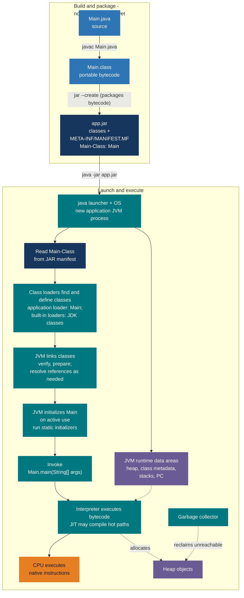
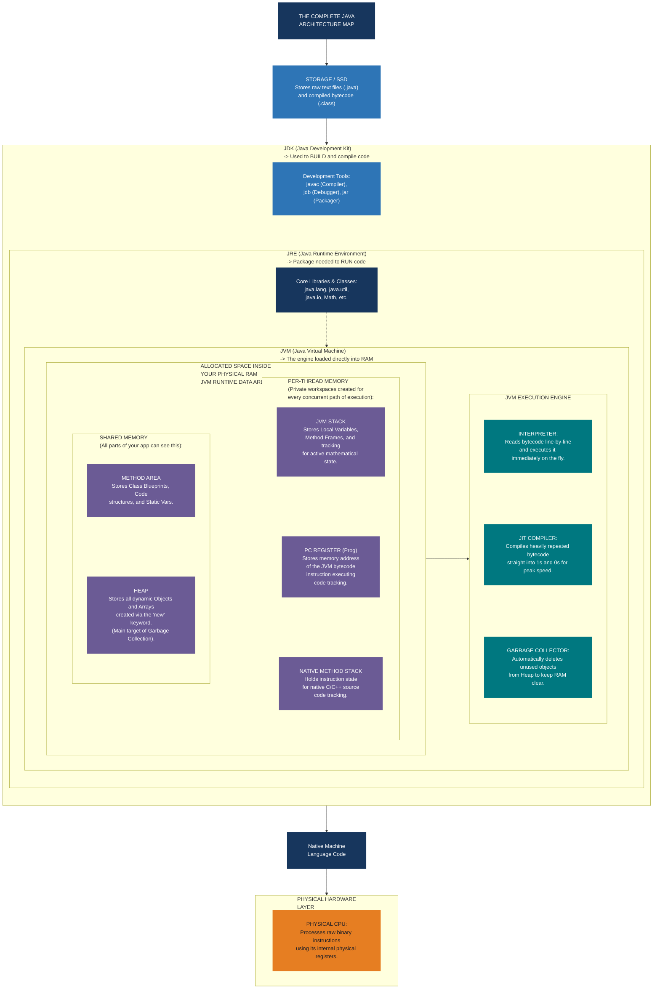
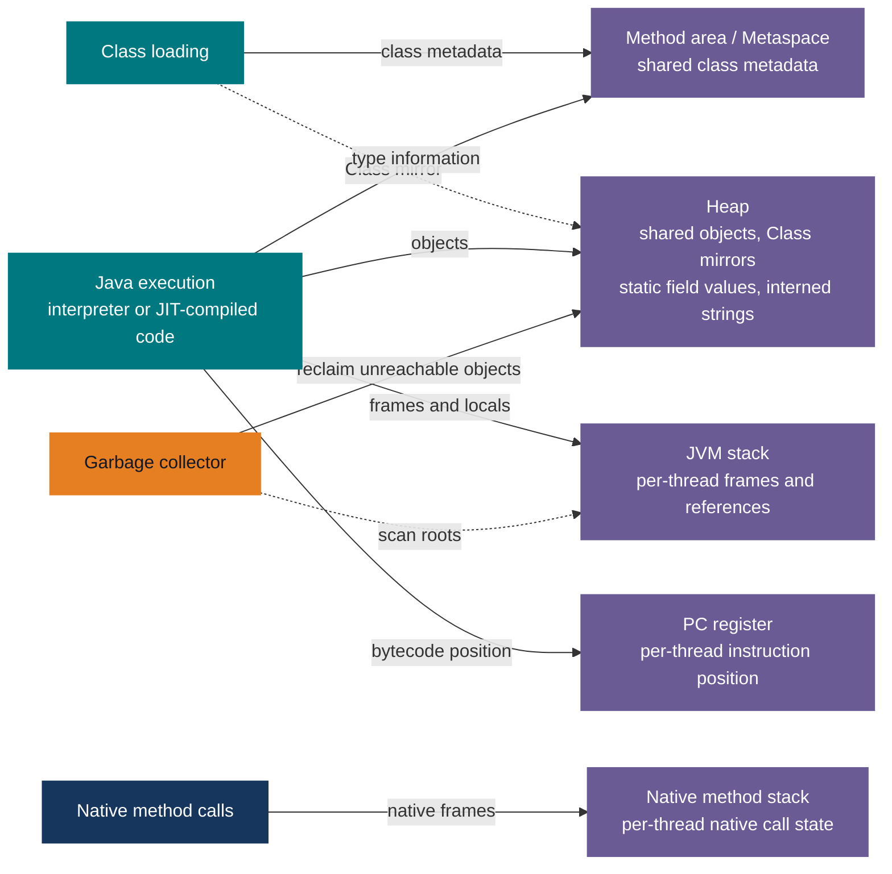

# Java Mastery

Core Java interview preparation, organized as numbered topic guides. Start with the
[Core Java index](00-core-java-index.md), then use the
[cheat sheet](09-core-java-cheat-sheet.md) for revision. The baseline is Java 17;
features introduced in Java 21 are identified where they appear.

| Order | Guide |
|---|---|
| 00 | [Core Java index and reading order](00-core-java-index.md) |
| 01 | [Language foundations and OOP](01-language-foundations-oop.md) |
| 02 | [JVM memory, GC and OOM](02-jvm-memory-gc.md) |
| 03 | [Collections and generics](03-collections-generics.md) |
| 04 | [Exceptions](04-exceptions.md) |
| 05 | [Functional Java](05-functional-java.md) |
| 06 | [Concurrency](06-concurrency.md) |
| 07 | [IO and files](07-io-files.md) |
| 08 | [Modern Java](08-modern-java.md) |
| 09 | [Interview cheat sheet](09-core-java-cheat-sheet.md) |

## From Java source to a running application

**Compile, package, and launch are different operations.** For a simple `Main.java` with no
package, these are illustrative commands, not steps performed by this document:

```powershell
javac Main.java
jar --create --file app.jar --main-class Main Main.class
java -jar app.jar
```

`javac` turns source into `.class` bytecode. `jar` **archives existing** classes and writes a
manifest with `Main-Class: Main`; it does not compile Java. `java -jar app.jar` starts the
application's JVM and uses that manifest to select the entry class. `java app.jar` without
`-jar` is not the command to launch an executable JAR.



| Step | What actually happens |
|---|---|
| Compile | `javac` writes `Main.class` to disk. Its compiler process is separate from the application JVM, which has not started yet. |
| Package | `jar` puts compiled classes, optional resources, and a `Main-Class` manifest entry into `app.jar`; bytecode is not recompiled. |
| Launch | The OS starts the `java` process. The launcher reads the JAR's entry point; the JVM establishes its heap, class metadata storage, and thread state. |
| Load and link | Built-in loaders normally delegate parent-first; the application loader finds `Main` and other application classes as needed. The JVM verifies bytecode, prepares static defaults, and may resolve references lazily. |
| Initialize and enter `main` | On first active use, the JVM runs class initialization, then invokes `public static void main(String[] args)`. Other classes may load later as execution reaches them. |
| Execute and exit | The interpreter executes bytecode; HotSpot may JIT-compile hot paths to native code. Threads use stack frames and the heap; GC reclaims unreachable heap objects while the app runs. On process exit, the OS reclaims its resources. |

For packaged classes, use their fully qualified name with `--main-class`. A plain JAR does
not automatically include third-party dependencies; a build tool can assemble more complex
applications. Without a `Main-Class` manifest entry, use `java -cp app.jar Main` instead.

## Java architecture at a glance

The JDK supplies development tools and a runtime image; the runtime includes the JVM and
standard libraries. A compatible JVM loads portable bytecode and executes it on its platform.
This map shows **component containment and interactions**, not the time-ordered build and
launch steps shown above. Class loaders find and define classes; the JVM performs linking
and initialization.



In HotSpot, class metadata uses native Metaspace. Static field values are associated with
heap-resident `Class` mirrors; interned strings also live on the heap. The
[memory and GC guide](02-jvm-memory-gc.md) expands on memory areas, collectors, leaks and
out-of-memory diagnosis. The build/run lifecycle is [documented above](#from-java-source-to-a-running-application).

### Which component accesses which memory area?

These arrows show **runtime access**, not the order in which Java is compiled. The heap and
method area are shared; the JVM stack, PC register, and native method stack belong to
individual threads.



See the [JVM memory guide](02-jvm-memory-gc.md#3-runtime-memory-shared-vs-per-thread) for
shared versus per-thread behavior and HotSpot implementation details.
